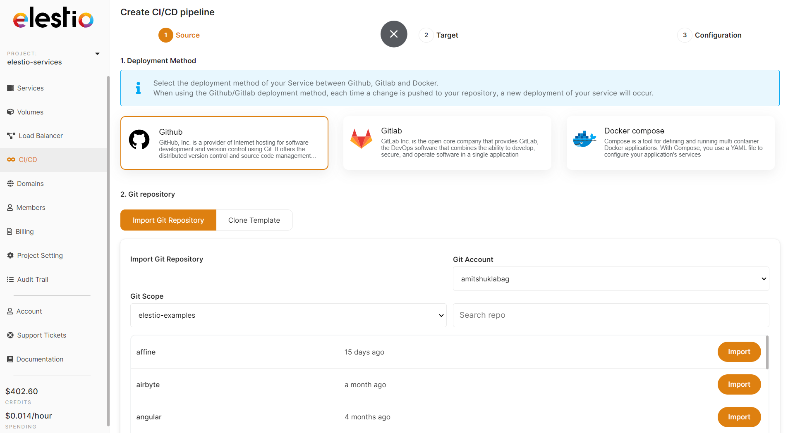

Elestio is the simplest and fastest way to deploy your source code from github/gitlab/docker registries to production.

**In** **3 steps** you can deploy any kind of project, frontend, backend, api, db, you name it.

1. Select your source code in Github / Gitlab or from a Docker registry (private registries are supported)
2. Select the target where you want to deploy
3. Configure in the UI env vars, volumes, life cycle events, reverse proxy with SSL

Wait few minutes and **your app is live!**

We support **ANY** linuxtech stack and we provide [samples for the most popular stacks \& frameworks (85\+ Apps \& Frameworks)](https://github.com/orgs/elestio-examples/repositories?ref=blog.elest.io)

##### Deploy to 80 datacenters in 27 countries \+ BringYourOwnVM

CI/CD Pipelines by Elestio are available with our 5 cloud partners (AWS Lightsail, Digital Ocean, Vultr, Linode \& Hetzner) in 80 locations over 27 countries but also on any cloud (AWS, Azure, Google, Oracle, ...) and on\-premise with [BYOVM.](https://doc.elest.io/books/cloud-providers/page/byovm-bring-your-own-vm?ref=blog.elest.io)

##### Vertical \& Horizontal scaling

Scale from 1 CPU/2GB Ram up to 32 CPU/128GB Ram, you can also scale horizontally with a [load balancer](https://doc.elest.io/books/load-balancers/page/create-a-new-load-balancer?ref=blog.elest.io) and clustered infrastructure. All fully managed on any cloud.

##### Full isolation or Shared infrastructure

You can decide to deploy CI/CD pipelines in full isolation mode (1 pipeline on 1 VM) or deploy several pipelines to the same CI/CD target (Multiple pipelines on 1 VM). It's up to you, if you are not sure we recommend to go with full isolation to avoid one pipeline to affect performance of others.

##### What is included

* Automated source code build \& deployment from Github/Gitlab \& docker registries
* Live \& history logs, quickly edit your config and redeploy when needed
* Deploy multiple pipelines on a single target
* You can move a pipeline from a target to another one in a click (nearly instant migration)
* Reverse proxy with managed SSL, additional custom domains are supported
* Tools: ssh, web terminal, VS Code, File explorer all in the context of your pipeline
* Automated Backups/Restore to S3 Bucket

##### Pricing

* We don't charge for build minutes
* We don't charge per user
* We don't charge per pipeline
* We don't charge per project
* We don't charge per X,Y,Z BS metrics

You pay only for the CICD Targets that you launch, price is per hour and details are available on [Elestio pricing page](https://elest.io/pricing?ref=blog.elest.io)

Example: If you need to deploy 2 CI/CD pipelines, 1 for the frontend of your app (React.js) and 1 for the backend (Node.js) you can deploy both of them to the same CI/CD target instance. Now if you need to deploy 5 projects to the same CI/CD target the price won't change. Of course at some point you might have to upgrade your instance to get more RAM/CPU to satisfy all your apps.

##### Philosophy \& Vision

**Low overhead:** we regularly see orchestration, networking, monitoring \& logging systems using 80% of the hardware resources. Leaving not much for the apps to perform well or pushing customers to over provision everything to get decent performances at huge cost. We have created in\-house a super low overhead management system. This allow us to offer a very efficient way to deploy and manage a lot of projects at scale.

**Portability:** your pipelines can be moved from one CI/CD target to another in a click. You can also download a backup and run it locally. There is no lock\-in. We want customers to stay with us because of quality of service, support and time saving compared to doing all the devOps task by yourself.

**KISS:** an acronym for keep it simple stupid. Principle states that most systems work best if they are kept simple rather than made complicated; therefore, simplicity should be a key goal in design, and unnecessary complexity should be avoided.

Click on the button below to test Elestio CI/CD pipelines and deploy your own code on any cloud in few minutes. 

[Deploy a CI/CD pipeline on Elestio](https://dash.elest.io/0/new/ci-cd?ref=blog.elest.io)

