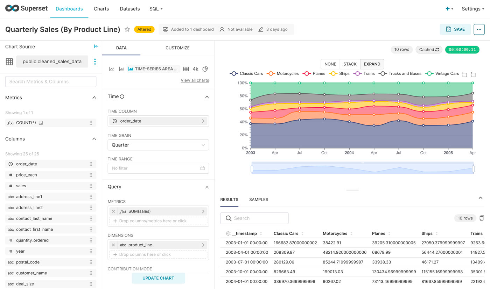

If you are looking for a free, open\-source solution for data exploration and visualization, then look no further than Apache Superset. This powerful platform allows you to connect to your existing databases, explore your data, and create beautiful visualizations in a user\-friendly interface. Whether you are a data analyst, business owner, or developer, Apache Superset has something to offer. 

In this article, we will explore the benefits of Apache Superset and how you can get started with it.

A video version of this article is also available here

Apache Superset

## Installation and Connection to a Database

The first step to using [Apache Superset](https://elest.io/open-source/superset?ref=blog.elest.io) is to install it and connect it to your database. Installation can be done using pip or Docker, if you want to self\-host it, and through the [one click\-install on Elestio](https://elest.io/open-source/superset?ref=blog.elest.io). Once installed, you can connect to your database using the web\-based interface. Superset supports many databases, including [MySQL](https://elest.io/open-source/mysql?ref=blog.elest.io), [PostgreSQL](https://elest.io/open-source/postgresql?ref=blog.elest.io), and [SQL Server](https://elest.io/open-source/mssql?ref=blog.elest.io), among others.

## Datasets, Charts \& Dashboards

Once connected to your database, you can start exploring your data in Superset. You can create datasets by selecting your database tables and defining filters and joins. 

You can also create charts using a wide variety of visualization types, including bar charts, line charts, scatter plots, and more. Superset also offers many customization options, such as adding filters, legends, and annotations to your visualizations.

Creating an advanced chart using Apache Superset

Once your datasets and charts are ready, you can build dashboards tailored to your need including adjustable time filters to compare data over time and make the best decisions for your projects.

Superset dashboard example 

## SQL Lab

One of the powerful features of Apache Superset is SQL Lab. This tool allows you to write SQL queries and see the results in a tabular format or as a visualization by using it as a dataset for your charts. This is a bit trickier than the visual editor on Metabase to link multiple tables.

## Conclusion

[Apache Superset](https://elest.io/open-source/superset?ref=blog.elest.io) is a powerful open\-source tool for data exploration and visualization. It offers a user\-friendly interface, supports many databases, and allows you to create beautiful charts and dashboards. While it may be more difficult to use than other tools like Metabase, it offers more advanced charting capabilities but is only compatible with relational SQL databases. If you are looking for a free and open\-source solution for your data analysis needs, then Apache Superset is definitely worth exploring.

In conclusion, Apache Superset is an excellent choice for anyone who wants to explore their data and create useful dashboards to take decisions wisely. 

It's easy to install, supports many databases, and offers powerful tools like SQL Lab. While it may not be as user\-friendly as other tools, it offers more advanced charting capabilities and is well\-suited for use with relational databases. 

