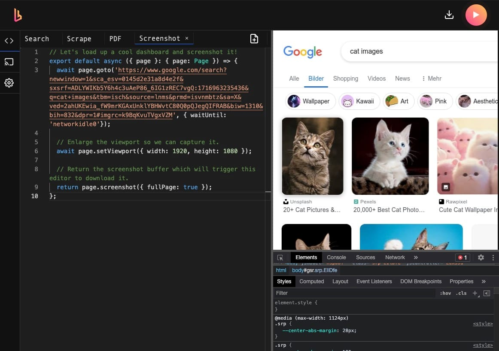

Let's see how you can create an application that makes HTTP requests to [Browserless](https://elest.io/open-source/browserless?ref=blog.elest.io) and get screenshots. During this tutorial, we will be building the workflow from scratch. Before we start, ensure you have deployed N8N, we will be self\-hosting it on [Elestio](https://elest.io/open-source/n8n?ref=blog.elest.io).

## What is N8N?

N8N is an open\-source workflow automation tool that allows you to automate tasks and workflows by connecting various applications, services, and APIs together. It provides a visual interface where users can create workflows using a node\-based system, similar to flowcharts, without needing to write any code. You can integrate n8n with a wide range of applications and services, including popular ones like Google Drive, Slack, GitHub, and more. This flexibility enables users to automate a variety of tasks, such as data synchronization, notifications, data processing, and more.

## Introduction to Browserless

Browserless is a service and platform that provides remote, headless browser automation, allowing users to run web browsers programmatically without a graphical user interface. It is often used for tasks such as web scraping, automated testing, and other web automation needs. By utilizing a cloud\-based infrastructure, Browserless offers APIs and tools to manage browser instances, handle browser\-based tasks efficiently, and scale operations as needed. This approach helps developers save resources and time by offloading the complexity of managing headless browsers and enabling seamless integration into various workflows and applications. We will be using Browserless to create a script to take screenshots and invoke this through N8N

## Creating Browserless Application

If you are building a Browserless Application along with this tutorial then we would recommend you go ahead and create an instance on [Elestio](https://elest.io/open-source/browserless?ref=blog.elest.io). Once you log into the Browserless instance using the credentials provided on the Elestio dashboard, you will be presented with the dashboard with some example scripts. One we will be using is Screenshot.

If the script is unavailable for some reason, you can create a new script page and add the following script.


```
// Let's load up a cool dashboard and screenshot it!
export default async ({ page }: { page: Page }) => {
  await page.goto('https://www.google.com/search?newwindow=1&sca_esv=0145d2e31a8d4e2f&sxsrf=ADLYWIKb5Y6h4c3uAeP86_6IG1zREC7vgQ:1716963235436&q=cat+images&tbm=isch&source=lnms&prmd=isvnmbtz&sa=X&ved=2ahUKEwia_fW9mrKGAxUnklYBHWvtC80Q0pQJegQIFRAB&biw=1310&bih=832&dpr=1#imgrc=k9BqKvuTVgxVZM', { waitUntil: 'networkidle0'});

  // Enlarge the viewport so we can capture it.
  await page.setViewport({ width: 1920, height: 1080 });

  // Return the screenshot buffer which will trigger this editor to download it.
  return page.screenshot({ fullPage: true });
};
```
## Setting Up N8N

Log into the N8N instance using the credentials provided in the Elestio dashboard. Once logged in, add three components as shown below. To keep the tutorial simple, we will just convert the HTML page into a markdown after receiving the response from the HTTP request.

Now, head over to the **HTTP Request** component and configure the following follows

**Method:** GET

**URL:** \<Your browserless instance URL\>

**Authentication:** None

Next head over to the **Markdown** component and configure it as follows. 

💡Remember this component is changeable according to the need of your application. You can also use the built\-in [Browserless integration](https://n8n.io/integrations/browserless/?ref=blog.elest.io) on N8N.**Mode:** HTML to Markdown

**HTML:** `{{$json.data}}` 

**Destination Key**: data

And done! The following window shows the landing HTML page for now but can be configured to invoke specific scripts and receive the responses. You can form multiple such workflows based on the script type.

## **Thanks for reading ❤️**

Thank you so much for reading and do check out the Elestio resources and Official [N8N documentation](https://docs.n8n.io/?ref=blog.elest.io) to learn more about N8N. You can click the button below to create your service on [Elestio](https://elest.io/open-source/n8n?ref=blog.elest.io) and create a workflow to get screenshots from the web. See you in the next one👋

[](https://elest.io/open-source/n8n?ref=blog.elest.io)

