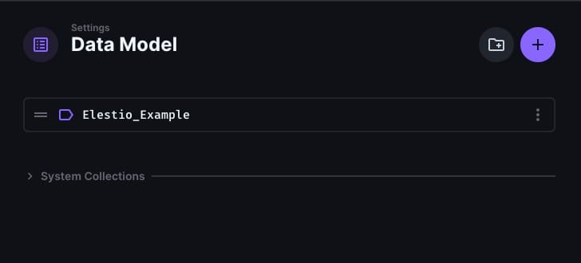

Connecting your front end to a headless CMS like [Directus](https://elest.io/open-source/directus?ref=blog.elest.io) offers flexibility and scalability. Whether you already have a front\-end application or are planning to build one, this guide will show you how to integrate it with Directus using the Directus JavaScript SDK. We'll also walk through deploying your frontend on Elestio using a [CI/CD](https://elest.io/cicd?ref=blog.elest.io) pipeline connected to your GitHub repository.

## Prerequisites

Before we get started, make sure you have the following:

* A frontend application (you can use an existing one or create a new one using a framework like Next.js).
* A Directus service deployed on [Elestio](https://elest.io/open-source/directus?ref=blog.elest.io).
* A GitHub account with a repository containing your frontend project.

## Configuring Directus

Before connecting your front end to Directus, it's essential to properly configure your Directus instance. You should have created the necessary collections and fields within Directus to store and manage your content by now.

 The next step is configuring roles and permissions to ensure your collections are accessible as needed. Navigate to the **Roles \& Permissions** section in Directus. Here, you'll want to adjust the settings for the **Public** role (or any other role you intend to use) to grant read or write access to the relevant collections. This ensures that your frontend can retrieve data from Directus without authentication if you plan for the content to be publicly accessible. Carefully consider which permissions are necessary, granting full access only when required, to maintain the security and integrity of your content.

## Deploying Frontend Project

If you already have a front\-end project, you're halfway there and can directly deploy it by heading to **CI/CD \> GitHub \> Import Git Repository** and connecting the proper repository. 

If not, you can create one using a modern JavaScript framework like Next.js. For this guide, we'll assume you're using **Next.js**, but the principles apply to any front\-end technology. To reduce the hassle can choose to deploy the next.js template directly on Elestio using the **CI/CD** pipeline, this will setup a boilerplate and GitHub repository automatically and reduce the installation steps. You can choose to host the frontend locally by running `npx` other suitable commands. To deploy the CI/CD pipeline, head over to Elestio Dashboard and click on **CI/CD \> GitHub** **\> Clone Template \> Next.js.** 

Once done, Head over to **Tools \> VSCode** and use the credentials to log into the web instance of VSCode where we will be editing the template to help us integrate Directus. 

Start a new terminal and now connect your front end to Directus, for this you'll need to install the Directus JavaScript SDK. Run the following command in your project directory: 


```
npm install @directus/sdk
```
Now make API requests to your Directus service which will connect your Directus service to your frontend, this can be done by creating a helper file in `lib/directus.js` 


```
// lib/directus.js
import { createDirectus, rest } from '@directus/sdk';

const directus = createDirectus('https://your-directus-instance-url').with(
  rest({
    onRequest: (options) => ({ ...options, cache: 'no-store' }),
  })
);

export default directus;
```
Replace `'https://your-directus-instance-url'` with the URL of your Directus instance. Next In your frontend, you can now use the Directus SDK to fetch and display data. As shown in the example file below, remember that the following code is an example and will change depending on your data model type, fields and their names


```
// pages/index.js
import directus from '@/lib/directus';
import { readItems } from '@directus/sdk';

export async function getStaticProps() {
  const global = await directus.request(readItems('Elestio_Example'));
  return {
    props: {
      global,
    },
  };
}

export default function HomePage({ global }) {
  return (
    <div>
      <h1>{global.title}</h1>
      <p>{global.description}</p>
    </div>
  );
}
```
This example fetches `global` metadata from Directus and displays it on the homepage. Now you can utilize this exported component in the main file to view it as your deployed website.

## Test Your Deployed Frontend

Start by visiting the URL provided by Elestio to access your live site. This is your chance to ensure that the deployment process was successful and that your frontend is up and running. Pay attention to how the content is rendered, ensuring that the information fetched from your Directus collections appears as intended. For example, if you've set up a homepage with global metadata or blog posts, confirm that the titles, descriptions, images, and any other dynamic content are showing up accurately.

## **Thanks for reading ❤️**

By following these steps, you’ve successfully connected your frontend to Directus and deployed it on Elestio with a [CI/CD](https://elest.io/cicd?ref=blog.elest.io) pipeline. This setup helps your content management and deployment processes, allowing you to focus more on developing your application. Thank you for reading! For more detailed guidance or to explore advanced features, check out the official [Directus documentation](https://docs.directus.io/use-cases/headless-cms/introduction.html?ref=blog.elest.io) and Elestio’s resources. Ready to enhance your project? Click below to start with Directus on Elestio. See you in the next one! 👋


[](https://elest.io/open-source/directus?ref=blog.elest.io)


