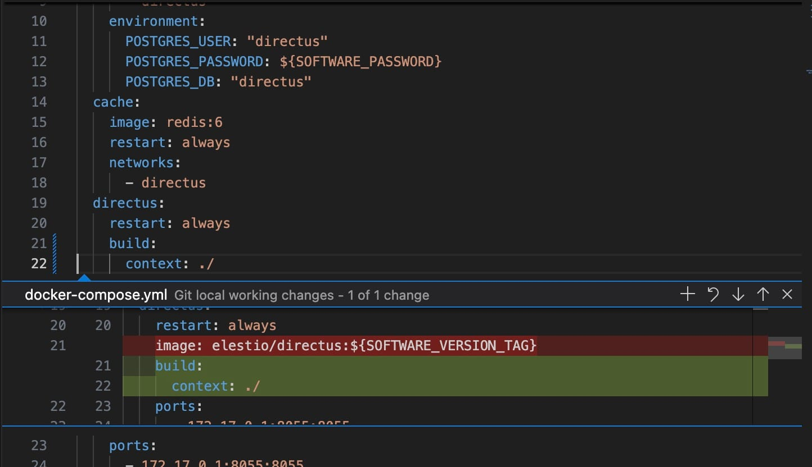
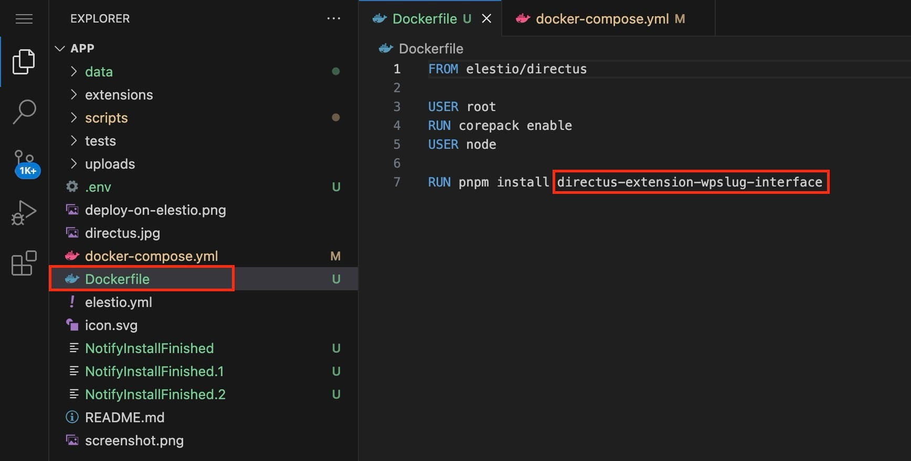
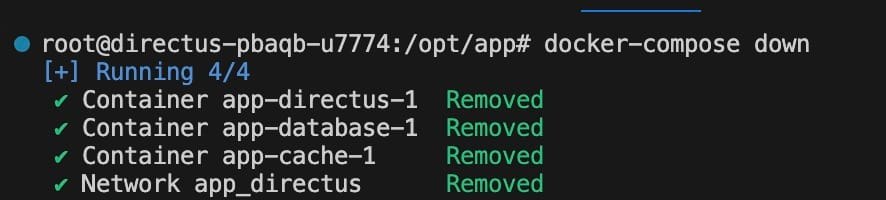
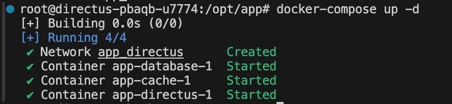
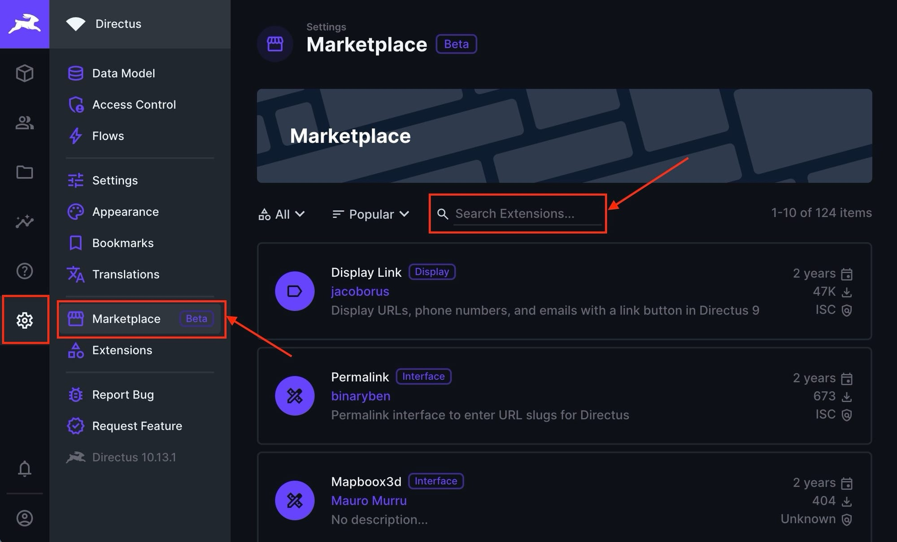
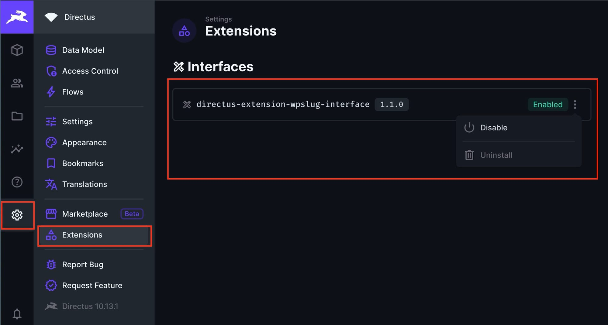

Extensions in [Directus](https://octabyte.io/applications/cms/directus) are additional modules or plugins that enhance the core functionalities of the platform. They allow you to add custom interfaces, hooks, endpoints, and more, providing a way to tailor the system to specific requirements. Installing extensions is a great way to expand the functionality of your Directus project. In this guide, we will walk you through the process of installing extensions from the npm registry in a Directus project. Before you begin, ensure you have a self\-hosted service of Directus ready on [OctaByte](https://octabyte.io/applications/cms/directus).

## What is Directus

Directus is an open\-source data platform that allows you to manage content and assets using a headless CMS approach. It provides an API and an admin app, making creating, managing, and distributing your data easily across various platforms. With Directus, you can extend its capabilities by installing extensions, adding new features, improving functionality, or customising the system to meet your specific needs.

## Installing Extensions

Logged in to VSCode if you don't have credentials then contact with support, open your project's `docker-compose.yml` file and replace the `image` option with a `build` section like the following:


```
- image: directus/directus:10.x.y
+ build:
+  context: ./

```
This change allows you to create a customized Docker image that includes your desired extensions. Next, create a `Dockerfile` at the root of your project (if it doesn't already exist) 

Copy the following content into the file as shown above. You can add a specific version like the following `10.x.y` or choose not to get the latest version.


```
FROM elestio/directus:10.x.y

USER root
RUN corepack enable
USER node

RUN pnpm install directus-extension-package-name

```
Replace `directus-extension-package-name` with the actual name of the npm package for your extension. 

Now, open the terminal in VS CODE to execute the necessary Docker commands. This terminal lets you interact directly with your Docker environment from VS CODE.  

* `docker-compose down` this stops and removes all containers defined in your `docker-compose.yml` file. This ensures that any running instances of the containers are stopped before new ones are started.


```
docker-compose down

```
* `docker-compose up -d` rebuilds and starts the containers in detached mode. The `-d` flag stands for "detached," meaning the containers run in the background, freeing up the terminal for other tasks.


```
docker-compose up -d

```
And done! You have successfully installed extensions in your superset instance. You can install multiple such packages.

## Additional Note

While making this guide, the native marketplace feature of Directus is still in Beta, so for now it activates when you install your first extension. To check the same head over to **Settings** \> **Marketplace**. You can also install other extensions from here from next or when it is released publically for public use.

Similarly, the installed extensions can be managed with the newly arrived appeared **Extensions** option. You can remove, update and perform other options related to your installed extensions here.

## **Thanks for reading ❤️**

By following these steps, you can easily extend the capabilities of your Directus project by installing extensions from the npm registry. This customization allows you to tailor the Directus platform to better meet your specific needs and improve the overall functionality of your data management system. Thank you so much for reading and do check out the OctaByte resources and Official [Directus documentation](https://docs.directus.io/) to learn more about Directus. Click the button below to create your service on [OctaByte](https://octabyte.io/applications/cms/directus). See you in the next one👋


[](https://octabyte.io/start-trial/?service=Directus)


