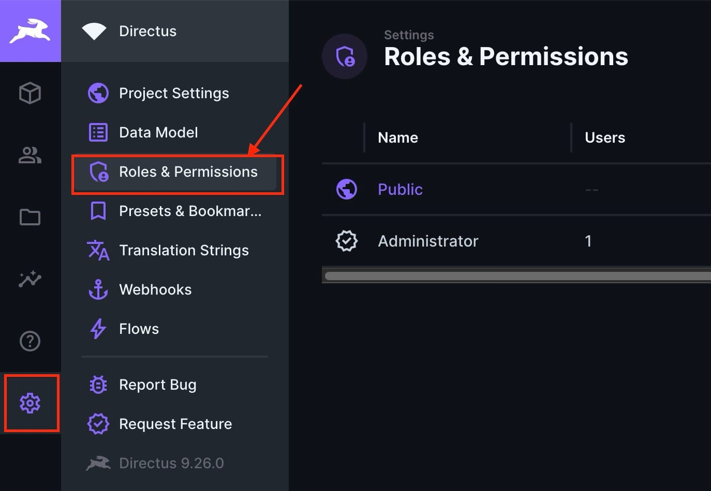
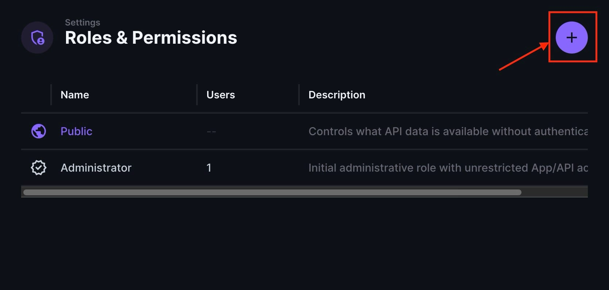
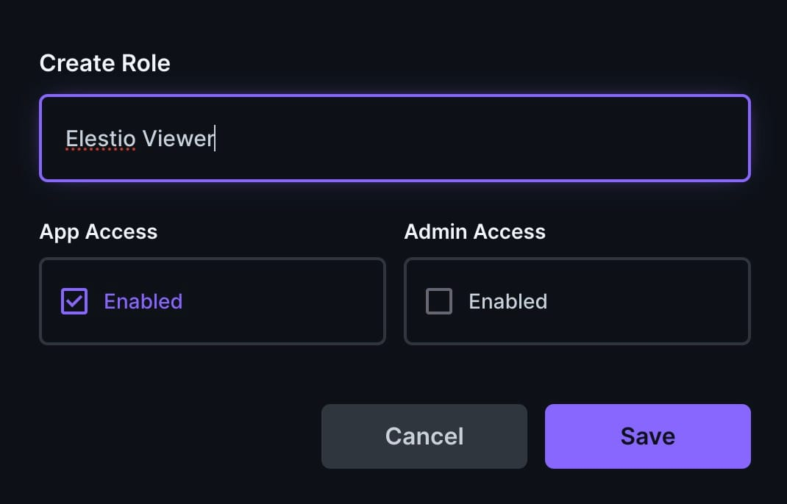
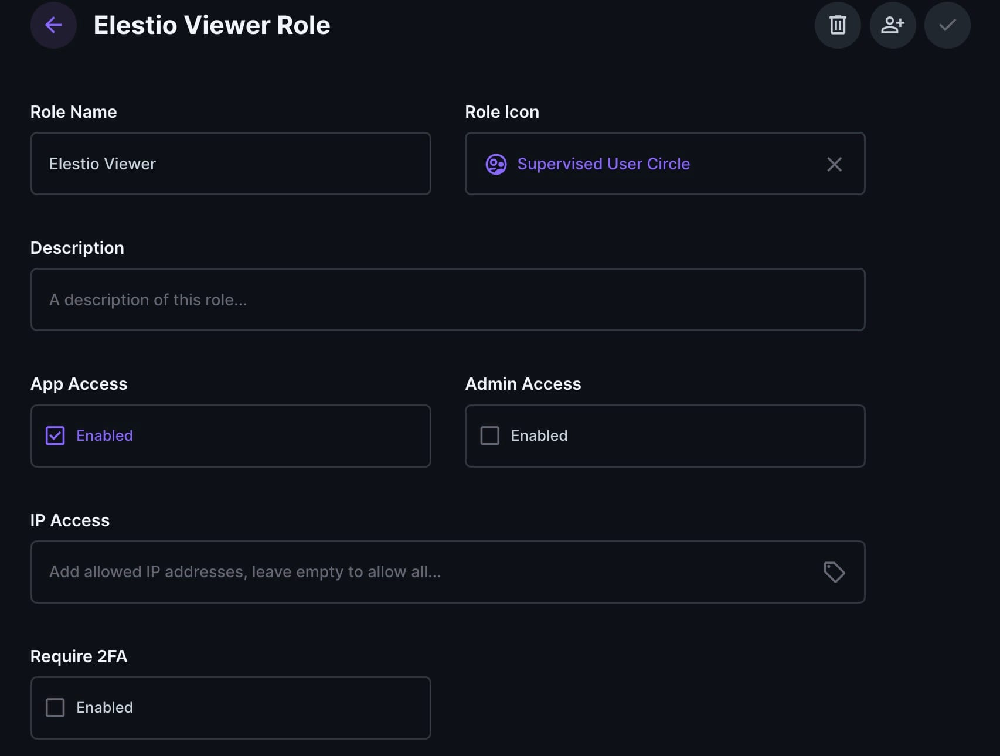
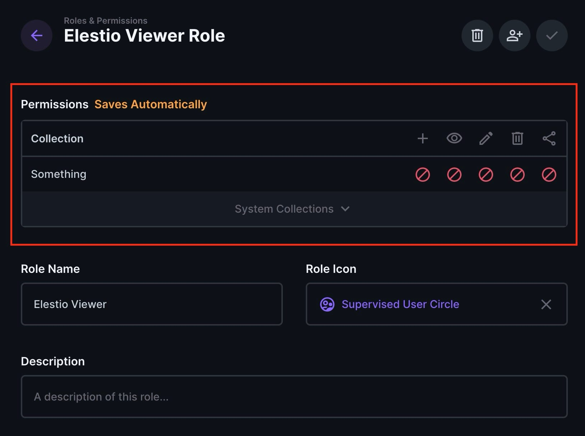
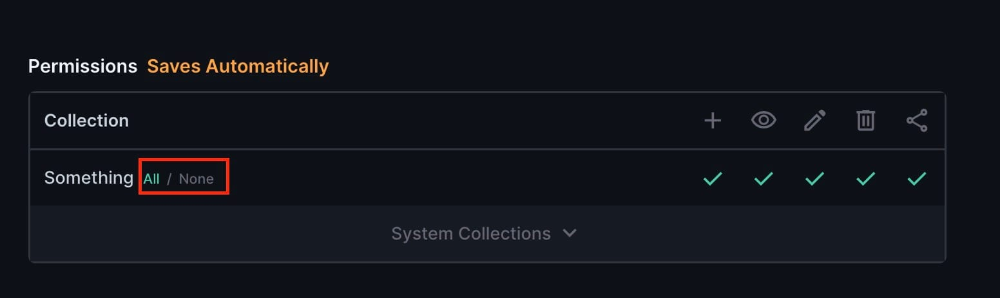
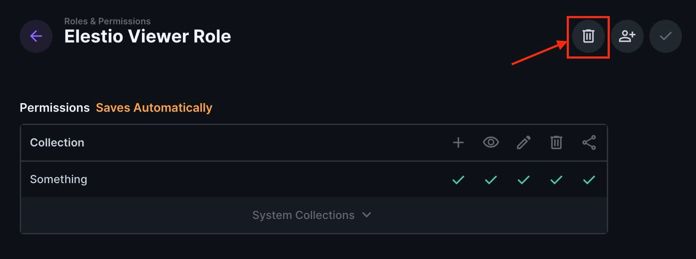

[Directus](https://octabyte.io/applications/cms/directus) is an open\-source data platform that provides an interface for managing databases. It allows you to interact with your data through a customizable API, offering tools for managing content, roles, and permissions with ease. This guide will walk you through viewing, creating, configuring, and deleting roles, as well as managing permissions, and ensuring users have appropriate access while safeguarding sensitive data. 

## Roles

Roles are collections of predefined access rights that can be allocated to multiple users within an application. They help the process of managing user privileges by bundling permissions, enabling administrators to easily grant or limit access to different features and resources. 

### Viewing a Role

To view an existing role, navigate to **Settings \> Roles and Permissions \> \[Role]**. Here, you can see the role's permissions and other details, helping you understand the access level and capabilities assigned to the role.

### Creating a Role

Creating roles allows for organized and better management of user access, ensuring that individuals only have access to the resources necessary for their responsibilities. To create a new role, follow these steps:

* Navigate to **Settings \> Roles and Permissions**.
* Click **Add (\+)** in the page header.

* Enter a unique **Role Name**.
* Toggle **App Access** and **Admin Access** as desired.
* Click **Save** to confirm.

### Configuring Role Details

In addition to defining permissions, roles come with several other configuration options. To configure a role's details, follow these steps:

* Navigate to **Settings \> Roles and Permissions \> \[Role]**.
* Configure the following options as desired:
	+ **Permissions**: Configures what actions users assigned to this role can perform within the application.
+ **Role Name**: Sets the unique name used to identify the role across the application.
+ **Description**: Adds a note to explain the role’s purpose and responsibilities.
+ **App Access**: Auto\-configures the minimum permissions required for logging into the application.
+ **Admin Access**: Auto\-configures full permissions to project data and settings; this must be toggled off to restrict permissions.
+ **IP Access**: Allow list of IP addresses, IP ranges, and CIDR blocks for this role. To add an entry, type it in and hit Enter/Return to confirm. Leave empty to allow all IP addresses.
	- **IP Address**: `1.2.3.4`
	- **IP Range**: `1.1.1.1-2.2.2.2`
	- **CIDR Block**: `1.2.3.0/24`
+ **Require MFA**: Forces all users within this role to use multi\-factor authentication.
+ **Users in Role**: Lists all users within this role.

* **Click the checkmark in the page header to confirm**: Save your configurations by clicking the checkmark to apply and finalize the role setup.

## Permissions

Permissions provide control over what actions users can perform within the application. Directus offers an easy permissions system. When you create a role, all permissions are turned off by default. From here, you can explicitly configure permissions for each collection as needed.

### Configuring Role Permissions

To set up a role's access permissions, follow these steps:

* Navigate to **Settings \> Roles and Permissions \> \[Role]** and scroll to **Permissions**.
* Each collection is listed in a row with CRUDS (Create, Read, Update, Delete, and Search) permissions as columns.
* Click the icon of the collection and permission type you want to set. A tooltip will appear. For Directus system collections, click **System Collections** to expand the menu and access these collections.
* Click the icon in the relevant collection row and CRUDS permission column to open a popup menu with the following options:
	+ **All Access**: Grants permission to all items in the collection.
	+ **No Access**: Denies permission to all items in the collection.
	+ **Use Custom**: Opens the custom access permissions drawer.

If you select **Use Custom**, configure custom access permission validations as desired. For each CRUDS permission, set filters in the sub\-menus. Confirm and save by clicking the checkmark in the side drawer header. 

To toggle all CRUDS permissions for a collection, navigate to **Settings** \> **Roles and Permissions** \> **\[Role]**, mouse over the desired collection's name, and choose **All** to enable or **None** to restrict all CRUDS permissions. 

To reset system permissions (available only when App Access is enabled), navigate to **Settings** \> **Roles and Permissions** \> **\[Role]**, click System Collections at the bottom of Permissions and choose to reset to either App Access Minimum for the bare minimum required permissions or Recommended Defaults. Click Reset to confirm.

## Deleting a Role

Deleting a role can help in access management by removing outdated or unnecessary roles, reducing potential security risks associated with orphaned permissions. It simplifies the role structure, making it easier to manage and audit current roles and permissions. To delete a role, follow these steps:

1. Navigate to **Settings \> Roles and Permissions \> \[Role]**.
2. Click **Delete** in the page header, and a popup will appear.
3. Click **Delete** to confirm.

> If you delete a role that still has users in it, those users will be given a NULL role, which limits them to public permissions. However, you can always assign them a new role.

## Use Cases

Common use cases for managing roles and permissions in an application include ensuring data security, user management, and operational efficiency. For instance, in a healthcare application, roles can be defined for doctors, nurses, and administrative staff, each with tailored permissions. This ensures that sensitive medical information is accessible only to authorized personnel, protecting patient privacy and complying with regulations. Similarly, in a corporate setting, roles like employee, manager, and HR can be defined to control access to different types of information and functionalities, simplifying management and improving security.

## **Thanks for reading ❤️**

Managing roles helps maintain security and appropriate access levels in your application. By following these steps, you can efficiently view, create, configure, and delete roles and manage detailed permissions, ensuring that users have the necessary access to perform their tasks effectively. Thank you so much for reading and do check out the OctaByte resources and Official [Directus documentation](https://docs.directus.io/) to learn more about Directus. Click the button below to create your service on [OctaByte](https://octabyte.io/applications/cms/directus). See you in the next one👋

