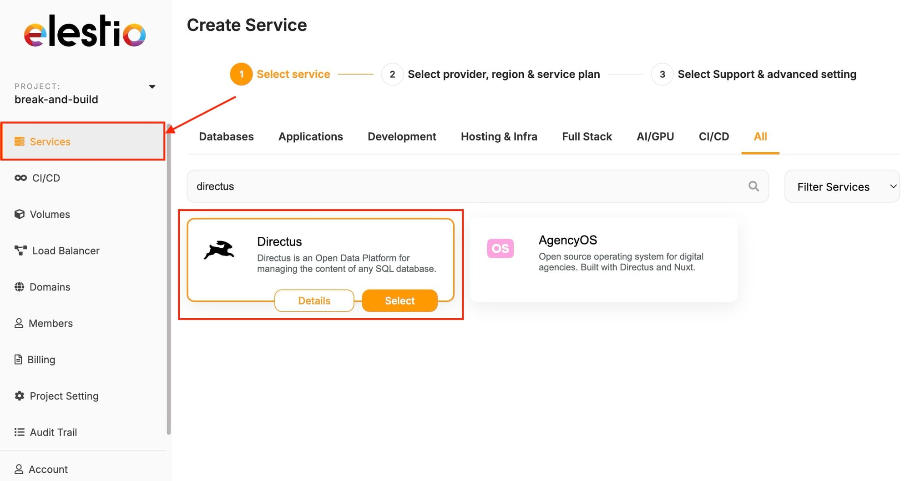

[Directus](https://elest.io/open-source/directus?ref=blog.elest.io) is an open\-source headless CMS that allows you to manage your data effectively while keeping your existing database schema intact. If you've deployed Directus on Elestio as a self\-hosted solution, you can easily import your existing database into this environment. This guide will walk you through the process of importing an existing SQL database into your Directus instance hosted on Elestio.

## **Installing \& Configuring Directus**

To begin, you'll need to set up your Directus instance on Elestio if you haven't already. First, log in to your Elestio dashboard and navigate to the **Services \> Create New Service** section. Select **Directus** from the list of available services. Configure your deployment settings, including domain name, resource allocation, and database options. After completing the deployment process, Elestio will automatically set up Directus for you. Once your deployment is complete, you can access the Directus admin interface via the domain or IP address provided by Elestio. Log in using the admin credentials set during the deployment process.

## Export and Import Your Database

### Exporting Database

Before importing your database into Directus, it's important to prepare it properly. Start by exporting your existing database using a database management tool like Sequel Pro, TablePlus, or `mysqldump` MySQL. For example, you can use the following command to export your database: 


```
mysqldump -u username -p database_name > database_export.sql
```
 Make sure that the exported SQL file is accessible from your Directus server on Elestio. Additionally, verify that your database is compatible with Directus by ensuring all tables have primary keys, data types are supported, and relationships are correctly defined.

### Importing Database

Now that your database is prepared, you can proceed to import it into your Directus instance. Start by accessing the Elestio server via **SSH** using the credentials provided by Elestio. Navigate to the directory where you want to store your SQL file or transfer the SQL file to the server. 

Then, use the following command to import your SQL file into the Directus database: 


```
mysql -u directus_user -p directus_db_name < /path/to/database_export.sql
```
 Replacing `directus_user`, `directus_db_name`, and `/path/to/database_export.sql` with your specific details. Once the import is complete, Directus will automatically recognize the new tables. Log in to the Directus admin interface, navigate to the Data Model section, and sync your database to ensure all tables are correctly mapped.

## **Post\-Import Configuration**

After importing your database, you'll need to configure Directus to work with your data. If your data includes references to users or files, update them to match Directus’s UUID format. For example, you can use an SQL query to update user references like this: 


```
UPDATE your_table SET user_created_id = (SELECT id FROM directus_users WHERE email = your_table.user_created_email);
```
 In the Directus admin interface, configure the collections, interfaces, and fields to suit your needs. This includes setting up appropriate field types, interfaces, and display options. Additionally, you should navigate to the **Roles \& Permissions** section to define access controls for your data. Ensure that roles are configured to protect your data while allowing the necessary access. Finally, perform various operations within Directus to ensure everything is functioning correctly. Test CRUD (Create, Read, Update, Delete) operations and API responses to verify that the data is being handled as expected.

## **Troubleshooting**

If you encounter any issues during the import process, check the logs available in your Elestio dashboard for any errors related to the Directus instance. You can also access Directus logs through the admin interface or via SSH to diagnose issues. Make sure that the Directus version on Elestio is compatible with your database structure. Common issues can be the format of dump/export files.

## **Thanks for reading ❤️**

By following these steps, you can ensure the transition, enabling you to take full advantage of Directus's capabilities while benefiting from the robust hosting environment provided by Elestio. Directus on Elestio offers the flexibility and control you need. For more detailed guidance, be sure to explore the official [Directus documentation](https://docs.directus.io/?ref=blog.elest.io). Ready to enhance your project? Click below to start with Directus on Elestio. See you in the next one! 👋


[](https://elest.io/open-source/directus?ref=blog.elest.io)


