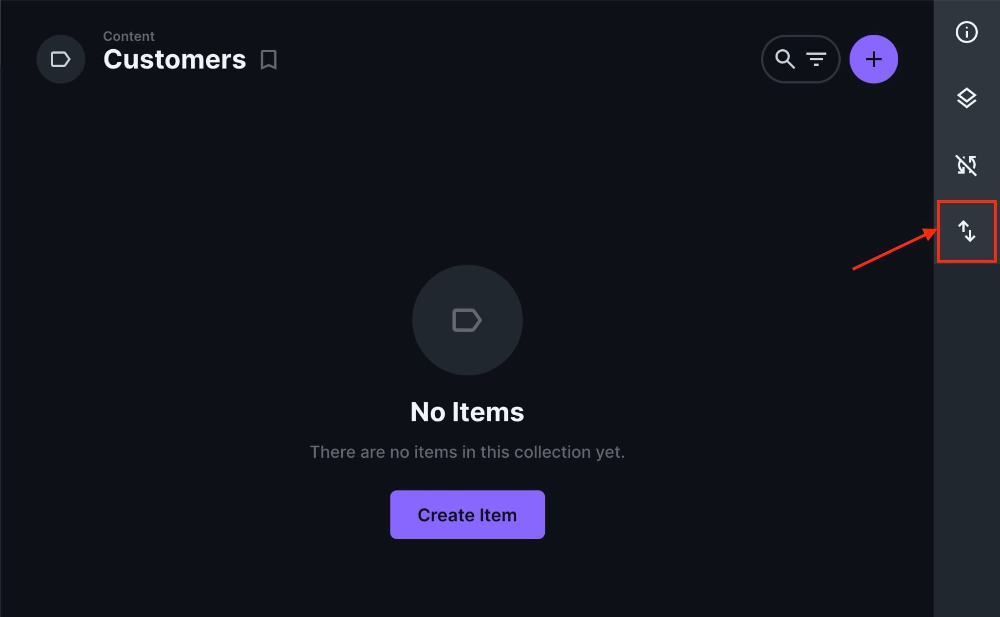

If you have existing projects with data that you want to manage within [Directus](https://elest.io/open-source/directus?ref=blog.elest.io), this guide will walk you through the process of importing those projects into Directus. This can be especially useful for consolidating various data sources into a single, manageable interface, or for migrating from another CMS to Directus.

## What is Directus

Directus is an open\-source data platform that allows you to manage content and assets using a headless CMS approach. It provides an API and an admin app, making creating, managing, and distributing your data easily across various platforms. With Directus, you can extend its capabilities by installing extensions, adding new features, improving functionality, or customising the system to meet your specific needs.

## Preparing Your Data

Before you can import your existing project into Directus, you need to ensure that your data is properly formatted and ready for import. Directus supports various data types and relationships, so it's important to map your existing data to these formats.

1. **Data Structure**: Ensure your data structure aligns with Directus collections and fields. Collections in Directus are analogous to database tables, and fields are similar to table columns.
2. **Data Types**: Verify that your data types (e.g., text, integer, date, etc.) match the types supported by Directus fields.
3. **Relationships**: Identify and map any relationships between your data entities. Directus supports one\-to\-one, one\-to\-many, and many\-to\-many relationships.

## Steps to Import Your Project

### Set Up Directus

First, you need to set up a Directus service running on Elestio. This managed service simplifies the process of hosting and scaling Directus, allowing you to focus on content management without worrying about infrastructure. Begin by signing up on Elestio's website and creating a new Directus service. You'll configure your service by selecting an appropriate plan, setting necessary environment variables, and connecting to a database, either managed by Elestio or external. Once deployed, Elestio provides a URL to access your Directus admin panel, where you complete the initial setup, configure security settings, and set up regular backups.

### Create Collections and Fields

Once your Directus instance is running, create collections and fields that correspond to your existing data structure.

* **Collections**: Navigate to the Collections page in the Directus admin app and create new collections for each of your data entities. Collections are the core structure in Directus where you define the types of content you want to manage. For each collection, you can specify fields and their types, such as text, number, date, file, or relational fields that link to other collections. Carefully design your collections to mirror the structure of your existing project data.
* **Fields**: For each collection, define the necessary fields that match the structure and types of your existing data. In the Directus admin app, navigate to the specific collection you created and start adding fields. These fields will represent the individual pieces of data that make up each entry in the collection.

### Prepare Data for Import

Export your existing data into a format that Directus can import, such as CSV or JSON. Ensure that your data files are correctly formatted and that field names match those in your Directus collections. Start by extracting your data from the original source, whether it's a database, another CMS, or a spreadsheet. Clean the data to remove any inconsistencies or errors. It's crucial to match the field names and data types with those defined in your Directus collections to facilitate a smooth import process.

### Import Data into Directus

Directus provides a straightforward import feature that allows you to upload your data files and map them to the corresponding collections and fields.

* **Navigate to Import Tool**: In the Directus admin app, go to the Import/Export section. This section allows you to efficiently manage the transfer of data into and out of your Directus instance.

* **Upload Data Files**: When importing data, select the appropriate collection for the data you are uploading to ensure it maps correctly. Directus supports various formats such as CSV and JSON, making it versatile for different data sources.

* **Map Fields**: During the import process, you can preview the data to verify that it matches your collection structure and make adjustments as needed. This feature also provides options to handle duplicates, such as updating existing records or skipping them, ensuring data integrity.
* **Import Data**: Initiate the import process. Directus will validate and import your data into the specified collections.

### Verify Imported Data

After the import process is complete, verify that your data has been imported correctly. Check the collections in the Directus admin app to ensure that all records and relationships are accurately represented.

💡If you have additional data that you want to import and aren't able to find import options on directus then you can export your database and import it into your database service from Elestio Dashboard.## **Thanks for reading ❤️**

By following these steps, you can import existing projects into Directus, using content management capabilities to unify and organize your data efficiently. This process not only helps data migration but also enhances your ability to manage content across different sources within a single platform. Thank you for reading, and be sure to explore Elestio's resources and the [Directus documentation](https://docs.directus.io/?ref=blog.elest.io) for more detailed guidance and advanced features. Click the button below to start your Directus service on [Elestio](https://elest.io/open-source/directus?ref=blog.elest.io). See you in the next one! 👋

