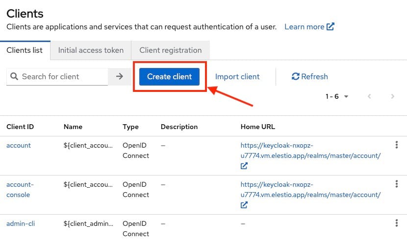

In this blog, we will implement Single Sign\-On (SSO) authentication with Keycloak. During this tutorial, we will take an example of SSO between Keycloak and Google Workspace accounts. You can also choose the cloud identity of your choice to get started. Before we start, make sure you have deployed Keycloak, we will be self\-hosting it on [OctaByte](https://octabyte.io/development/identity-and-access-management/keycloak).

## What is Keycloak?

Keycloak is an open\-source Identity and Access Management solution developed by Red Hat. It provides robust authentication, authorization, and single sign\-on capabilities for web applications, mobile apps, and services. With Keycloak, organizations can centrally manage user identities, enforce security policies, and facilitate resource access across various platforms and environments.

## Introduction to Single Sign\-On (SSO)

Single Sign\-On (SSO) is an authentication mechanism that enables users to log in once and gain access to multiple applications and services without having to re\-enter their credentials for each one. With SSO, users authenticate themselves through a centralized identity provider (IdP), which then issues security tokens or session cookies that grant access to affiliated applications. This authentication experience improves user convenience, reduces the risk of password fatigue, and simplifies organisation identity management.

## Creating a Client

Once logged in to Keycloak, create or switch to your preferred realm and head over to the **Clients** section from the left side panel and click on **Create Client** to create a new client. 

We will be using SAML federation for setup here so we will set client type as **SAML**, client id becomes **google.com** and name can be anything of your choice like I have given here as **Google Cloud**.

In the next step add **https://www.google.com/\*** as valid redirect URIs. You can add multiple URIs.

Now we will be configuring additional settings for **google.com**. Select **email** from the dropdown for **Force Name ID format** and toggle it **on**.

Next, under signature and encryption section toggle **off** the **Sign documents** option and toggle **on Sign assertions**.

Now head over to the Keys section and turn **off** the **Client Signature required** settings. This step is optional and you can choose to validate the keys and move ahead. For the simplicity of this article we are going to keep it off.

## Exporting Signing Certificate

Keycloak after authenticating a user passes SAML assertion to Cloud Identity and to enable it to verify the authenticity of that assertion, Keycloak signs the assertion with unique token\-signing key that then provides the certificate that enables cloud identity to check the signature.

To view the certificate, head over to the **Realm Settings** and then go to the **Keys** tab. You will see a row **Algorithm: RS256** and **Use: SIG** and select **Certificate.** A pop up will appear with your certificate content. Now copy this certificate content safely to a notepad or text editor.

## Converting Signing Certificate

Open your notepad or text editor and paste the following at the begining of the certificate followed by new line


```
-----BEGIN CERTIFICATE-----
```
and in the end add the following line


```
-----END CERTIFICATE-----
```
It should look something like the following


```
-----BEGIN CERTIFICATE----- 

MIICmzCCAYMCBgF7v8/V1TANBgkq... 

-----END CERTIFICATE-----
```
## Configuring Cloud Identity

⚠️Make sure you replace \<KEYCLOAK\> and \<REALM\> with appropriate values1. Open [Admin Console](https://admin.google.com/?ref=blog.octabyte.io) and log in as a super\-admin user.
2. Head over to **Security \> Authentication \> SSO with third\-party IdP**
3. Now **Add SSO Profile** and **Setup SSO with third party identiy provider** to **enabled.**
4. Configure the following settings
	1. **Sign\-in page URL :** https://*\<KEYCLOAK\>*/realms/*\<REALM\>*/protocol/saml
	2. **Sign\-out page URL :** https://*\<KEYCLOAK\>*/realms/*\<REALM\>*/protocol/openid\-connect/logout
	3. **Use a domain specific issuer:** clear
	4. **Change the password URL :** https://*\<KEYCLOAK\>*/realms/*\<REALM\>*/account
5. Under **Verification certificate**, click on **Upload Certificate**, and then select the certificate you downloaded previously
6. Click **Save** to save the configurations

## **Thanks for reading ❤️**

Thank you so much for reading and do check out the OctaByte resources and Official Keycloak documentation to learn more about the Keycloak. You can click the button below to create your service on [OctaByte](https://octabyte.io/development/identity-and-access-management/keycloak) and implement this SSO authentication method. See you in the next one👋

[](https://octabyte.io/development/identity-and-access-management/keycloak)

