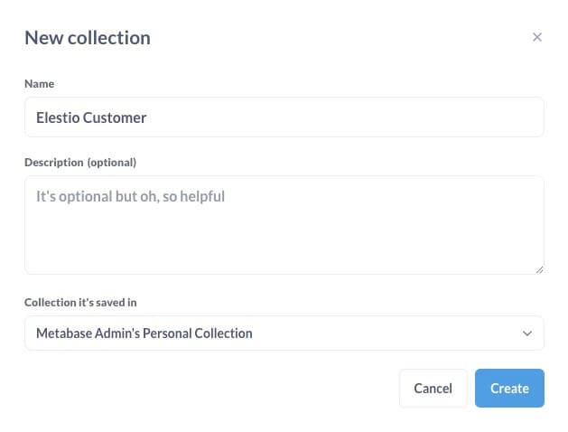

Let's see how you can build a BI Dashboard with [Metabase](https://elest.io/open-source/metabase?ref=blog.elest.io). During this tutorial, we will be creating a BI dashboard to analyse the provided data and visualize it in a dashboard. We are going to create this application from scratch. Before we start, make sure you have deployed Metabase, we will be self\-hosting it on [Elestio](https://elest.io/open-source/metabase?ref=blog.elest.io).

## What is Metabase?

Metabase is an open\-source business intelligence (BI) tool that enables users to visualize and analyze data without requiring advanced technical skills. It allows users to create dashboards, run custom queries, and generate reports through a user\-friendly interface. Metabase connects to various databases and data sources, providing interactive visualizations and easy\-to\-understand insights.

## Creating Collection

Collection is a way to organize and manage related questions, dashboards, and other data\-related objects. Collections function like folders, allowing users to group and categorize their analytical content for easier access and collaboration. To create a new collection head over to **New** \> **Collection**. Add a name to your collection, and select the group you want to save your collection into. Optionally add a description to your collection and click on **Create**.

## Creating Model

The next step is to create a model. Model is a curated representation of your data designed to make data exploration and analysis easier. Models abstract the underlying complexities of the database schema, providing a simplified view with meaningful names, descriptions, and categorizations for tables and fields. To create a model click on **New** \> **Model** and then click on **Use the notebook editor**. 

for this tutorial, we will use the already provided dataset model called **Feedback** add the filters and summarization matric if needed and click on the **Run** button to get the data into the model.

## Creating Dashboard

The dashboard is a visual interface that aggregates and displays multiple data visualizations, metrics, and interactive elements in one place, providing a comprehensive overview of key information and insights. Dashboards allow users to monitor and analyze performance, trends, and other critical data points at a glance. To create a new dashboard, click on **New** \> **Dashboard.** Add a name to your dashboard, add an optional description and choose the collection you want to build your dashboard upon.

## Data Visualization Components

Apart from the Usual dashboard, you can choose to create visualised graphs on your data. Head over to **New** \> **Question**, select the data source as the feedback model and choose the basic matrics from the dropdown like below or provide **Custom Expression.**

Now click on **Visualize** to start the visualization based on the parameter you provided.

For example, if the **Summerize** pattern was the **Standard deviation of Rating** then the visualized answer is **0\.81\.** To change the type of visualization from charts to graphs, click on the **Visualization** button on the left bottom section as shown below.

Here we have selected the Gauge type. Click on the **Save** button to save the chart. Once done you will be prompted with a pop\-up to add the created chart to your dashboard, you can choose to directly add it from here or do it manually afterwards.

## Adding To Dashboard

You can add your visualizations and data to the dashboard by clicking on the "**\+**" button in the dashboard navigation bar. You can add multiple such charts and create different layouts according to your preference.

And done! You have successfully created a BI dashboard for customer feedback. you can create such dashboards consisting of different data sources, and visualizations fitting your business need. 

## **Thanks for reading ❤️**

Thank you so much for reading and do check out the Elestio resources and Official [Metabase documentation](https://www.metabase.com/docs/latest/?ref=blog.elest.io) to learn more about Metabase. You can click the button below to create your service on [Elestio](https://elest.io/open-source/metabase?ref=blog.elest.io) and build your BI dashboards. See you in the next one👋

