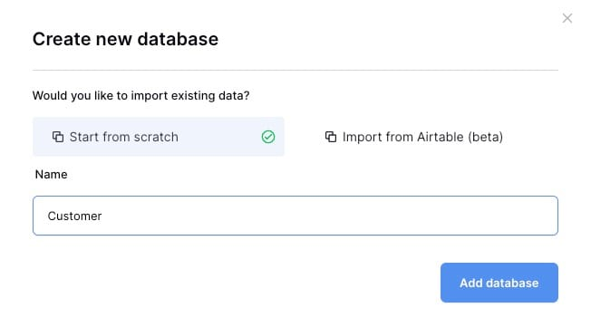

Let's see how you can build a Customer Support Dashboard with [Baserow](https://octabyte.io/open-source/baserow?ref=blog.octabyte.io). During this tutorial, we will be creating a database and application which returns the particular record once the button is created. We are going to create this application from scratch. Before we start, ensure you have deployed Baserow, we will be self\-hosting it on [OctaByte](https://octabyte.io/open-source/baserow?ref=blog.octabyte.io).

## What is Baserow?

  
Baserow is an open\-source, no\-code database platform that allows users to create, manage, and collaborate on databases through a web interface. It offers customizable tables and fields, real\-time collaboration, and integration with other tools, making it a powerful alternative to traditional spreadsheets. Baserow can be self\-hosted, giving users full control over their data, and supports API access for custom applications.

## Creating New Database

  
In Baserow, a database is a structured collection of data organized into tables, much like in traditional relational database management systems. Each database in Baserow can contain multiple tables, where each table consists of rows (records) and columns (fields). To create a new database click on **Create New** \> **Database**. Add the name for your database and click on the **Add database** button.

For this tutorial, we are going to create a sample customer base. We have 3 main entities in the database **Name**, **Company**, **Subscribed**. We will use data from this database moving ahead with our web application. The data we are providing has **Name** in string format, **Company** in string format, and **Subscribed** in multiple\-choice format.

## Creating New Application

Next, we are going to create a new application. To create a new application click on **Create New** \>  **Application.** Add a name to your application and click on **Add application**.

Once you are in the dashboard click on **Data** and add the data source **List rows**, **Local Baserow**

**Database:** Customer

**Table**: Table

**View:** Grid

Now inside the application interface, click on "**\+**" and Select the **Button** component. You can choose different components based on the type of application you want to build, but for the simplicity of this application, we will create an application that shows a notification with data once the button is clicked.

Once the button is added, head over to **Events** and choose 

**On click**: Show Notification 

**Title:** `Data source > Data source > 0 > Name`

**Description** **:** `Data source > Data source > 0 > Subscribed > [All] > value`

## Testing Application

Head over to the preview section or publish it if you wish. To test the working of the application, click on the button and a pop\-up notification with the first **Name** in the database with the **Subscribed** status.

And done! You have successfully created a simple customer support dashboard using Baserow's database and application features. You can create more complex, interactive and visually appealing dashboards using different components provided by Baserow

## **Thanks for reading ❤️**

Thank you so much for reading and do check out the OctaByte resources and Official [Baserow documentation](https://baserow.io/docs/index?ref=blog.octabyte.io) to learn more about Baserow. You can click the button below to create your service on [OctaByte](https://octabyte.io/open-source/baserow?ref=blog.octabyte.io) and build your customer support dashboards. See you in the next one👋

