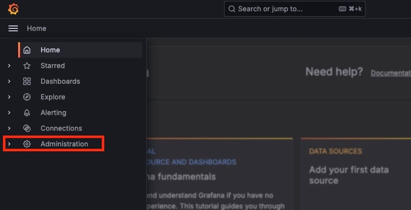

We will explore how to manage users in [Grafana](https://elest.io/open-source/grafana?ref=blog.elest.io). Whether you are an admin or just someone looking to understand user management in Grafana, this guide will help you. We will cover how to add local users, organize them into teams, and ensure they have access only to the resources they need. Managing users and teams effectively is crucial for maintaining security and organization within your Grafana instance.

## Types Of Users

In Grafana, each user is assigned an organization role that dictates what resources they can access. There are three main types of roles:

1. **Grafana Admin**: This is a global role that allows the user to manage organizations, and users, and view server\-wide settings. It provides the highest level of access and is assigned to users responsible for overall Grafana administration.
2. **Organization Administrator**: Users with this role can manage data sources, teams, and other users within their organization. This role is suitable for department heads or team leads.
3. **Editor**: Editors can create and edit dashboards. This role is intended for users who need to build and modify visualizations and reports.
4. **Viewer**: Viewers can only view dashboards and cannot make any changes. This role is ideal for users who need to access information without altering the data.

Grafana also allows for anonymous access, making dashboards available to those without a Grafana user account. For instance, Grafana Labs' [play.grafana.org](https://play.grafana.org/?ref=blog.elest.io) is publicly accessible this way. This feature can be useful for sharing dashboards with external stakeholders without requiring them to log in.

## Adding Users:

* **Log in** as a user with the Server Admin role and ensure you have the necessary permissions to add new users.
* On the sidebar, click the **Administration**. This will take you to the Admin panel where you can manage users.

* After this click on **Users and Access** and this will take you to the dashboard to configure and access different users, teams and service accounts.

* Choose **Users** from the menu, then click **New User**. This will open a form for adding a new user.

* Enter the **Name, Email, Username, and Password** for each user from the table above. Fill in the details for each new user as provided in the table.

* Click **Create User** to create the account and this will add the new user to Grafana.

By default, new users are granted the viewer role, which means they can't change resources. We will adjust their permissions by adding them to teams.

## Creating Teams:

* In the sidebar, hover over **Administration \> Users and Access \> Teams.** This will take you to the Teams management page.

* Click **New Team** and this will open a form to create a new team.

* Enter the team's name and click **Create.** Name your team appropriately based on the department and provide an optional email to allow custom team avatars.

* Click **Teams** at the top of the page to return and create the second team. Repeat the process to create the second team.

## Adding Users to Teams:

* Click the **Team** name to add members to that team. Navigate to the team you want to add members to.
* Click **Add Member,** This will open a dialogue to add team members.
* In the **Add Member** box, select the user you want to add from the drop\-down menu. Choose the user from the list.
* Now select the role you want to assign to the user being added to the team.
* Click **Save** and this will add the user to the team.

Repeat these steps for each user to assign them to their respective teams. By the end, you will have two teams with two users each. This setup allows for efficient permissions management and ensures that users can access the resources they need.

## **Thanks for reading ❤️**

By organizing users into teams and assigning appropriate roles, you can ensure that each user has the access they need while maintaining control over your resources. This tutorial has walked you through the process of adding users, creating teams, and managing permissions, setting you up for efficient user management in Grafana. Thank you so much for reading and do check out the Elestio resources and Official [Grafana documentation](https://grafana.com/docs/grafana/latest/?ref=blog.elest.io) to learn more about Grafana. You can click the button below to create your service on [Elestio](https://elest.io/open-source/grafana?ref=blog.elest.io). See you in the next one👋

