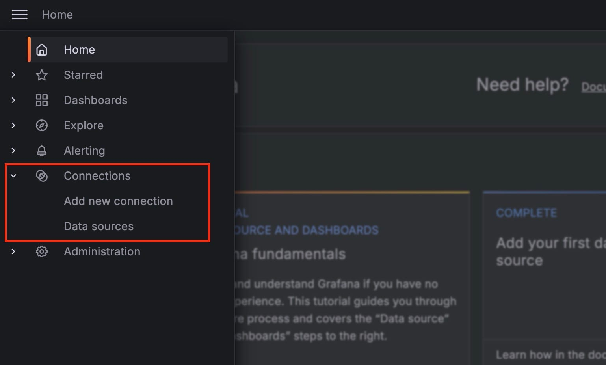

Configuring a [MySQL](https://octabyte.io/open-source/mysql?ref=blog.octabyte.io) data source in [Grafana](https://octabyte.io/open-source/grafana?ref=blog.octabyte.io) allows you to use Grafana's visualization capabilities alongside MySQL's data management features. This guide will provide detailed steps to help you set up and configure the MySQL data source in Grafana. For this tutorial, we will be using Grafana and MySQL services hosted over OctaByte.

## Accessing the Data Source Configuration Page

Once you log in with the credentials provided on the OctaByte dashboard. Begin by clicking on the **Connections** option in the left\-side menu of your Grafana dashboard. This will navigate you to the area where you can manage and configure your **data sources**. Here, you will find a list of all existing data connections within your Grafana instance, allowing you to easily add, modify, or remove data sources as needed. This management interface ensures that all your data integrations are organized and accessible from one convenient location, streamlining the process of connecting Grafana to your MySQL database.

Under the drop\-down under the **Connections** section, click on **Data Sources**. This section lists all the data sources currently configured in your Grafana instance. Search and click on the **MySQL** data source from the search results. This action opens the configuration page for the MySQL data source.

## Configuring Basic Settings

Once you are on the Settings tab of the MySQL data source, you need to configure several basic settings to connect Grafana to your MySQL database. We have already deployed MySQL service on [OctaByte](https://octabyte.io/open-source/mysql?ref=blog.octabyte.io) and will be taking information from the dashboard to configure during the following steps:

* **Data Source Name**: Enter a unique and descriptive name for your data source in the **Name** field. This helps easily identify the data source within Grafana, especially if multiple data sources are configured.
* **MySQL Server**: In the **Host** field, enter the hostname or IP address of your MySQL server. Ensure that this address is reachable from the Grafana server.
* **Database Name**: Specify the database name you want to connect to in the **Database** field. This tells Grafana which specific database to query.
* **User Credentials**: Enter the **username** and **password** required to access your MySQL database. These credentials should have the necessary permissions to read from the database.
* **Port**: By default, MySQL runs on port **`24306`**. If your MySQL server uses a different port, enter it in the **Port** field.
* **SSL Configuration**: If your MySQL server requires SSL for connections, configure the SSL settings appropriately. You can enable SSL and provide the necessary certificates and keys to secure the connection.
* **Additional Connection Options**: Grafana allows you to specify additional options for the MySQL connection. You can add these options in the **Extra Connection Parameters** field. This is useful for setting timeouts, character sets, and other connection\-specific parameters.

Click the **Save \& Test** button at the bottom of the configuration page. Grafana will attempt to connect to the MySQL database using the provided details. If the connection is successful, you will see a confirmation message.

## Utilizing the MySQL Data Source

With the MySQL data source configured, you can now start creating dashboards and visualizations:

1. **Create a Dashboard**: Go to the **Dashboards** menu and create a new dashboard. Add a new panel and select your MySQL data source from the data source dropdown.
2. **Query Builder**: Use Grafana’s query builder to construct SQL queries against your MySQL database. You can write custom SQL queries or use the visual query builder to fetch data for your visualizations.
3. **Visualization Options**: Customize your visualizations using Grafana’s wide range of options. Choose from different graph types, apply filters, and set up dynamic dashboards that update in real time.

## **Thanks for reading ❤️**

This tutorial has walked you through the detailed steps of accessing the data source configuration, setting up basic configuration options, and utilizing the MySQL data source in Grafana. By following these steps, you can now create dynamic and informative dashboards. Thank you for reading, and be sure to check out additional resources and the official [Grafana documentation](https://grafana.com/docs/grafana/latest/?ref=blog.octabyte.io) to learn more. Click the button below to get started with your service on [OctaByte](https://octabyte.io/open-source/grafana?ref=blog.octabyte.io). See you in the next one 👋

