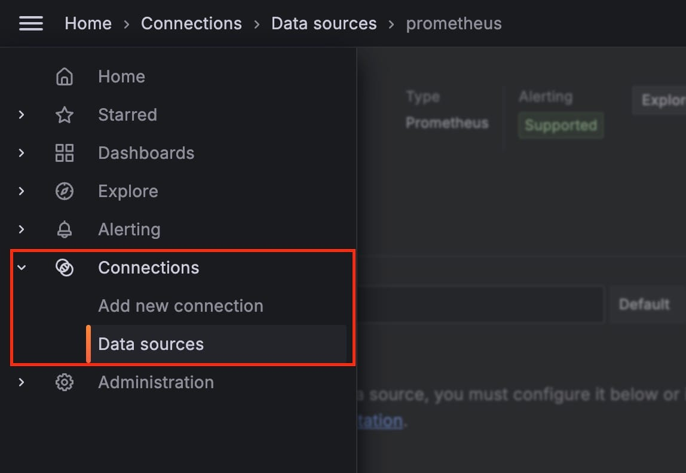

Configuring a [Prometheus](https://octabyte.io/hosting-and-infrastructure/monitoring/prometheus) data source in [Grafana](https://octabyte.io/hosting-and-infrastructure/monitoring/grafana) allows you to use Grafana's visualization capabilities with Prometheus' monitoring and alerting features. This guide will provide detailed steps to help you set up and configure the Prometheus data source in Grafana. For this tutorial, we will be using Grafana and Prometheus services hosted on OctaByte.

## Adding Prometheus as a Data Source

Once you log in with the credentials provided on the OctaByte dashboard, begin by clicking on the **Connections** option in the left\-side menu of your Grafana dashboard. 

This will navigate you to the area where you can manage and configure your **data sources**. Here, you will find a list of all existing data connections within your Grafana instance, allowing you to easily add, modify, or remove data sources as needed. This management interface ensures that all your data integrations are organized and accessible from one convenient location.

Under the drop\-down under the **Connections** section, click on **Add new connection**. In the search bar, enter **Prometheus** and select it from the search results. This action opens the configuration page for the Prometheus data source.

## Configuring Basic Settings

Once you are on the **Settings** tab of the Prometheus data source, you need to configure several basic settings to connect Grafana to your Prometheus server. Follow these steps:

* Enter a unique and descriptive name for your data source in the Name field. This helps easily identify the data source within Grafana, especially if multiple data sources are configured. Examples: `prometheus-1`, `prom-metrics`.
* Toggle to select this data source as the default for your dashboard panels. When you go to a dashboard panel, this will be the default selected data source.
* Now, Enter the URL of your Prometheus server. If your Prometheus server is local, use `http://localhost:9090`. Since we have hosted our Prometheus server on OctaByte we will be using the hostname and other information provided on the dashboard. Eg: `https://prometheus-u2twa-u7774.vm.elestio.app:443`
* Select the authentication type as **Basic authentication** and add the **User** and **Password** provided on the OctaByte dashboard under Prometheus service.

Click the **Save \& Test** button at the bottom of the configuration page. Grafana will attempt to connect to the Prometheus server using the provided details. If the connection is successful, you will see a confirmation message.

## Utilizing the Prometheus Data Source

With the Prometheus data source configured, you can now start creating dashboards and visualizations:

1. **Create a Dashboard**: Go to the Dashboards menu and create a new dashboard. Add a new panel and select your Prometheus data source from the data source dropdown.
2. **Query Builder**: Use Grafana’s query builder to construct queries against your Prometheus server. You can write custom PromQL queries or use the visual query builder to fetch data for your visualizations.
3. **Visualization Options**: Customize your visualizations using Grafana’s wide range of options. Choose from different graph types, apply filters, and set up dynamic dashboards that update in real time.

## **Thanks for reading ❤️**

This tutorial has walked you through the detailed steps of accessing the data source configuration, setting up basic configuration options, and utilizing the Prometheus data source in Grafana. By following these steps, you can now create dynamic and informative dashboards. Thank you for reading, and be sure to check out additional resources and the official [Grafana documentation](https://grafana.com/docs/grafana/latest/?ref=blog.octabyte.io) to learn more. Click the button below to get started with your service on [OctaByte](https://octabyte.io/hosting-and-infrastructure/monitoring/grafana). See you in the next one! 👋

