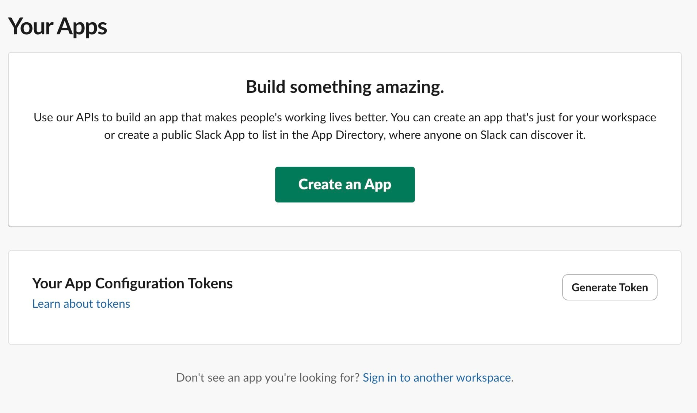

In this tutorial, we will explore how to configure Slack and email for alert notifications in [Grafana](https://octabyte.io/hosting-and-infrastructure/monitoring/grafana). We will cover how to integrate Slack using an API token or a Webhook URL and set up email notifications to ensure you receive alerts promptly. Properly configuring alert notifications is essential for maintaining a responsive and well\-monitored Grafana instance.

## Configuring Slack

There are two primary methods for integrating Slack with Grafana: using a [Slack API token](https://api.slack.com/authentication/token-types?ref=blog.octabyte.io) or a [Webhook URL](https://api.slack.com/messaging/webhooks?ref=blog.octabyte.io). Each method has distinct advantages and is suited for different use cases. For this tutorial, we will be using Slack API token.

### Creating a Slack App and Requesting Scopes

To start, create a Slack app by visiting the apps page and selecting the [Go to Your Apps](https://api.slack.com/apps?ref=blog.octabyte.io) button. On the **Your Apps** page, choose **Create an App.**

Then click on **From scratch,** enter a name for your app, such as **OctaByte Grafana Demo** and select the workspace where you will be developing your app. You can distribute your app to other workspaces later if needed. Click **Create App** to finalize the process. 

If you need to update your app's name later, you can do so from the Home tab under **Basic Information**. Note that this change will update the bot name, which is the name that appears when the app performs actions like posting in a channel or sending direct messages.

After creating your app, the next step is to request the necessary scopes, which give your app permission to perform specific actions within your workspace. By default, Slack apps cannot post to public channels. They need explicit permission through scopes. Request the `chat:write.public` scope to enable your app to post in all public channels without joining them. 

To request scopes, navigate to **OAuth \& Permissions** and scroll down to the **Scopes** section. Under **Auth Tokens** click on **Install to Workspace**. 

Once installed copy the **Bot User OAuth Token** to a safe place. Additionally, head over to your Slack workplace, right\-click on the channel you want to get alerts on, click View Channel Details, **View Channel Details** and scroll down to find **Channel ID**. Copy this ID as it will be required in the next steps.

To allow your app to access public Slack channels, add the `channels:read` scope. By configuring these scopes, your app will have the necessary permissions to interact effectively within your Slack workspace.

### Configuring Grafana for Slack Notifications

To set up Slack notifications in Grafana, navigate to **Alerts** \-\> **Alerting** \-\> **Contact points**. Click **\+ Add Contact Point** and name to your contact point, and choose **Slack** from the Integration list.

* For API token integration: Enter the copied Channel ID in the **Recipient field** and the Bot User OAuth Token in the **Token field**.
* For Webhook URL integration: Paste the Webhook URL into the Webhook field.

**Test** the integration to confirm its functionality and then save the contact point.

## Configuring Email

In addition to Slack, you can configure email as a contact point in Grafana to ensure that you receive alerts via email as well. Follow these steps to set up email notifications:

* **Navigate to Contact Points**: Go to Alerts \& IRM \-\> Alerting \-\> Contact points in Grafana.

* **Add a Contact Point**: Click on "\+ Add contact point."

* **Name Your Contact Point**: Enter a name for the contact point, such as **OctaByte Trial Mail**.

* **Configure Email Settings**:
* **Addresses**: Enter the email addresses where you want to receive alerts. You can add multiple addresses separated by commas.
* **Subject**: Define a subject template for the email notifications.
* **Body**: Customize the body of the email to include relevant alert information.
* **Test the Integration**: Click the Test button to ensure the email configuration is working correctly.

## Assigning the Contact Point to Alerts

Once the Slack contact point is configured, it needs to be added to your alert rules. Go to **Alerting** \-\> **Alert rules** in Grafana. Click on the **New alert rule** to head over to the alert rule.

Edit or create a new alert rule, and navigate to the **Configure labels and notifications** section. Under **Notifications**, select the contact point you created from the drop\-down menu, save the rule, and exit. This step is similar for both Slack and Email integrations.

## **Thanks for reading ❤️**

Setting up both Slack and email as contact points in Grafana ensures you have robust and reliable alert notifications. By following the steps outlined, you can configure these integrations to keep you informed of any critical alerts, whether through Slack messages or email notifications. This multi\-channel approach enhances your monitoring setup, providing greater flexibility and ensuring you never miss important alerts.

