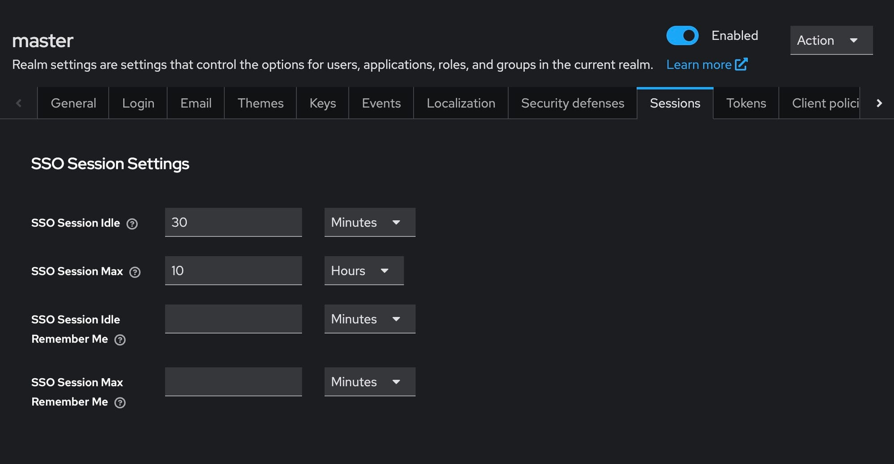

Let's see how to configure sessions on OctaByte using [Keycloak](https://octabyte.io/development/identity-and-access-management/keycloak). We will be using a self\-hosted Keycloak instance deployed on OctaByte. So, to get started head over to [OctaByte Dashboard](https://octabyte.io/development/identity-and-access-management/keycloak) and deploy and login into the Keycloak service to get started.

In this tutorial, we explore the technicalities of Keycloak session and token configuration, emphasizing the importance of session timeouts and optimal settings for effective session management. By understanding and applying the recommended best practices, administrators can create a secure and efficient authentication environment within Keycloak.

### Prerequisites

Ensure that you have Keycloak properly set up in your system. Navigate to the realm settings, where you will find the Sessions and Tokens configurations. The session settings are divided into four categories, but our primary focus will be on "SSO session settings" and "Client session settings." For tokens, we will concentrate on "Refresh tokens" and "Access tokens."

### Client Session Settings

#### 1\. Client Session Idle Timeout

This setting determines the duration a client session can remain inactive before it expires. Once expired, all tokens associated with the client session become invalid. This defaults to the "SSO Session Idle" value if not explicitly set.

#### 2\. Client Session Maximum Lifespan

This defines the maximum duration a client session remains valid after a user logs in. After this period, the tokens associated with the session are invalidated. If this setting is left unset, it defaults to the "SSO Session Max" value.

### SSO Session Settings

#### 1\. SSO Session Idle Timeout

This setting specifies the duration a session can remain idle before it expires. Upon expiration, all tokens and browser sessions are invalidated. A typical recommendation is to set this value to around 30 minutes.

#### 2\. SSO Session Maximum Lifespan

This defines the maximum period a session can remain active. Similar to the idle timeout, tokens and browser sessions are invalidated once this period elapses. It is advisable to set this value between 10 to 24 hours.

### Token Configuration

#### 1\. Refresh Tokens

Administrators can configure the revocation of refresh tokens. It is advisable to enable this option and set the "Refresh Token Max Reuse" to 0, ensuring that tokens cannot be reused beyond their intended lifespan.

#### 2\. Access Tokens

Two critical settings here are "Access Token Lifespan" and "Access Token Lifespan For Implicit Flow." The "Access Token Lifespan" should be set to a value less than or equal to the session idle timeout, while the "Access Token Lifespan For Implicit Flow" dictates the timeframe within which a refresh token can generate new access tokens. It is recommended to keep these values consistent to maintain security.

### Example Configuration

To illustrate, consider the following settings:

* Leave "Client Session Idle" and "Client Session Max" unset.
* Set "SSO Session Idle" to 30 minutes.
* Set "SSO Session Max" to 1 day.
* Set "Access Token Lifespan" to 15 minutes or less.
* Set "Access Token Lifespan For Implicit Flow" to 30 minutes or less.
* Set "Refresh Token Max Reuse" to 0\.

### Best Practices for Session Management

Effective session management in Keycloak relies on two core principles:

1. Access tokens should not outlast their corresponding refresh tokens, ensuring controlled access within the refresh token’s lifespan.
2. Refresh tokens must align with the duration of the Keycloak session, maintaining session integrity and security.

By following these guidelines and configuring session durations appropriately, administrators can establish a secure authentication framework that balances usability with stringent access controls. These practices not only enhance the overall user experience but also safeguard sensitive resources across multiple applications.

## **Thanks for reading ❤️**

Thank you so much for reading and do check out the OctaByte resources and Official [Keycloak documentation](https://www.keycloak.org/documentation?ref=blog.octabyte.io) to learn more about Keycloak. You can click the button below to create your service on [OctaByte](https://octabyte.io/development/identity-and-access-management/keycloak). See you in the next one👋

