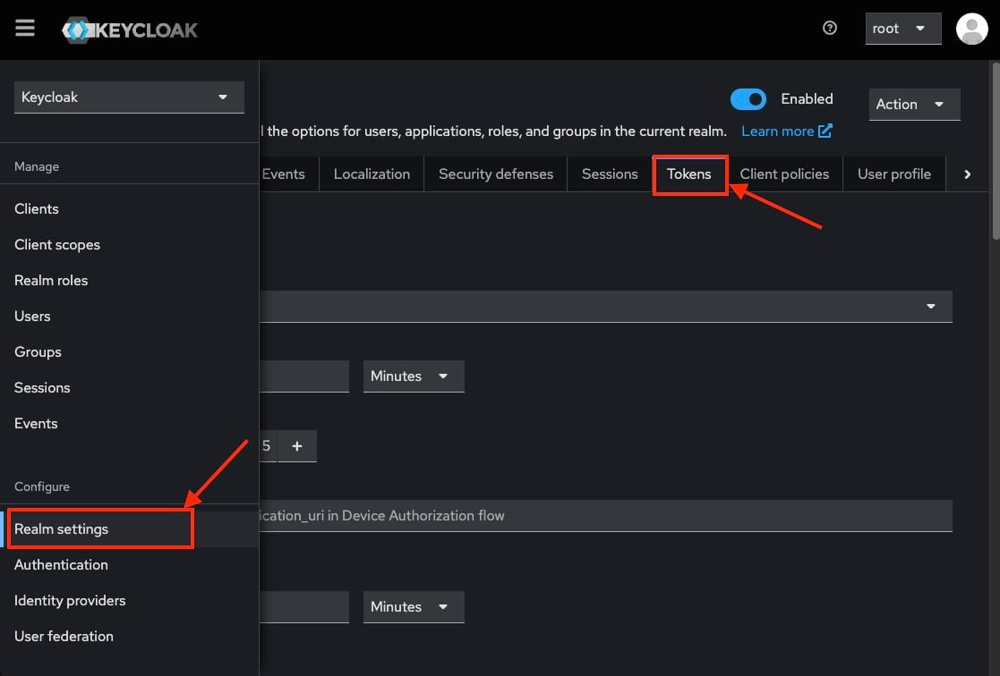

[Keycloak](https://elest.io/open-source/keycloak?ref=blog.elest.io) is an open\-source identity and access management tool that simplifies authentication, authorization, and user management for modern applications. One of the features of Keycloak is token\-based authentication. Tokens, such as access tokens, refresh tokens, and ID tokens, are central to how Keycloak handles user sessions and secure communication between applications. In this blog, we will explore the key concepts of **Keycloak token management**, focusing on token expiration, revocation, and renewal.

## Types of Tokens in Keycloak

Before diving into token management, let’s quickly review the types of tokens that Keycloak issues:

1. **Access Token**: The access token is a key component in token\-based authentication systems like OAuth 2\.0\. It is used to authenticate and authorize API requests on behalf of a user. The token is typically short\-lived for security purposes, meaning it expires after a set amount of time (usually minutes or hours). During its validity, the access token is passed with each API call in the authorization header to grant access to protected resources.
2. **Refresh Token**: A refresh token is used to request a new access token when the original one expires, without requiring the user to log in again. This ensures a seamless user experience, especially in long\-running sessions or applications where users expect to stay logged in for extended periods. Refresh tokens have a longer lifespan than access tokens, often lasting days, weeks, or even months.
3. **ID Token**: The ID token is a specialized type of token mainly used in OpenID Connect (OIDC) flows to convey information about the user. It contains identity claims, such as the user's name, email address, and other profile information. Unlike the access token, which is used to grant access to resources, the ID token's primary purpose is to provide identity information to the client application, confirming the user’s identity after authentication.

## Token Expiration

Token expiration is a critical security feature in Keycloak that defines how long a token remains valid before it is no longer accepted. Each token type has its own specific expiration time, which can be configured based on the needs of your application. The purpose of token expiration is to minimize the risk of unauthorized access by ensuring that compromised or misused tokens can only be used for a limited period. Once a token expires, the user must either log in again or, in some cases, use a refresh token to obtain a new access token. 

### How Expiration Works

* **Access Tokens**: By default, access tokens in Keycloak expire after 5 minutes. Once expired, they cannot be used for authentication or API calls. A user will need to request a new access token using the refresh token or by re\-authenticating.
* **Refresh Tokens**: These tokens have a longer lifespan, typically set to 30 minutes by default. They are used to refresh the access token after it expires. If the refresh token itself expires, the user must log in again to obtain new tokens.
* **ID Tokens**: The expiration for ID tokens depends on the session and is used to maintain user sessions within client applications.

### Configuring Token Expiration in Keycloak

To change token expiration times go to the **Realm Settings** in the Keycloak admin console and navigate to the **Tokens** tab.

If you scroll down you will find a section to enable or disable your refresh tokens.

Upon scrolling furthermore, you will get a section to work with your access tokens. You can change the lifespan of the token, timeouts etc from here.

The next field you will encounter is action tokens. You can configure and set these values according to your personal needs. You can also choose Override action tokens from here.

You can configure custom token expiration settings for each client under **Clients \> \[client name] \> Settings**.

### Best Practices for Expiration

* **Keep access tokens short\-lived** to minimize the risk of misuse if the token is leaked.
* **Refresh tokens should have a moderate expiration time**, giving users a seamless experience while maintaining security.
* **Consider session timeouts** when configuring token expiration, especially for applications that require high security.

## Token Revocation

Keycloak doesn’t track the state of individual tokens directly but instead manages revocation through session states. When a user logs out or an administrator manually invalidates a session, all tokens tied to that particular session are automatically revoked. This approach ensures that tokens linked to an invalid session can no longer be used, preventing unauthorized access. By revoking the entire session, Keycloak streamlines the token management process, enhancing security without needing to monitor each token separately. 

### Token Revocation Mechanism

Keycloak does not keep track of individual token states but manages revocation using session states. When a user logs out or an admin invalidates a session, all tokens associated with that session are automatically revoked.

### Revoking Tokens Manually

1. **User Logout**: When a user logs out, both access and refresh tokens are revoked.
2. **Admin Console**: An admin can manually revoke tokens by going to the **Sessions** tab for a specific user and ending the session.
3. **Token Introspection Endpoint**: Using the Token Introspection API, you can check the validity of a token and revoke it if necessary.

### Best Practices for Revocation

* **Log users out on critical security events** (e.g., password changes, suspicious activity).
* Regularly monitor and manage active sessions to ensure old tokens are revoked.

## Token Renewal

Renewal refers to obtaining a new access token after the current one expires, without forcing the user to re\-authenticate, allowing for a smooth and uninterrupted user experience. This process is essential for applications where users need to maintain continuous access without frequent logins, such as during long browsing sessions or when using mobile apps. Token renewal is done using the refresh token, which is designed to have a longer lifespan than the access token. This approach reduces the need for the user to log in repeatedly while still maintaining security by ensuring that the access token itself is short\-lived. 

### How Token Renewal Works

When an access token expires, the application can use the refresh token to request a new access token. If the refresh token is still valid, a new access token will be issued. If the refresh token has expired, the user will need to log in again.

### Steps for Renewing Tokens

1. **Application Requests a New Token**: The application sends the refresh token to the Keycloak token endpoint.
2. **New Access Token Issued**: If the refresh token is valid, Keycloak issues a new access token and, optionally, a new refresh token.
3. **Refresh Token Expiration**: If the refresh token has expired, the user will be redirected to the login page.

### Best Practices for Token Renewal

* **Monitor refresh token expiration closely** to avoid unexpected logouts.
* **Implement automatic token renewal** in client applications to ensure a seamless user experience.
* **Securely store refresh tokens** to prevent misuse, as they can be used to obtain new access tokens.

## **Thanks for reading ❤️**

Token management is a critical aspect of secure authentication and session handling in Keycloak. By understanding how token expiration, revocation, and renewal work, administrators and developers can ensure their applications are secure while maintaining a smooth user experience. Thank you so much for reading and do check out the Elestio resources and Official [Keycloak documentation](https://www.keycloak.org/documentation?ref=blog.elest.io) to learn more about Keycloak. You can click the button below to create your service on [Elestio](https://elest.io/open-source/keycloak?ref=blog.elest.io). See you in the next one👋

