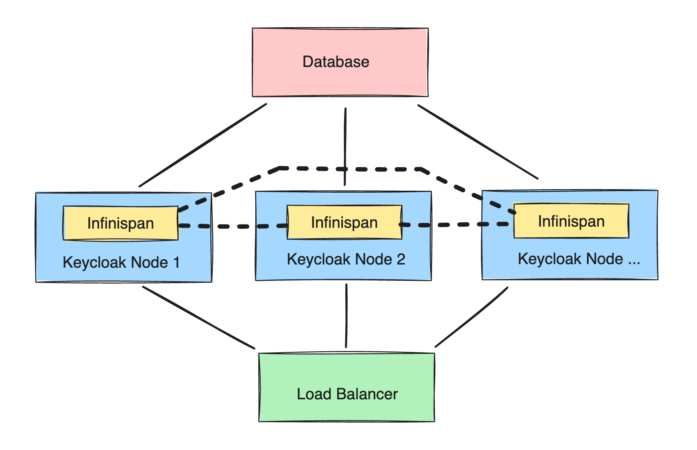

We will be creating a [Keycloak](https://octabyte.io/development/identity-and-access-management/keycloak) cluster using OctaByte. So, to get started head over to [OctaByte Dashboard](https://octabyte.io/development/identity-and-access-management/keycloak) and deploy and login into the Keycloak service to get started.

### Terraform Module for Keycloak Cluster

A comprehensive Terraform module developed by OctaByte significantly simplifies the process of deploying and scaling Keycloak clusters. By leveraging this module, users can streamline their infrastructure setup, ensuring consistency and reliability in their Keycloak deployments. The module is designed to handle the complexities of scaling and maintaining a Keycloak cluster, making it an essential tool for developers and DevOps engineers looking to optimize their authentication and authorization workflows.

#### Why Choose Keycloak?

Keycloak stands out as a premier solution for managing user access across various applications. Its powerful features include single sign\-on (SSO), identity brokering, and user federation, which collectively enhance security and user experience. By integrating Keycloak, organizations can reduce development time, as they no longer need to build authentication systems from scratch. Additionally, Keycloak supports a wide range of authentication protocols like OAuth2, OpenID Connect, and SAML, making it versatile for different use cases. The robust security features ensure that sensitive user data is protected, meeting compliance requirements and boosting user trust.

#### Keycloak Cluster Architecture

In a Keycloak cluster, multiple independent nodes work together using a distributed Infinispan cache to manage user sessions and data efficiently. This architecture allows the cluster to scale horizontally, meaning more nodes can be added to handle increased load without downtime. High availability is another critical feature, as the cluster can continue operating even if some nodes fail. The distributed cache ensures that user sessions are consistently available across all nodes, providing a seamless experience for users regardless of which node they connect to. This architecture is ideal for large\-scale applications that require robust and reliable user management.

#### Terraform Module Design

This Terraform module focuses primarily on deploying Keycloak nodes. It is designed to be used in conjunction with other essential services, such as a load balancer and a database, to create a fully functional Keycloak cluster. While OctaByte offers these services as part of their platform, the module is flexible enough to integrate with other compatible services you might already be using. This flexibility allows you to tailor the deployment to meet specific requirements and infrastructure setups. By using this module, you can automate the deployment process, ensuring that each Keycloak node is configured correctly and consistently.

#### About OctaByte

OctaByte is a comprehensive DevOps platform that simplifies the deployment and management of various services. Their fully managed approach means that you don't have to spend extensive time configuring and maintaining your infrastructure. OctaByte handles crucial aspects like security, DNS management, SMTP configuration, SSL setup, monitoring and alerts, backups, and updates. This allows developers to focus on building and deploying their applications rather than dealing with operational overhead. An OctaByte account is required to use the Terraform module, and the platform offers various services that can be seamlessly integrated into your deployment.

##### Getting Started with OctaByte

1. **Create an account**: Sign up on OctaByte's platform to get started.
2. **Request free credits**: Take advantage of the free credits offered by OctaByte to explore their services.
3. **Explore services**: Browse the growing list of deployable services on OctaByte. If a service you need is missing, you can request its inclusion.

OctaByte's platform is user\-friendly and designed to cater to both novice users and experienced developers. Their support team is available to assist with any questions or issues, ensuring that you can get your services up and running smoothly.

#### Usage

To use this module with your own database and load balancer, you need to configure it appropriately. Below is an example configuration:


```
module "cluster" {
  source = "elestio-examples/keycloak-cluster/elestio"

  project_id        = "12345"
  keycloak_version  = "latest"
  keycloak_password = "MyPassword1234"

  database          = "postgres"
  database_host     = "hostname.example.com"
  database_port     = "5432"
  database_name     = "keycloak"
  database_schema   = "public"
  database_user     = "admin"
  database_password = "password"

  nodes = [
    {
      server_name   = "keycloak-01"
      provider_name = "hetzner"
      datacenter    = "fsn1"
      server_type   = "SMALL-1C-2G"
    },
    {
      server_name   = "keycloak-02"
      provider_name = "hetzner"
      datacenter    = "fsn1"
      server_type   = "SMALL-1C-2G"
    },
  ]

  configuration_ssh_key = {
    username    = "terraform-user"
    public_key  = chomp(file("~/.ssh/id_rsa.pub"))
    private_key = file("~/.ssh/id_rsa")
  }
}

```
This configuration sets up a Keycloak cluster with specified database and node details. By adjusting these parameters, you can customize the deployment to fit your infrastructure needs.

#### Complete Deployment Example

To deploy a complete setup including the database, load balancer, and nodes, follow these steps:

1. **Install Terraform**: Download and install the Terraform client from the official [Terraform website](https://learn.hashicorp.com/tutorials/terraform/install-cli?ref=blog.octabyte.io). This tool will enable you to manage your infrastructure as code, simplifying deployment and scaling processes.
	* Create a new directory for your project.
	* Inside this directory, create the following files: `main.tf`, `terraform.tfvars`, `terraform_rsa`, `terraform_rsa.pub`, and `.gitignore`.
* Populate `main.tf` with your configuration details.
* Add sensitive information like passwords and keys to `terraform.tfvars`.

3. **Generate SSH Key**: This key is required by the module to configure the nodes. Generate a dedicated SSH key pair for secure communication with your servers.

**Apply Configuration**:


```
terraform apply

```
Confirm the deployment when prompted. Terraform will then create and configure the resources as defined in your configuration files. The process will take a few minutes, during which Terraform will set up the infrastructure and deploy the Keycloak nodes.

**Initialize Terraform**:


```
terraform init

```
This command initializes the Terraform configuration, downloading necessary plugins and preparing your workspace.

**Setup Configuration**:


```
.
├── main.tf
├── terraform.tfvars
├── terraform_rsa
├── terraform_rsa.pub
└── .gitignore

```
#### Output Cluster Information

Use the following command to display details about the created resources:


```
terraform show

```
For essential information, use custom outputs. This will give you a concise summary of critical details, such as database access information and node credentials:


```
terraform output database_admin
terraform output nodes_admins
terraform output load_balancer_cname

```
This information is crucial for managing and accessing your deployed services.

#### Verify Deployment

To ensure your deployment is successful, check the logs of the deployed services via the OctaByte dashboard:

1. Navigate to the [OctaByte Dashboard](https://dash.elest.io/?ref=blog.octabyte.io).
2. Select your cluster project.
3. View the logs for each Keycloak service under the "Overview" section.

You should see log entries indicating the proper initialization and joining of nodes in the cluster. Look for specific lines that show the nodes have successfully started and joined the cluster, confirming that the deployment is functioning as expected.

#### Adding a Third Node

To expand your cluster, add additional nodes in the `main.tf` file:


```
nodes = [
  {
    server_name   = "keycloak-01"
    provider_name = "hetzner"
    datacenter    = "fsn1"
    server_type   = "SMALL-1C-2G"
  },
  {
    server_name   = "keycloak-02"
    provider_name = "hetzner"
    datacenter    = "fsn1"
    server_type   = "SMALL-1C-2G"
  },
  {
    server_name   = "keycloak-03"
    provider_name = "hetzner"
    datacenter    = "fsn1"
    server_type   = "SMALL-1C-2G"
  },
]

```
Run `terraform apply` again and confirm the changes. The new node will join the cluster shortly. This process allows you to scale your Keycloak cluster easily, adding capacity as your application's needs grow.

#### Recommendations

* **Secrets**: Avoid committing sensitive information like API tokens, Keycloak passwords, and SSH keys to your version control system. Use environment variables or secret management tools to handle these credentials securely.
* **Configuration**: Refer to the Keycloak service documentation for all available attributes. For example, you can disable the service firewall with `firewall_enabled = false`. This flexibility allows you to customize the deployment to meet your specific security and operational requirements.
* **Hosting**: Review the Providers, Datacenters, and Server Types guide for available options. Understanding the available hosting options can help you choose the best infrastructure for your needs.
* **Resource Limits**: Adding more nodes may exceed your resource quota. Visit your account quota page to request additional resources if necessary. Monitoring your resource usage and planning for scalability will ensure that your deployment remains stable and responsive.

## **Thanks for reading ❤️**

Thank you so much for reading and do check out the OctaByte resources and Official [Keycloak documentation](https://www.keycloak.org/documentation?ref=blog.octabyte.io) to learn more about Keycloak. You can click the button below to create your service on [OctaByte](https://octabyte.io/development/identity-and-access-management/keycloak). See you in the next one👋

[](https://octabyte.io/development/identity-and-access-management/keycloak)

