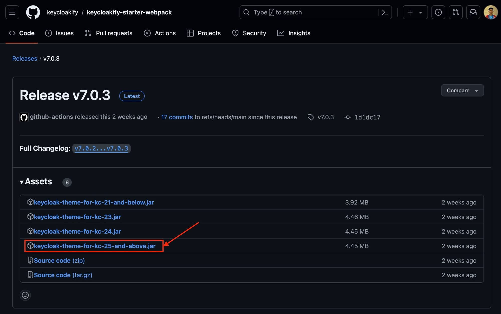

[Keycloak](https://octabyte.io/open-source/keycloak?ref=blog.octabyte.io) is a tool for managing authentication and authorization. However, you might want to tailor its user interface to better match your brand or meet specific design requirements. Using React and Keycloakify, you can create a custom Keycloak UI that provides a seamless experience for your users. This blog will guide you through the steps to customize your Keycloak UI with React and Keycloakify. To follow along, make sure you have service deployed on [OctaByte](https://octabyte.io/open-source/keycloak?ref=blog.octabyte.io).

## Introduction to Keycloakify

[Keycloakify](https://keycloakify.dev/?ref=blog.octabyte.io) is a library that allows you to customize Keycloak’s login and account management pages using React. It provides a simple way to build and deploy custom UIs for Keycloak, enabling you to maintain consistency across your applications.

## Downloading \& Installing Keycloakify

To begin, you need to use Keycloakify to customize the Keycloak UI. This involves copying the necessary jar file to your Keycloak setup. The following instructions assume that your Keycloak is installed in the default directory at `/opt/keycloak`.

First, download the latest jar file from the [Keycloakify GitHub repository](https://github.com/keycloakify/keycloakify-starter-webpack?ref=blog.octabyte.io) or build it from the source. Depending on your Keycloak version, place the jar file in the appropriate directory. You can also choose different template repositories provided on Keyclokify GitHub to build custom themes with different functionalities. Here we are going to use the pre\-built theme.

### Keycloak Version 17\+ (Quarkus)

We are using Keycloak version 17\+ hence we will be placing `.jar` file in the following location. To do the same, head over to the **Tools** section from the navigation bar in the **OctaByte Dashboard** and click on **VS Code** to access the VS Code window. You can do the same with the **File Explorer** menu which can be similar found under the **Tools** section.


> Ensure that the volume mounted for the provider is correctly set up in `/opt/app/providers`.


```
/opt/keycloak/providers/keycloak-theme-for-kc-25-and-above.jar

```
### Restart Keycloak

After configuring the integration, it is essential to restart your Keycloak server to apply the changes effectively. To do this, you will need to execute a series of commands to stop, rebuild, and start the Keycloak server container. First, stop the currently running Keycloak server to ensure that it is not in use while applying the new configuration. This sequence of stopping, rebuilding, and starting the container ensures that all the changes are correctly applied and that the Keycloak server runs with the updated configuration.


```
docker-compose down
docker-compose build
docker-compose up -d

```
### Select New Theme

To implement a new theme in Keycloak using the `keycloakify-starter` theme, you need to navigate to the theme settings within the Keycloak administration console. Select the realm where you want to apply the new theme. In the left\-hand navigation menu, click **Realm Settings** and select the **Themes** tab. Here, you will find options to configure various themes for different aspects of the Keycloak user interface, such as login, account, email, and admin console. Under the **Login Theme** and **Account Theme** dropdown menus, select `keycloakify-starter` to apply the new theme. After making your selections, click **Save** at the bottom of the page to implement the `keycloakify-starter` The theme for the login and account pages provides a customized look and feel that aligns with your desired design and branding.

## **Thanks for reading ❤️**

You have integrated Keycloakify into your Keycloak setup, enabling you to customize the Keycloak UI with React. This allows you to create a seamless and branded user experience for your authentication and authorization flows. See you in the next one👋

[](https://octabyte.io/open-source/keycloak?ref=blog.octabyte.io)

