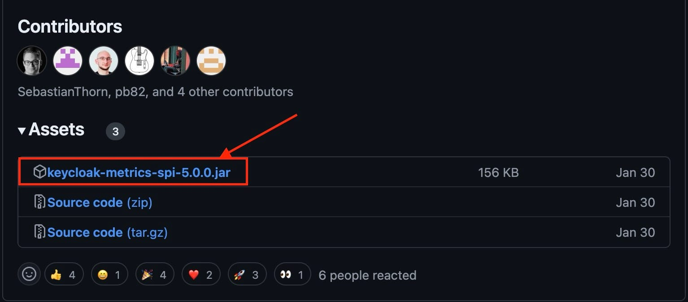

Monitoring and tracking the performance and health of your [Keycloak](https://octabyte.io/development/identity-and-access-management/keycloak) server is important for maintaining an identity management system. One way to achieve this is by exposing a metrics endpoint from Keycloak. Let's see how to expose the metrics endpoint from Keycloak. Before we start, ensure you have deployed Keycloak, we will be self\-hosting it on [OctaByte](https://octabyte.io/development/identity-and-access-management/keycloak). 

## Downloading \& Installing Metics SPI

To begin, you need to use the Keycloak Metrics SPI (Service Provider Interface) to expose metrics. This involves copying the necessary jar file to your Keycloak setup. The following instructions assume that your Keycloak is installed in the default directory at `/opt/app`.

### Copy the Metrics SPI Jar

First, download the latest jar file by [clicking here](https://github.com/aerogear/keycloak-metrics-spi/releases/download/5.0.0/keycloak-metrics-spi-5.0.0.jar?ref=blog.octabyte.io) or build it from the source. You can use the [GitHub repository](https://github.com/aerogear/keycloak-metrics-spi?ref=blog.octabyte.io) and the following command to build from the source. Depending on your Keycloak version, place the jar file in the appropriate directory

**Keycloak version 17\+ (Quarkus):**

OctaByte is using Keycloak version 17\+ hence we will be placing `.jar` file in the following location. To do the same, head over to the **Tools** section from the navigation bar in the **OctaByte Dashboard** and click on **VS Code** to access the VS Code window. You can do the same with the **File Explorer** menu which can be similar found under the **Tools** section.


> Ensure that the volume mounted for the provider is correctly set up in `/opt/app/providers`.


```
/opt/app/providers/keycloak-metrics-spi-5.0.0.jar

```
If performing externally you can add the same process to your `Dockerfile`. You can add it to `build` stage or `run` stage.

**On Build Stage:**


```
COPY keycloak-metrics-spi.jar /opt/keycloak/providers/
```
**On Run Stage:**


```
COPY keycloak-metrics-spi.jar /opt/keycloak/providers/
```
### Ensure Correct Placement

It is essential to copy the jar file in both the build and run stages. If the jar file is not copied correctly, Keycloak will fail to start and display the following error messages:


```
ERROR: Failed to start quarkus
ERROR: Failed to open /opt/app/lib/../providers/keycloak-metrics-spi.jar

```
### Restart Keycloak

After configuring the integration, restart your Keycloak server to apply the changes. To do so, access the terminal in the **VS Code** window and run the following commands to stop, re\-build and start the container.


```
docker-compose down
docker-compose build
docker-compose up -d
```
### Access the Metrics Endpoint

Once Keycloak is running with the Metrics SPI enabled, you can access the metrics endpoint using the following URL structure:


```
http://<your-keycloak-domain>/<http_relative_path>/realms/<realm>/metrics

```
Replace `<your-keycloak-domain>`, `<http_relative_path>`, and `<realm>` with your actual Keycloak domain, the relative path for HTTP, and your realm name, respectively. This endpoint will provide you with various metrics related to your Keycloak server's performance and health.

## **Thanks for reading ❤️**

You have successfully exposed the metrics endpoint from your Keycloak server, enabling you to monitor and track its performance effectively. With the metrics endpoint in place, you can integrate Keycloak metrics with your preferred monitoring and alerting tools to keep your system running smoothly.

[](https://octabyte.io/development/identity-and-access-management/keycloak)

