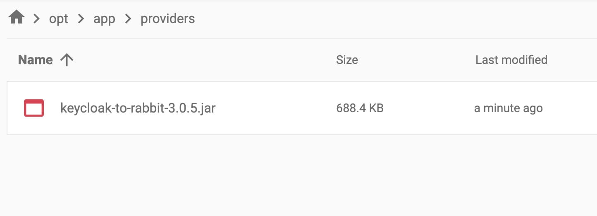

Let's see how you can publish [Keycloak](https://octabyte.io/open-source/keycloak?ref=blog.octabyte.io) events to [RabbitMQ](https://octabyte.io/open-source/rabbitmq?ref=blog.octabyte.io). Before we start, make sure you have deployed Keycloak, we will be self\-hosting it on [OctaByte](https://octabyte.io/open-source/keycloak?ref=blog.octabyte.io).

## What is Keycloak?

Keycloak is an open\-source Identity and Access Management (IAM) solution that provides tools for managing authentication and authorization. It enables single sign\-on (SSO) and identity federation, supporting various protocols like OpenID Connect, OAuth 2\.0, and SAML 2\.0, which allows integration with a wide range of applications and services. Keycloak's features include user management, role\-based access control, multi\-factor authentication, and customization options through themes and extensions. It operates as a central authentication server, issuing tokens to clients and validating them to ensure secure access to protected resources, making it ideal for enterprise SSO, cloud and microservices architectures, and secure API management.

## Introduction to RabbitMQ

RabbitMQ is an open\-source tool that helps different parts of your software talk to each other by sending messages through a queue. Imagine it as a post office for your software, where one part can send a message, and another part can pick it up, even if they aren't running at the same time. This makes your system more flexible and reliable because the different parts don't need to directly communicate with each other all the time. RabbitMQ ensures that messages are delivered in the correct order and helps manage the flow of information between applications smoothly.

## Downloading \& Installing Extension

First, download the latest jar file by [clicking here](https://github.com/aznamier/keycloak-event-listener-rabbitmq/blob/target/keycloak-to-rabbit-3.0.5.jar?raw=true&ref=blog.octabyte.io) or build it from the source. You can use the [GitHub repository](https://github.com/aznamier/keycloak-event-listener-rabbitmq?tab=readme-ov-file&ref=blog.octabyte.io) and the following command to build from the source. Depending on your Keycloak version, place the jar file in the appropriate directory

**Keycloak version 17\+ (Quarkus):**

We are using Keycloak version 17\+ hence we will be placing `.jar` file in the following location. To do the same, head over to the **Tools** section from the navigation bar in the **OctaByte Dashboard** and click on **VS Code** to access the VS Code window. You can do the same with the **File Explorer** menu which can be similar found under the **Tools** section.


> Ensure that the volume mounted for the provider is correctly set up in `/opt/app/providers`.


```
/opt/app/providers/keycloak-to-rabbit-3.0.5.jar

```
## Configure Keycloak

You can configure the Keycloak\-to\-RabbitMQ integration using one of the following options:

##### Environment Variables

Set up the environment variables for your RabbitMQ configuration. This is the preferred and simplest method. You can get the details to feed into new environment variables from your service information. Here we have deployed RabbitMQ on OctaByte so we will be using the same details for configuring.

The following is the list of environment variables you can configure with their default values.

* `KK_TO_RMQ_URL` \- default: *localhost*
* `KK_TO_RMQ_PORT` \- default: *5672*
* `KK_TO_RMQ_VHOST` \- default: *empty*
* `KK_TO_RMQ_EXCHANGE` \- default: *amq.topic*
* `KK_TO_RMQ_USERNAME` \- default: *admin*
* `KK_TO_RMQ_PASSWORD` \- default: *admin*
* `KK_TO_RMQ_USE_TLS` \- default: *false*
* `KK_TO_RMQ_KEY_STORE` \- default: *empty*
* `KK_TO_RMQ_KEY_STORE_PASS` \- default: *empty*
* `KK_TO_RMQ_TRUST_STORE` \- default: *empty*
* `KK_TO_RMQ_TRUST_STORE_PASS` \- default: *empty*

Head over to your VS Code window and click on `docker-compose.yaml` and make some changes to `environment` section with the above environment keys.

##### Restart Keycloak

After configuring the integration, restart your Keycloak server to apply the changes. To do so, access the terminal in the **VS Code** window and run the following commands to stop, re\-build and start the container.


```
docker-compose down
docker-compose build
docker-compose up -d
```
### Enable Logging in Keycloak UI

After configuring the Keycloak\-to\-RabbitMQ integration and restarting your Keycloak server, the next crucial step is to enable logging for events in the Keycloak UI. This will allow Keycloak to publish events to RabbitMQ, ensuring that all relevant activities are captured and sent to your message broker.

Here’s how to enable logging in the Keycloak UI:

1. **Log in to the Keycloak Admin Console**:
	* Log in to **OctaByte Dashboard** and access the login information by clicking on **Display Admin UI** under your deployed Keycloak service. Copy the username and password provided.
	* Open your web browser and navigate to the Keycloak Admin Console URL copied.
	* Enter your admin username and password to log in.
2. **Navigate to Events Configuration**:
	* Once logged in, go to the main menu on the left\-hand side.
	* Click on **Manage** to expand the menu options.
	* Select **Events** from the list.
3. **Configure Event Listeners**:
	* In the Events section, click on **Config** under the **Events** menu.
	* Here, you will see various options for configuring event listeners and event settings.
4. **Add the RabbitMQ Event Listener**:
	* In the **Event Listeners** section, you’ll see a list of available listeners.
	* Add `keycloak-to-rabbitmq` to the list of event listeners by selecting it from the dropdown menu or by typing its name if it’s not already listed.
	* Ensure that the listener is enabled.
	* After making your selections, click the **Save** button to apply the changes.

By enabling logging and configuring the RabbitMQ event listener in the Keycloak UI, you ensure that your Keycloak instance can effectively publish events to RabbitMQ. This setup is vital for maintaining an efficient and responsive communication system between your identity management and message brokering services.

## **Thanks for reading ❤️**

You have successfully published Keycloak events to RabbitMQ, enabling better integration and communication between your identity management and message brokering systems. This setup can significantly enhance your system's responsiveness and reliability, helping operations. See you in the next one👋

[](https://octabyte.io/open-source/keycloak?ref=blog.octabyte.io)

