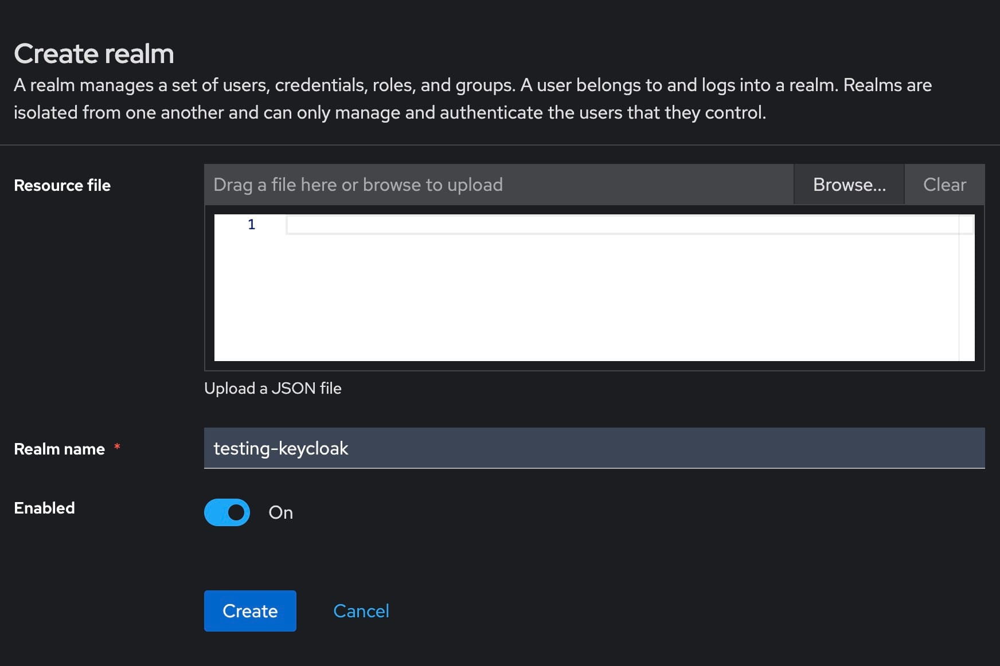

Integrating Keycloak as an OAuth provider with your applications, such as [WordPress](https://octabyte.io/applications/cms/wordpress) or [Apache Superset](https://octabyte.io/applications/business-intelligence/superset), helps security and user management by leveraging Keycloak's identity and access management features. This guide will walk you through the necessary steps to configure Keycloak as an OAuth provider and integrate it with your client applications. Before starting, ensure you have a Keycloak server deployed on [OctaByte](https://octabyte.io/development/identity-and-access-management/keycloak).

## Set Up Keycloak as an OAuth Provider

### Add a Realm

To begin setting up Keycloak as an OAuth provider, log in to the Keycloak administration console using your admin credentials. Once logged in, navigate to the **Realms** section in the left\-hand menu. Here, you will see an option to **Create a Realm**. Click on this option to proceed. Enter a unique and meaningful name for your realm, which will be used to identify it within the Keycloak server. After entering the name, click on the **Create** button to finalize the realm creation process. This new realm will serve as a container for all your client applications, users, and roles.

### Create an OpenID Client

Next, you need to create an OpenID client within the newly created realm. Navigate to the **Clients** section within your realm. Click on **Create Client** to initiate the process. Provide a client ID, which will uniquely identify this client within the realm. Select **openid\-connect** as the client protocol to ensure compatibility with OAuth2 standards. Configure the client settings, including enabling the **Client Authentication** and **Authorization** toggles. Enter the callback/redirect URL that your application will use to handle authentication responses from Keycloak. Save the configuration and copy the client secret from the **Credentials** tab. This client secret will be used later to authenticate your application with Keycloak.

## Configure OAuth Client Plugin

In your client application, such as WordPress or Apache Superset, you need to configure the OAuth client plugin or module settings. Enter the client ID and client secret that you obtained from Keycloak. Additionally, provide the Keycloak server URL and the realm name where your client is configured. These settings will allow your application to communicate with Keycloak for authentication purposes. Ensure all necessary configurations are correctly entered and save the settings.

## Add Users and Configure Roles

To manage access within your realm, you need to add users and configure roles. Navigate to the **Users** section within your realm in the Keycloak administration console. Click on **Create new user** to add a user. Fill in the user details, including username, email, and any other required information. 

Set a password for the user by going to the **Credentials** tab and disabling the **Temporary** option to make the password permanent. Assign appropriate roles to the user in the **Role Mappings** section. If necessary, create new roles by navigating to the **Roles** section and defining the permissions and access levels for each role.

## Configure Your Client Application as an OAuth Client

### Register a New Client Application

Within your client application, navigate to the OAuth client plugin or module settings. Here, you will add a new client application entry for Keycloak. Provide a descriptive app name to identify this configuration. Enter the client ID and client secret that you obtained from Keycloak. Additionally, specify the domain name where your Keycloak server is running, followed by the port number. Enter the realm name to complete the registration. Save the configuration to finalize the client application setup.

### Select Grant Type

Choose the appropriate grant type for your application from the available options, such as authorization code, client credentials, or implicit grants. The selected grant type will determine how your application requests and receives access tokens from Keycloak. Save the configuration to apply the selected grant type.

## User Attribute Mapping

#### Configure User Attributes

Navigate to the OAuth client plugin or module settings in your client application. Go to the **Test Configuration** section to verify the attributes returned by Keycloak. Ensure that the returned attributes include essential user details such as first name, last name, email, and username. If any required attributes are missing, adjust the settings in Keycloak to include them in the user information response.

#### Map User Attributes

In the **Attribute / Role Mapping** tab of your client application, map the returned attributes to the corresponding fields in your application. This mapping ensures that user information is correctly synchronized between Keycloak and your client application.

#### Assign Corresponding Roles

Assign the corresponding roles in your client application based on the roles defined in Keycloak. Save the mapping to ensure that users are granted the correct permissions and access levels within your application.

## Sign\-In Settings

#### Customize Sign\-In Experience

In the **Single Sign\-On (SSO) Settings** tab of your OAuth client plugin or module, configure the user experience for SSO. Enable the **Show on login page** option to display the Keycloak SSO login button on your application's login page.

#### Test the Sign\-In

Navigate to your application's login page and ensure the Keycloak SSO login button is visible and functioning. Click the button to initiate the SSO process and verify that users can authenticate using their Keycloak credentials.

## **Thanks for reading ❤️**

You have successfully configured your client application to use Keycloak as an OAuth provider, providing a robust Single Sign\-On (SSO) solution for secure user authentication. This setup enhances security and simplifies user management across various applications and services.

