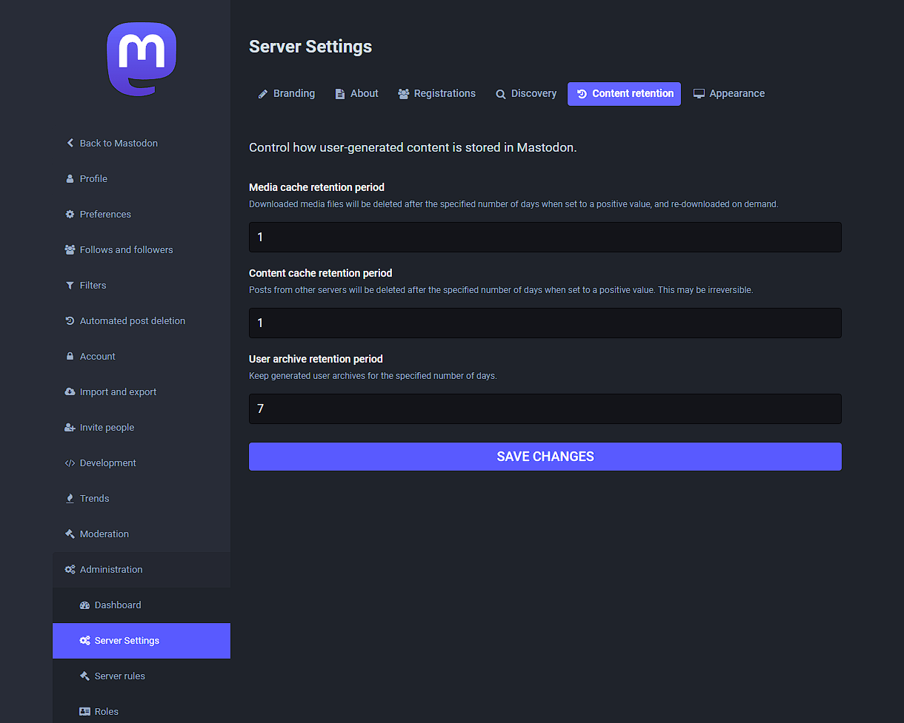

Enter Mastodon, the open\-source alternative to Twitter that has seen a surge in popularity in recent days. Mastodon is a decentralized social media platform that is not owned by any single entity, allowing users to have more control over their data and privacy.

Since the news of Musk's acquisition of Twitter, Mastodon has seen a massive influx of new users, with many Twitter users flocking to the platform as a safer and more ethical alternative. Mastodon has even had to temporarily disable new user sign\-ups due to the overwhelming demand.

But what makes Mastodon stand out from other social media platforms? For one, Mastodon is completely ad\-free, meaning users are not bombarded with annoying and intrusive ads. It also has a strong focus on community and inclusivity, with a code of conduct that promotes respectful and constructive dialogue.

Another major selling point for Mastodon is its commitment to privacy and data protection. Unlike Twitter and other mainstream platforms, Mastodon does not sell user data to third parties or use it for targeted advertising.

Of course, Mastodon is not without its drawbacks. The platform is not as user\-friendly as Twitter and may take some time to get used to. It also has a smaller user base, meaning you may not be able to connect with as many people as you can on Twitter. Also with November and December waves of new Mastodon users, many servers experienced problems with their performance and had to close registrations until they had time to scale up the infrastructure.

## How to scale up a Mastodon instance

First issue you will have will probably be the disk space usage of Mastodon, reason is all the remote content from federated instances you follow will be cached by your instance. This can lead to use all the disk space available on your instance.

## Cache retention period

By default, Mastodon is configured to clean the cache once per week. However, on active instances, this may use more storage than is available.

You can configure the cache retention duration by visiting this url on your instance: https://YOURDOMAIN/admin/settings/content\_retention

Mastodon control cache retention settings

## Emergency cleanup

In case your server disk is full, you can run this command over SSH in your instance to cleanup all space used by remote medias: 

> docker\-compose down \-v \-\-remove\-orphans  
> tootctl media remove \-\-days 0;

For Docker installations (like here with [Mastodon fully managed](https://octabyte.io/applications/forum-community/mastodon) by OctaByte) you will have to use this command instead:

> cd /opt/app \&\& docker\-compose exec streaming sh \-c "RAILS\_ENV\=production bin/tootctl media remove \-\-days 0;"

## Scale up the storage

Easiest solution is to connect a network Volume attached to your instance, and store all the Mastodon data on it. That way you can resize the disk later based on your needs without needing to migrate to another server.

## Network volume

For OctaByte users, you just have to create a volume on your Mastodon instance and keep the checkbox checked to ensure all data will be moved to the Volume.

Add a network volume and move the data

For users outside of OctaByte you have to check with your cloud provider their process to create and attach a volume to your instance and mount it into your VM. From there you will have to change the volume configuration in your docker\-compose.yml to point to your new volume. Let's assume your new volume is mounted in /mnt/vol1, then you will have to change the 2 occurrences of "./public/system" to "/mnt/vol1"

After the change it should look like this:

## **Thanks for reading ❤️**

Thank you so much for reading and do check out the OctaByte resources and Official [Mastodon documentation](https://docs.joinmastodon.org/?ref=blog.octabyte.io) to learn more about Mastodon. Click the button below to create your service on [OctaByte](https://octabyte.io/open-source/keycloak?ref=blog.octabyte.io). See you in the next one👋

