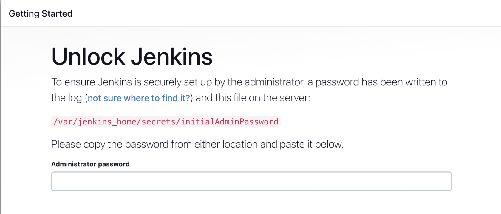
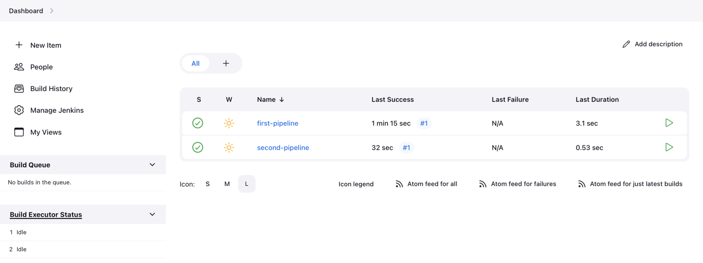
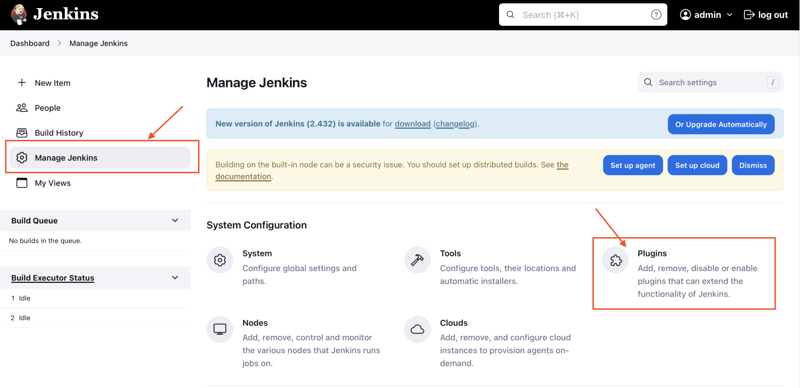
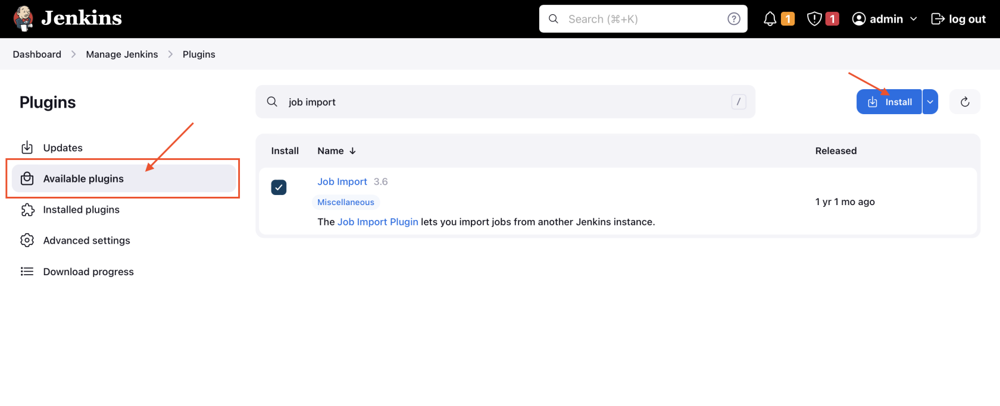
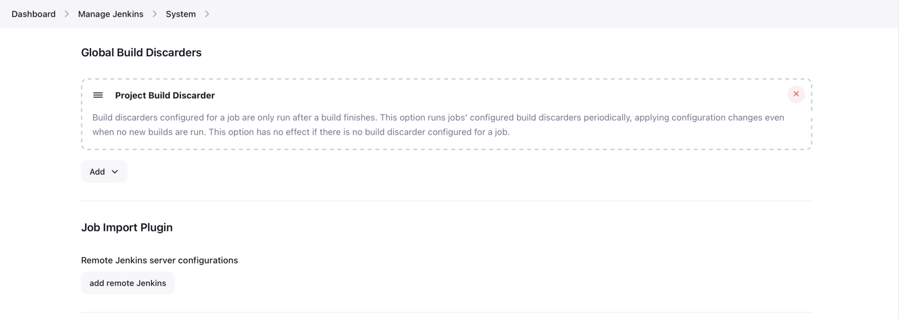
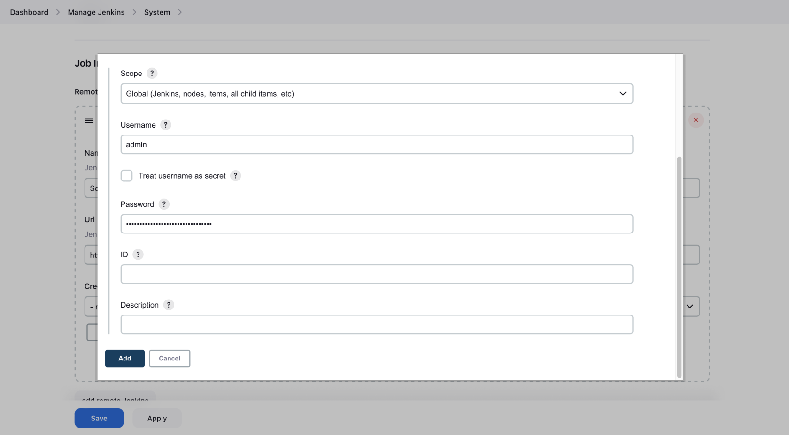
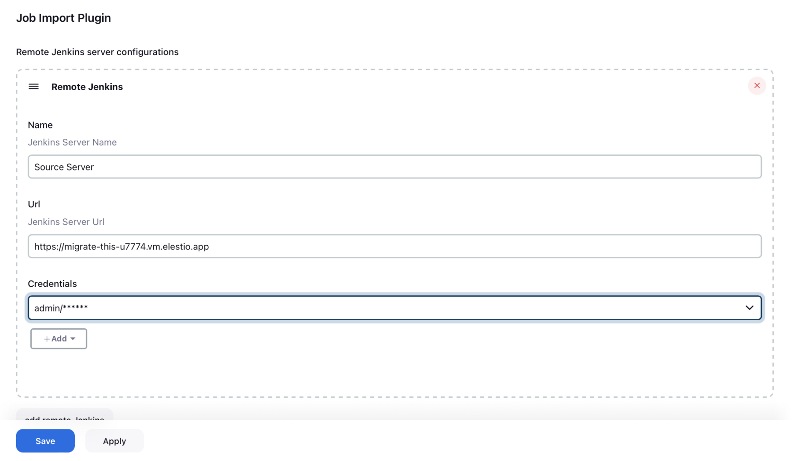
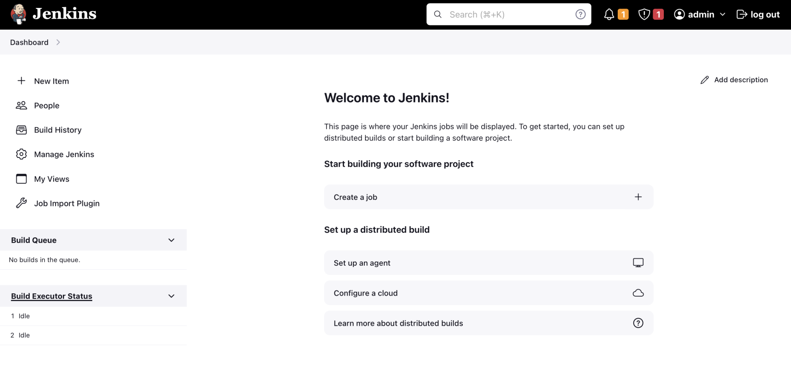
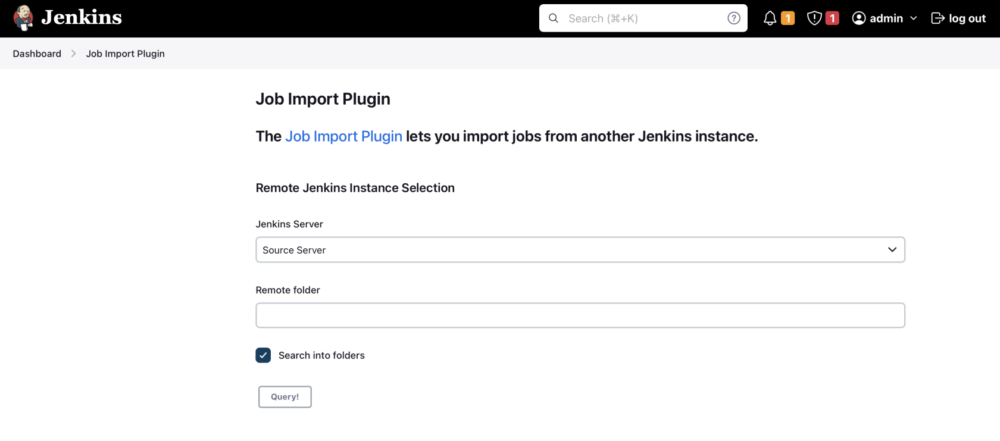
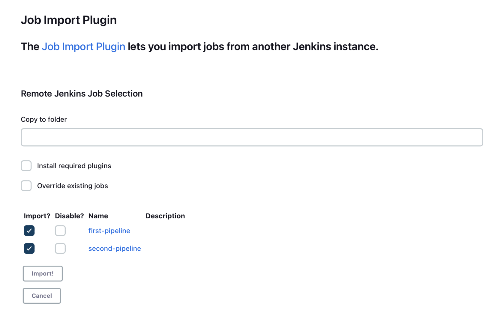

> This migration document focuses on the migration of the applications supported by OctaByte. Find the software list [here](https://octabyte.io/all-services?ref=blog.octabyte.io)

This document provides a step\-by\-step guide for migrating your existing Jenkins pipelines to OctaByte. OctaByte is designed to enhance performance, scalability, and overall system efficiency. Before you begin the migration process, make sure to check the pre\-requisites

### Importing Data

1. Copy the password with the instructions given in the email and paste it into the dashboard window here

[]

2. For this tutorial, we are going to import two simple pipelines that are already created on a source server

[]

3. Head over to your Jenkins instance dashboard on OctaByte. Click on "Manage Jenkins" and select "Plugins"

[]

4. Once you are in there install "Job import" plugin. Accordingly, you might want to restart the Jenkins too

[]

5. Now, head over to the "Manage Jenkins" and head over to "System" to update the configuration. Scroll down until you find the Job Import Plugin section and click on "add remote Jenkins"

[]

6. Add your original Jenkins server information as requested, you will have to add the credentials. Click on add credentials and add the credentials of your original Jenkins server

6. Select that as credentials under the drop\-down and make sure you have the window looking similar to this

[]

8. Apply and save the remote Jenkins settings head over to the Jenkins dashboard and click on the new option you can see called "Job Import Plugin"

[]

9. Select your server from the drop\-down and click on Search into folders so you don't have to put it in the remote folder. Click on the Query button.

[]

10. Now you will be able to see all the pipelines available on your source server. You can select selective pipelines if you want to. Select the needed pipelines and hit the Import button

[]

11. Woohoo 🎉, You have successfully imported the pipelines from your source server.

### Testing the Migration

1. You have successfully migrated to OctaByte, now it's time for testing if your application is running as you intended

2. Head over to the Jenkins dashboard and see if all of your pipelines have been imported correctly. Additionally, try running the pipelines.

[]

