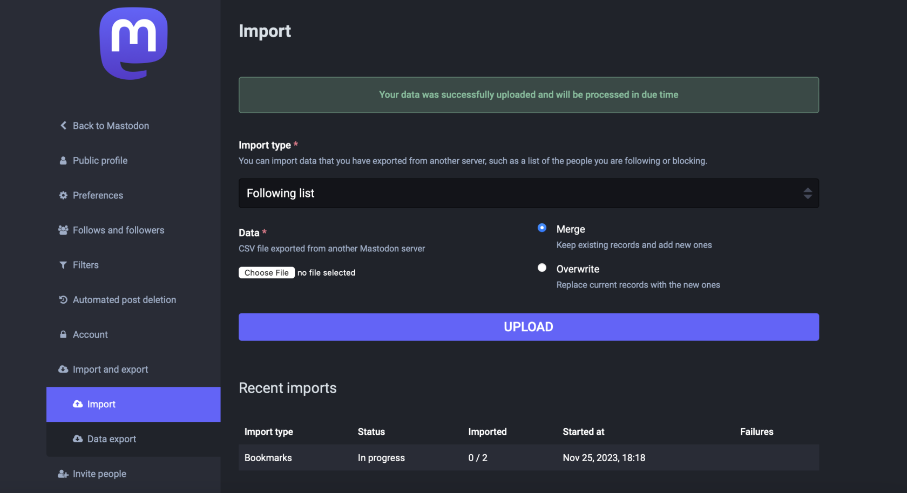
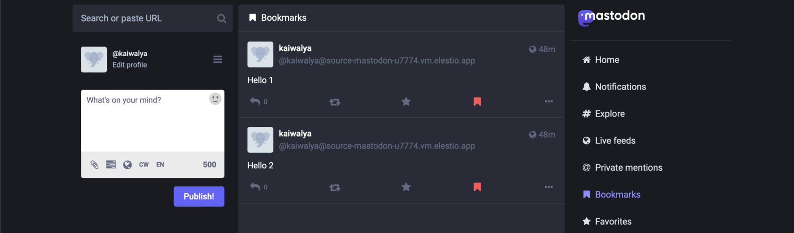

> This migration document focuses on the migration of the applications supported by OctaByte. Find the software [here](https://octabyte.io/applications/forum-community/mastodon)

This document provides a step\-by\-step guide for migrating your existing Mastodon database system to OctaByte. OctaByte is designed to enhance performance, scalability, and overall system efficiency. Before you begin the migration process, make sure to check the pre\-requisites

### Exporting the Data

1. Log into your Mastodon server that has been originally hosted.
2. Head over to the preferences settings

3. Head over to the "Import and Export" and click on the Data Export option

4. Click on the "CSV" file section to download the data you want to migrate. The CSV files will be stored in your local machines

> For exporting the additional data you should export the underlying Postgres database and also your media storage.

### Importing the Data

1. Login to your mastodon

2. Once you are in, head over to the UI you should head over and log in with the credentials on the server.

3. Head over to the "Import and Export" and click on the import

4. Now click the "Choose file" option under the data section and the "Import type" from the drop\-down menu. Select the file according to the import type you have selected.

5. Confirm your imports by clicking on the confirm button

> If you imported the Postgres database in the previous step then make sure to import the database in the OctaByte instance by using the Postgres credentials provided on the OctaByte dashboard and also import the media storage.

6. Woohoo! Your data is successfully migrated to OctaByte, wait for a couple of minutes for the data to be imported. You can check the progress for the same on the same tab

[]

### Testing the Migration

1. You have successfully migrated to OctaByte, now it's time for testing if your application is running as you intended

2. Head over to the Mastodon server and check the bookmarks, posts, and list you have imported in their respective tabs and you will notice the mention of your previous server to set the differentiations

3. Here as you can see, my bookmarks were successfully imported into the new instance of OctaByte

[]

### Need additional help?

Stuck somewhere? We are here to help you, go ahead and contact with support at support@octabyte.io and we will get back to you in no time.

