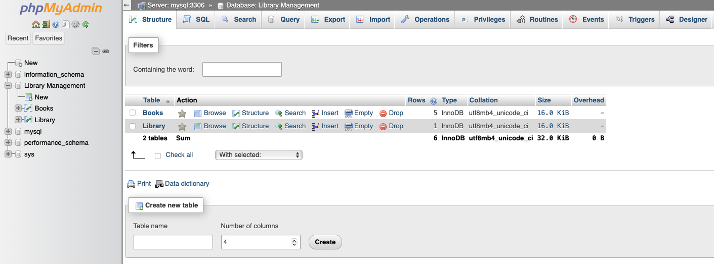
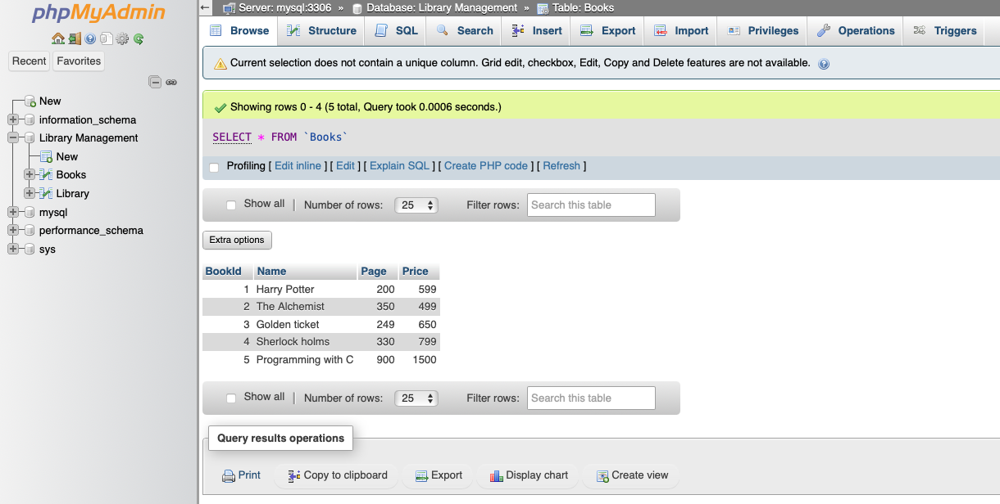
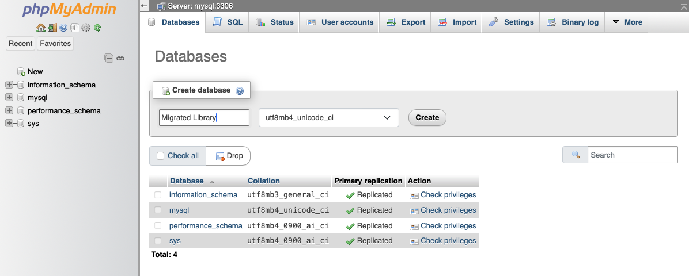
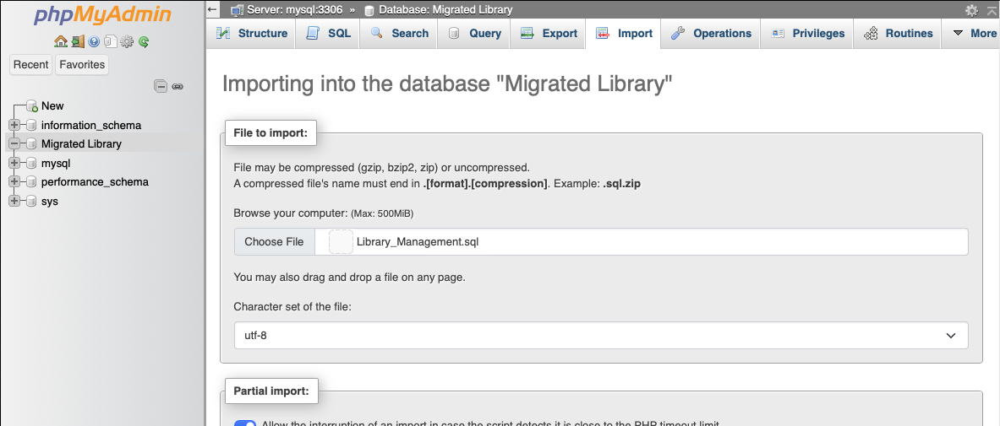
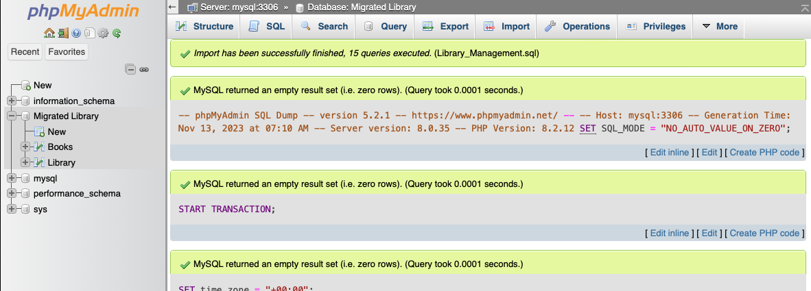
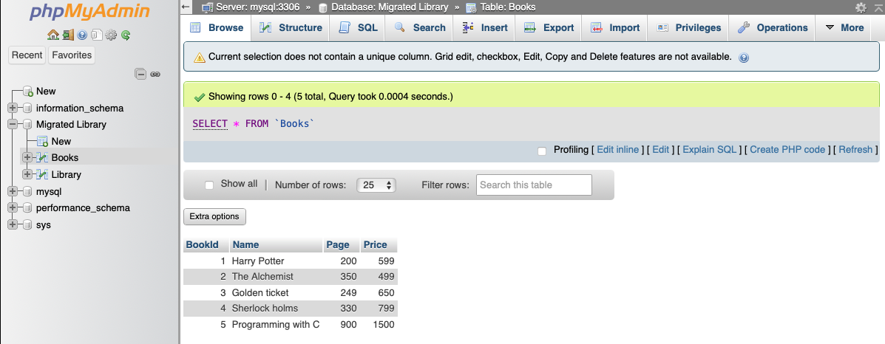

> This migration document focuses on the migration of the applications supported by OctaByte. Find the software [here](https://octabyte.io/databases/relational-databases/mysql)

This document provides a step\-by\-step guide for migrating your existing MySQL database system to OctaByte. OctaByte is designed to enhance performance, scalability, and overall system efficiency. Before you begin the migration process, make sure to check the pre\-requisites

### Exporting the Data

1. Head over to your Phpmyadmin UI with Admin credentials and make sure you are logged in and can see your database, table, and data
2. For this example, we are going to migrate the Library Management database that has 2 tables: Books and Library

3. This is the dummy data under the Books table to verify the migration

4. Here, you can choose to migrate/export specific tables or entire databases. For this tutorial, I am going to export the entire database with all the tables

5. For this, click on your database so it shows the list of all the tables like below, and head over to the "Export" option from the above option panel

6. You can use the "Quick" Option like below or go to custom and tweak the setting for exports as you need

7. Click on "Export" and save the file to your local machine. The file being downloaded will have `.sql` extension because we have selected the format as SQL from above. Feel free to change the format if required.

8. With this, your database is exported

### Importing the Data

1. Head over to the UI you should go ahead and create your database. We will be creating a database with Name Migrated Library to see the difference after the migration

7. Click on the database head over to the "Import" option from the top option bar, and choose the file from your local machine that you downloaded from the previous step.

8. Remember that if you used the custom settings in the import section then you might want to change the options from the default while importing too, else it will raise an error

9. After uploading the essential .SQL file, scroll down and click on "Import"

10. The tables and data will get imported and can be seen under the database we created on OctaByte instance

Voila 🎉 you have successfully imported your tables and data to your new instance of MySQL.

### Testing the Migration

1. You have successfully migrated to OctaByte, now it's time for testing if your application is running as you intended
2. Head over to the tables and check if you can still see the data like your previous instance
3. Here as you can see, my new database has successfully imported the tables and the data as I showed during the import

### Need additional help?

Stuck somewhere? We are here to help you, go ahead and contact with support at support@octabyte.io and we will get back to you in no time.

