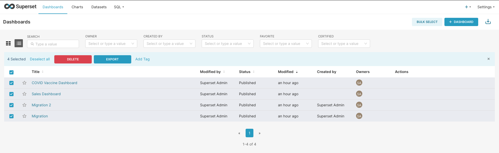
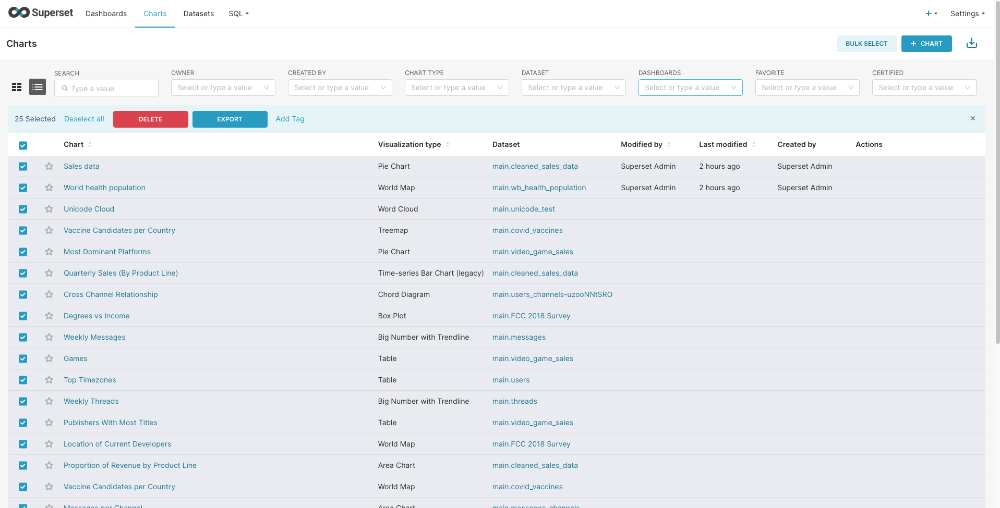
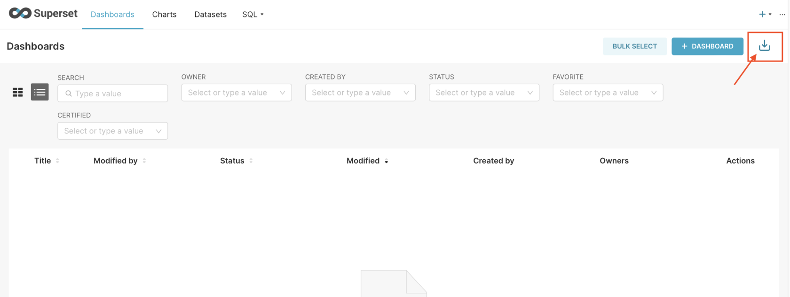
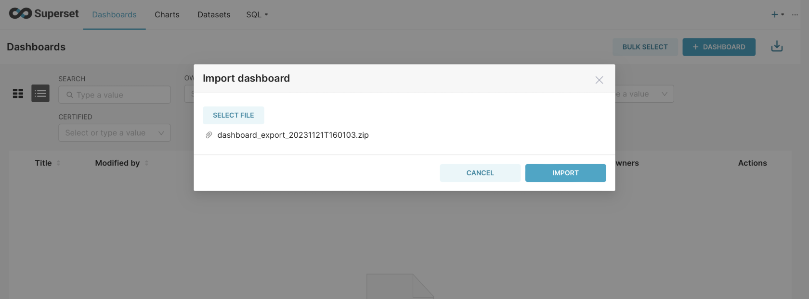
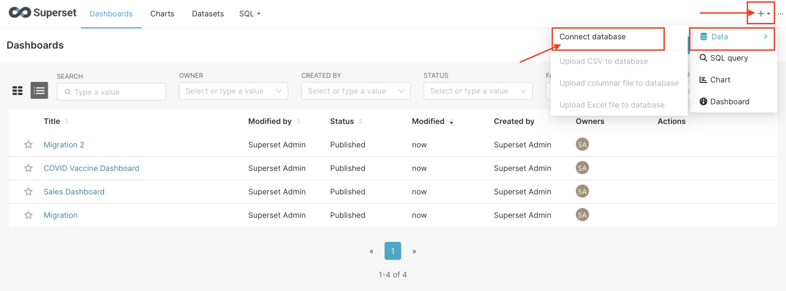
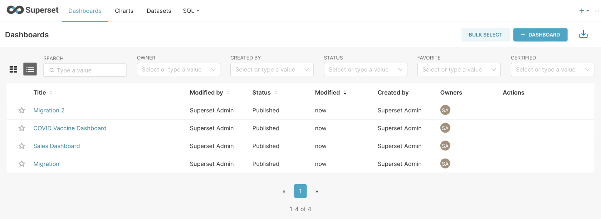

> This migration document focuses on the migration of the applications supported by OctaByte. Find the software [here](https://octabyte.io/applications/business-intelligence/superset)

This document provides a step\-by\-step guide for migrating your existing Superset pipelines to OctaByte. OctaByte is designed to enhance performance, scalability, and overall system efficiency. Before you begin the migration process, make sure to check the pre\-requisites

### Exporting the Dashboards and Data

1. Head over to your original (source) dashboard of superset
2. Select all the dashboards you are planning on migrating and click on Export

3. Similarly, head over to the charts section, select all the required charts, and click on Export

1. These exported files will be stored in your local machine in .zip format

2. You will have to reconfigure your connected database with Superset after the migration so you should make sure you have all the information required for configuration

### Importing the Dashboards and Data

1. Once logged in, head over to the dashboard tab and click on the import button as shown in the image

2. Click on "Select File" select the export (.zip) you exported from the previous step and click on "Import"

3. Additionally, you can add and configure your databases from the settings shown in the image below

Woohoo 🎉 you have successfully imported all your dashboards and repeat the same to import the charts.

### Testing the Migration

1. You have successfully migrated to OctaByte, now it's time for testing if your application is running as you intended

2. Head over to the Dashboard and check if you can still see the dashboards like your previous instance

3. Here as you can see, my new dashboards have successfully been imported  as I showed during the import

### Need additional help?

Stuck somewhere? We are here to help you, go ahead and contact with support at support@octabyte.io and we will get back to you in no time.

