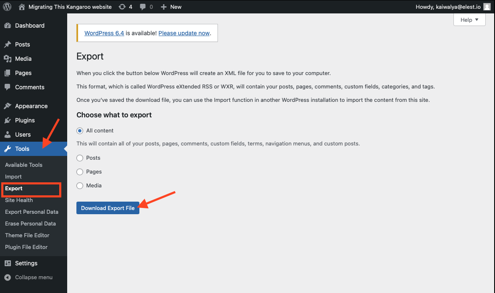
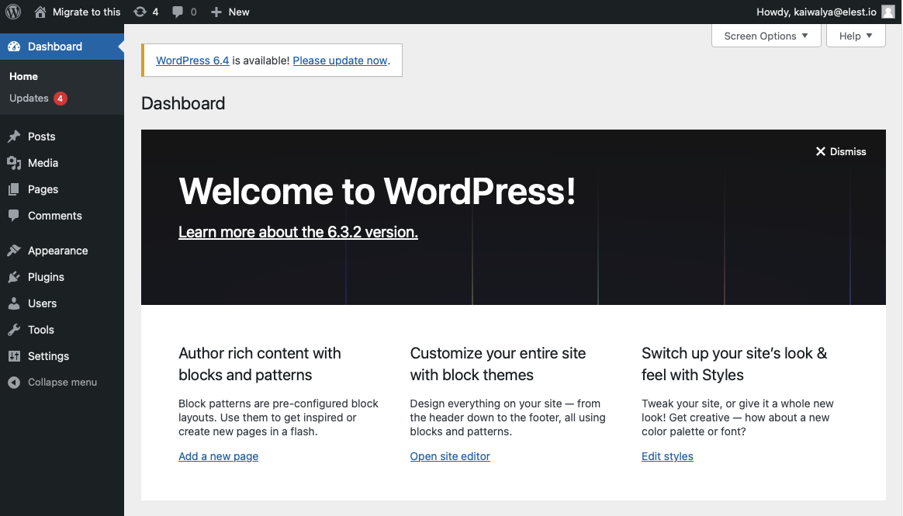
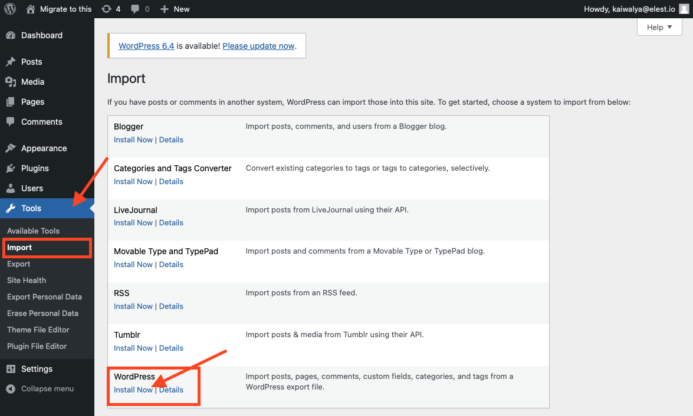
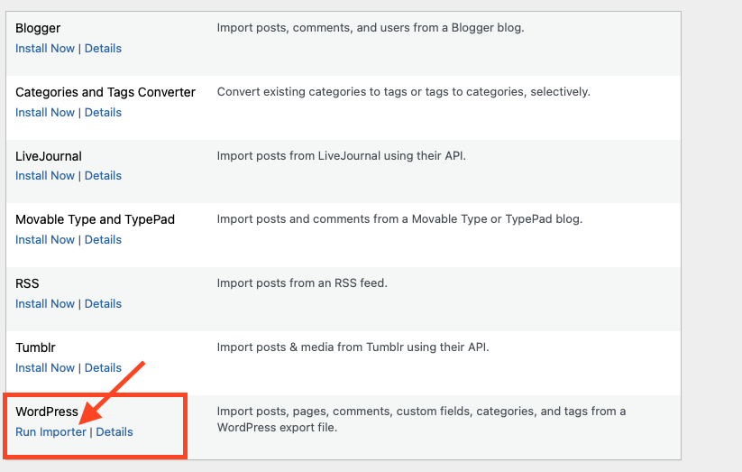
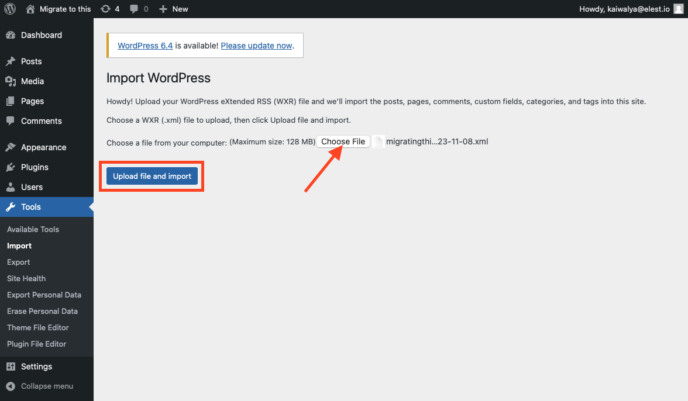
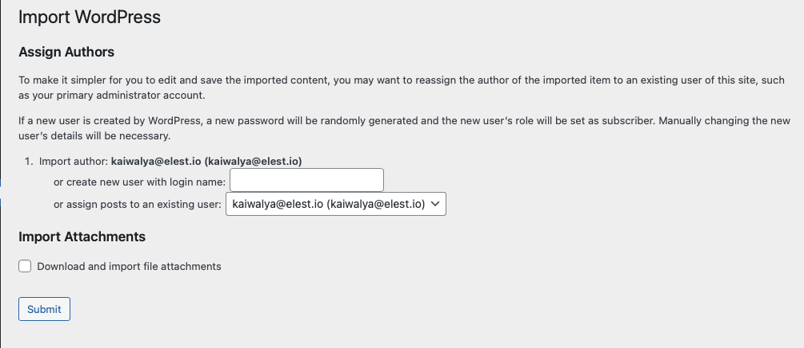
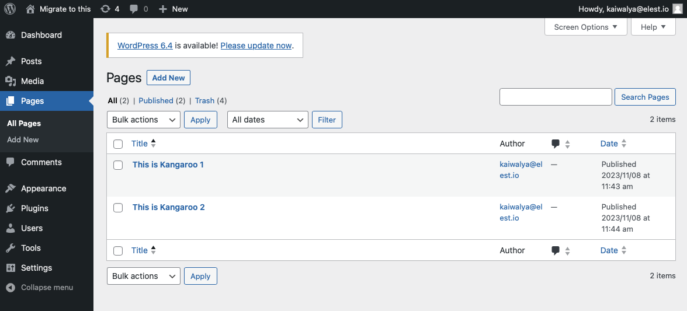
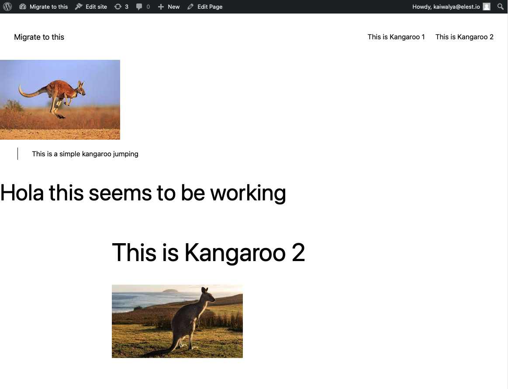

> This migration document focuses on the migration of the applications supported by OctaByte. Find the software [here](https://octabyte.io/applications/cms/wordpress)

This document provides a step\-by\-step guide for migrating your existing system to OctaByte. OctaByte is designed to enhance performance, scalability, and overall system efficiency. 

### Exporting the Data

There are two primary ways to export your data from Wordpress, we will focus on the native one but you can consider using plugins like WPvivid to carry out the migration.

* Here we are going to migrate a simple kangaroo site with 2 pages as you can see in the image below

* Head over to the dashboard of your WordPress go to the "Tools" option in the left panel and select the "Export" option

* Click on "Download Export Files" as shown in the image above, here we are exporting all content but you can choose to export selectively if you want.

* The exported file will be saved on your local machine. The exported file will be in XML format.

* You can additionally make a copy of this exported data and store it as a backup on local disks. This is totally optional step if you want additional backup than what WordPress natively offers.

### Wordpress Dashboard

* Create your site with the details provided here and log in to the WordPress instance. You will see a similar dashboard below

### Importing the Data

* Head over to the new instance of WordPress head over to "Tools" and click on the "Import" option.

* Click on "Install Now" for WordPress as shown in the image above.

* Run importer after getting installed

* Choose the XML file you exported from the previous step. and click on "Upload file and Import"

* Fill out the author information and click on "Submit"

* Voila! It's imported and your site is migrated safely. You can check if it's working from the options above.

### Testing the Migration

* Go to the top left of the screen where you can see the site name, in this case, "Migrate to this". Upon clicking on the name, you should see the site as it was before the migration.

* Enjoy your newly migrated WordPress site on OctaByte 🎉

### Need additional help?

Stuck somewhere? We are here to help you, go ahead and contact with support at support@octabyte.io and we will get back to you in no time.

