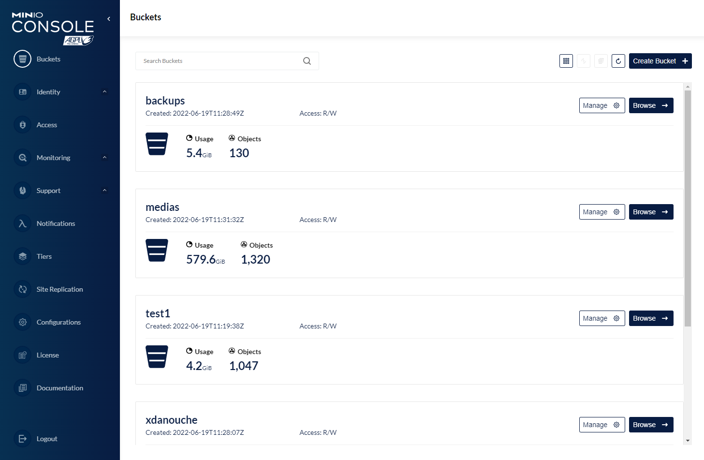

With industry\-leading performance and scalability, MinIO can deliver a range of use cases from AI/ML, analytics, backup/restore, and modern web and mobile apps. It's packed with powerful features.

**Update:** since June 2022, MinIO supports all the advanced features like Quota / Versioning / Object locking / Retention in all versions. It's a great achievement and was a long\-awaited feature.

## Main benefits

* Cloud agnostic object storage, you can deploy it on any cloud \& on\-premise
* Modern Web UI with bucket browser, configuration, logs \& traces
* Full AWS S3 API compatibility
* Support replication and cluster mode
* Support for IAM policies, quota, versioning, Object Locking, Retention, Lifecycle rules, Notifications, and more.

Buckets list UI in MinIO Web UI

## Use cases

MinIO is a lifesaver if you are in one of those situations:

* You have a software that requires an S3 bucket but you have to deploy it in a specific cloud provider or on\-premise
* You need an S3 bucket with very low latency, MinIO can achieve 10x lower latencies than an S3 bucket
* You need buckets for dev/staging/pre\-prod quickly and for cheap
* You need a Web UI to manage your buckets / Users / Policies / Replication without calling an API (but you can also do it with the API)
* You need an off\-site backup for disaster recovery needs

Browse a Bucket with MinIO Web UI

## MinIO deployment checklist:

* Deploy MinIO instance with Docker
* Configure a reverse proxy to expose your container to internet with SSL/TLS
* Configure a rate limiter to protect your instance and an output cache to optimize performance
* Monitor your instance and configure alerts
* Do upgrades frequently (every week)
* Do OS upgrades frequently (every week)

If you want automated backups, reverse proxy with SSL termination, DOS protection, firewall, automated OS \& Software updates (So your instance of MinIO stays always up to date), and a team of Linux experts and open source enthusiasts to ensure your services are always safe, and functional.

Click on the button below to get a [fully managed instance of MinIO](https://octabyte.io/hosting-and-infrastructure/storage/minio) ready to use in less than 3 minutes. 

[Deploy MinIO](https://octabyte.io/hosting-and-infrastructure/storage/minio)

