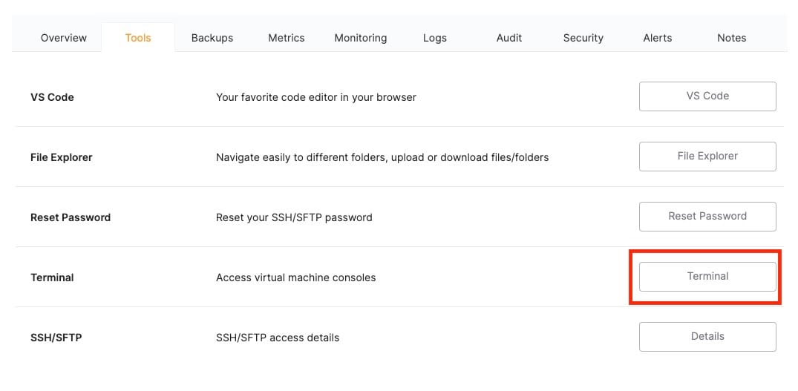

Hey everyone, we are going to install a community node manually on [N8N](https://octabyte.io/open-source/n8n?ref=blog.octabyte.io). During this tutorial, we will be using the internal terminal tool to access the docker container running the N8N instance. Before we start, ensure you have deployed N8N, we will be self\-hosting it on [OctaByte](https://octabyte.io/open-source/n8n?ref=blog.octabyte.io).

## What is N8N?

N8N is an open\-source workflow automation tool that allows you to automate tasks and workflows by connecting various applications, services, and APIs together. It provides a visual interface where users can create workflows using a node\-based system, similar to flowcharts, without needing to write any code. You can integrate n8n with a wide range of applications and services, including popular ones like Google Drive, Slack, GitHub, and more. This flexibility enables users to automate various tasks, such as data synchronization, notifications, data processing, and more.

## Accessing Terminal

Now log into your **OctaByte Dashboard** and head over to **Tools** from the navigation bar. Under the tools section, you will find **Terminal**. Click on the **Terminal** button.

Once you click it, you will be presented with credentials to access your terminal. Paste the **Access link** in the browser tab and use the **User** and **Password** to log in.

## Installing Community Node

These nodes extend the functionality of n8n by adding integrations and features that are not available in the core set of nodes provided by the platform. Community Nodes can be shared and reused by other n8n users, fostering a collaborative environment where users can benefit from the contributions of others. Community Nodes are precious because they allow users to connect with a wider variety of applications and services, often covering niche or less common use cases that might not be addressed by the standard nodes.

Following steps will be performed in VSCode. To access it, head over to your service deployed on **OctaByte Dashboard.** Now head over to the **Tools** section in the navbar and click on **VS Code** and use the credentials provided to log in into VS Code.

### Step 1: Add an Environment Variable

First, add an environment variable to allow the installation of additional libraries in n8n. You can do this in the `.env` file using Visual Studio Code (VSCode) or directly from the **OctaByte Dashboard** via the **Update config** button. Add the following line to your `.env` file:

`NODE_FUNCTION_ALLOW_EXTERNAL=*`

This setting permits the installation of external libraries, facilitating the addition of community nodes.

### Step 2: Create a Dockerfile

Next, create a Dockerfile in the `/opt/app/` directory, alongside the `docker-compose.yml` file. 

The Dockerfile should include instructions to install the necessary packages. 


```
FROM n8nio/n8n:latest
USER root
RUN npm install -g n8n-nodes-nodeName
USER node
```
Replace `n8n-nodes-nodeName` with the specific community node you wish to install. This example ensures that the specified community node is installed globally.

### Step 3: Modify the Docker Compose File

Adjust the `docker-compose.yml` file to disable the default image and use the build process instead. Modify your `docker-compose.yml` to look like this:


```
image: n8nio/n8n:${SOFTWARE_VERSION_TAG}
build:
  context: .
```
This change ensures that the custom Docker image you are building will be used.

### Step 4: Build and Run the Custom Image

Navigate to the `/opt/app` directory and execute the following commands in the terminal to build and run your custom Docker image:


```
cd /opt/app
docker-compose down
docker-compose build
docker-compose up -d
```
### Step 5: Update the Auto Update Script

To automatically rebuild the image when n8n releases an update, run the following command in the terminal:


```
sed -i 's/--debug;/--debug;\ncd \/opt\/app;\nsource .env;\ndocker-compose pull;\ndocker-compose up -d --build;/' /opt/elestio/watchtower/watchtower-upgrade.sh

```
And done! You have successfully installed community nodes manually in N8N. You can create multiple such community notes based on your requirements and packages. Additionally, you can follow the [installation guide by N8N](https://docs.n8n.io/integrations/community-nodes/installation/manual-install/?ref=blog.octabyte.io) to see other installation options.

## **Thanks for reading ❤️**

Thank you so much for reading and do check out the OctaByte resources and Official [N8N documentation](https://docs.n8n.io/?ref=blog.octabyte.io) to learn more about N8N. You can click the button below to create your service on [OctaByte](https://octabyte.io/open-source/n8n?ref=blog.octabyte.io) and retrieve weather information based on a zip code. See you in the next one👋

[](https://octabyte.io/open-source/n8n?ref=blog.octabyte.io)

