Let's see how you can create an application that can generate PDFs with [N8N](images/n8n) using [Gotenberg](https://octabyte.io/open-source/gotenberg?ref=blog.octabyte.io). During this tutorial, we will be building the workflow from scratch. You can choose to use different databases to perform similar actions. Before we start, make sure you have deployed N8N, we will be self\-hosting it on [OctaByte](images/n8n).

## What is N8N?

N8N is an open\-source workflow automation tool that allows you to automate tasks and workflows by connecting various applications, services, and APIs together. It provides a visual interface where users can create workflows using a node\-based system, similar to flowcharts, without needing to write any code. You can integrate n8n with a wide range of applications and services, including popular ones like Google Drive, Slack, GitHub, and more. This flexibility enables users to automate a variety of tasks, such as data synchronization, notifications, data processing, and more.

## What is Gotenberg?

Gotenberg is an open\-source API that converts web documents, including HTML and Markdown, to high\-quality PDFs using headless Chrome or Chromium. It also supports converting office documents (like DOCX) to PDF. Designed for integration, it offers a REST API for easy automation of document generation processes and is distributed as a Docker container, ensuring consistent deployment across environments. Gotenberg is a versatile tool for developers and businesses needing reliable and customizable PDF conversion within their applications.

## Configuring Manual Button

Once you get started, you will find a blank workflow canvas in the dashboard. Head over and click on the "\+" button as shown below to start with the first step of creating the workflow

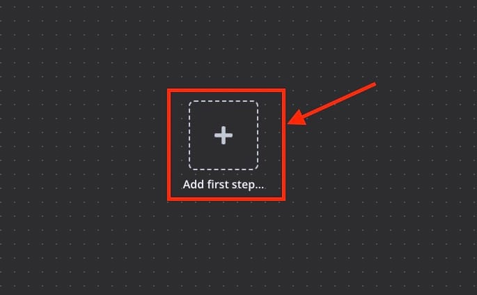Next, you will see a pop\-up on the right side of the screen, Select the **Manually** component. This component runs the flow by clicking the button in N8N.

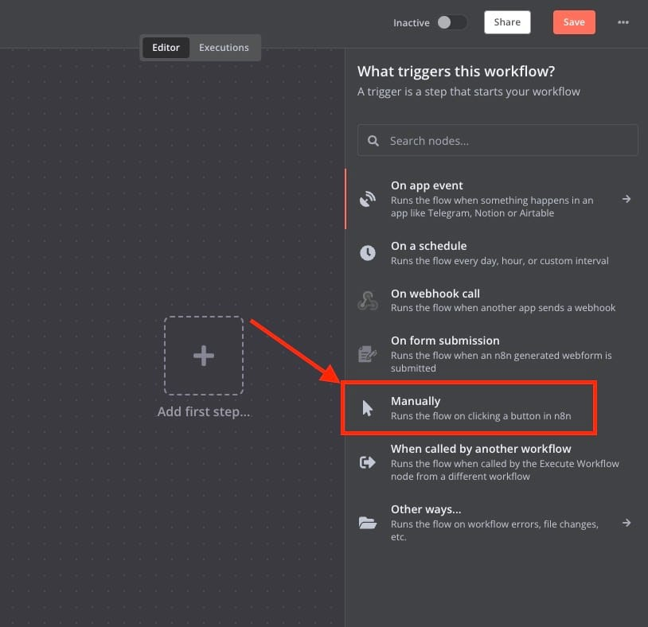## Setting up HTML component

Next, we will add the next component in the flow which is in **HTML**. In the HTML component, select **Generate HTML template**. 

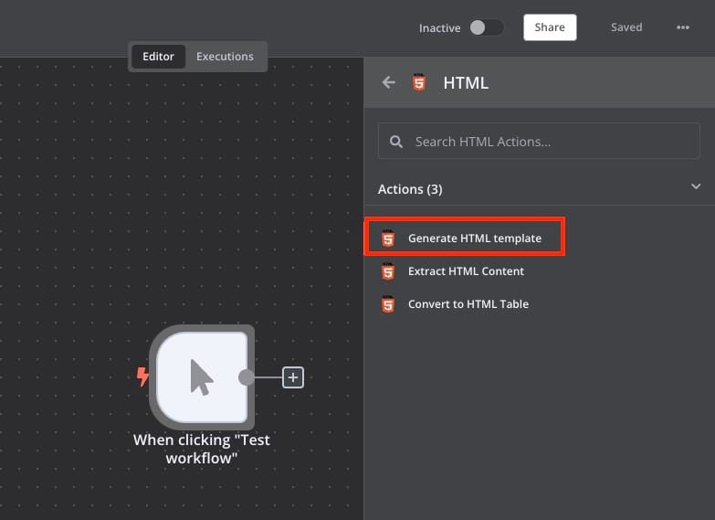## Convert to File Component

Now we will attach the next component in the flow. The next component in the flow is **Convert to File**. In the component, select **Move base64 string to file**. 

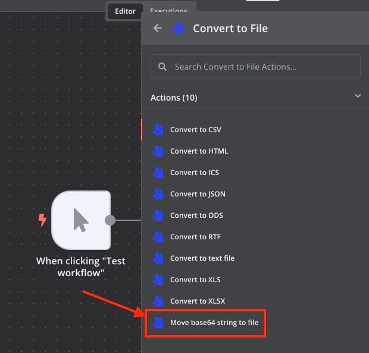Now set the parameters of these components as follows:

**Operation:** Move Base64 String to File

**Base64 Input Field:** HTML

**Put Output File in Field:** data

**Encoding:** utf8

**File Name:** index.html

**MIME Type**: text/HTML

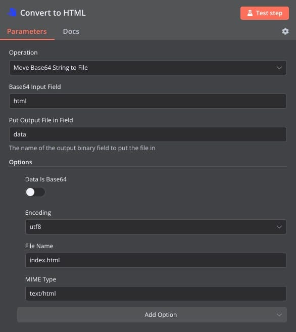## Configuring HTTP Request

The next component we are going to configure is the **HTTP Request**. This component makes an HTTP request and returns the response data.

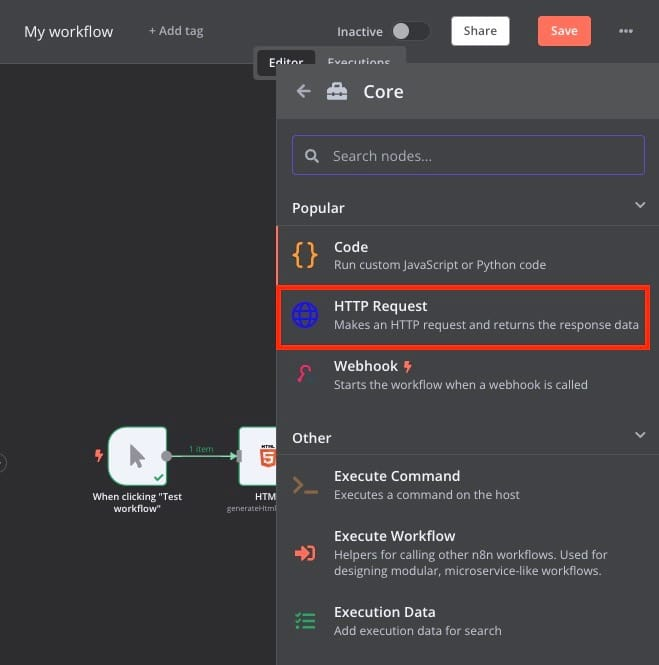## Setting Up Gotenberg

We will require a Gotenberg service that we are deploying it on OctaByte and you can do the same by clicking [here](https://octabyte.io/open-source/gotenberg?ref=blog.octabyte.io). Once the instance is deployed head over to the email you received on your email ID registered with OctaByte. Find the **Usage** section as we are going to use this information while configuring the Gotenberg in the flow.

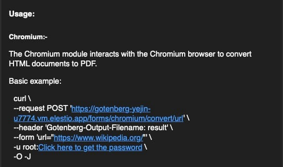Now add the **User** and **Password** from elestio dashboard and add it under connection.

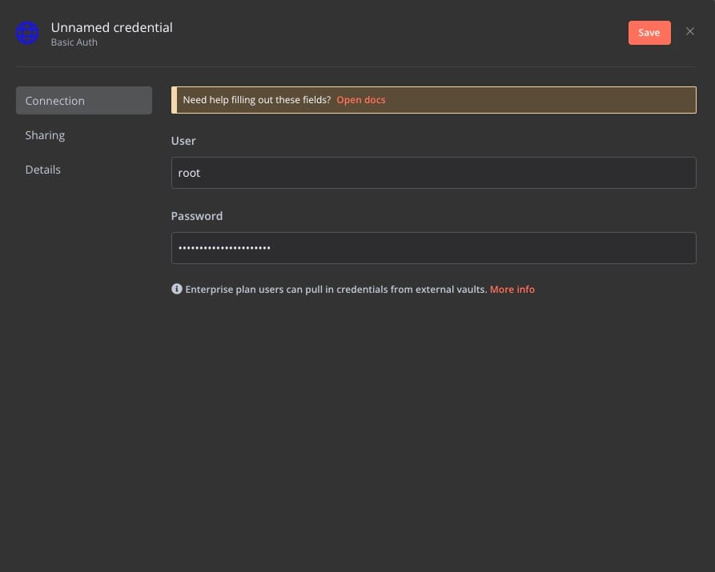Now set the other parameters similar to those found in the email.

**Method:** Post

**URL:** \<URL from the email or OctaByte dashboard\>

**Authentication:** Generic Credential Type

**Generic Auth Type:** Basic Auth

**Credential for Basic Auth**: User login

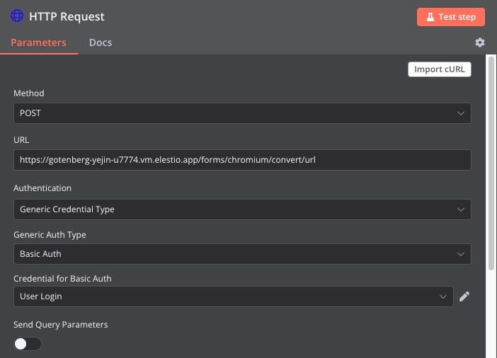Next, configure the Head and body of the request.

**Specify Headers:** Using Fields Below

**Name:** Gotenberg\-Ourput\-Filename

**Value:** result

**Body Content Type**: Form\-Data

**Parameter Type:** Form Data

**Name:** URL

**Value**: https://www.wikipedia.org/

This HTTP request is to send a request to the provided URL to fetch the HTML page and convert it into a PDF using Gotenberg.

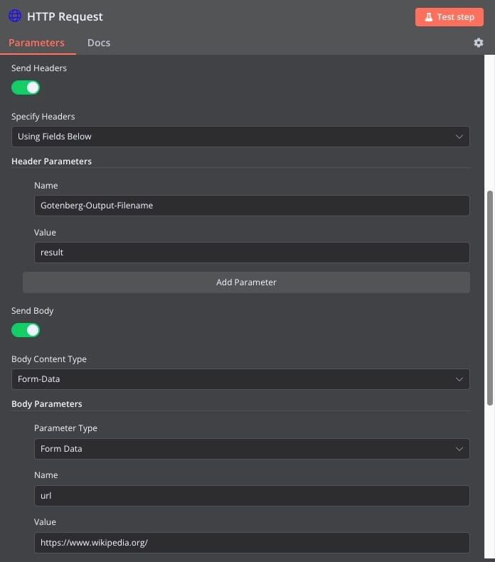Now we have to configure the Response. Set the **Response format** to **File** and **Put Output in Field** to data.

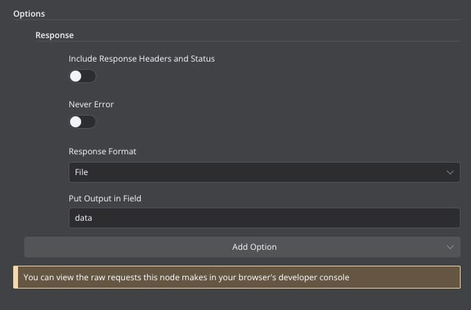The final workflow looks something like this. Now we will test the workflow before we deploy it to production. Click on **Test workflow**. 

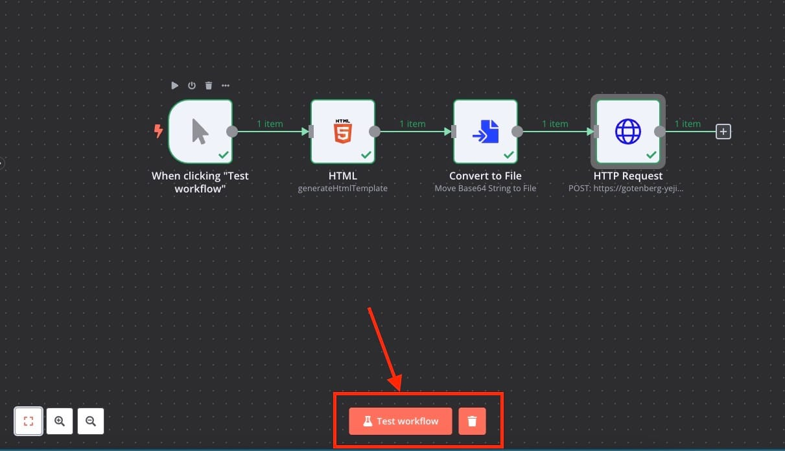Once the button is clicked an output window will pop up where we can see our pdf ready. You can download or choose to print the PDF directly.

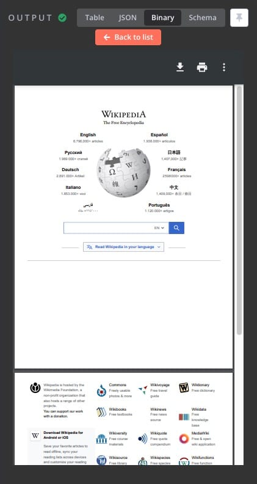And done! You have successfully created a workflow that creates a pdf of the webpage provided using URL in HTTP request and Gotenberg. You can form multiple such workflows based on the request type.

## **Thanks for reading ❤️**

Thank you so much for reading and do check out the OctaByte resources and Official [N8N documentation](https://docs.n8n.io/?ref=blog.octabyte.io) to learn more about N8N. Click the button below to create your service on [OctaByte](images/n8n) and generate PDFs using Gotenberg. See you in the next one👋

