Let's see how you can create an application that can retrieve weather information based on a zip code using API. During this tutorial, we will be creating the workflow using a template. You can create the same from scratch too. Before we start, make sure you have deployed N8N, we will be self\-hosting it on [OctaByte](images/n8n).

## What is N8N?

N8N is an open source workflow automation tool that allows you to automate tasks and workflows by connecting various applications, services, and APIs together. It provides a visual interface where users can create workflows using a node\-based system, similar to flowcharts, without needing to write any code. You can integrate n8n with a wide range of applications and services, including popular ones like Google Drive, Slack, GitHub, and more. This flexibility enables users to automate a variety of tasks, such as data synchronization, notifications, data processing, and more.

## Using Template

Once you log in to N8N you will land on the canvas page of N8N. To check out different templates and use one, head over to the templates section from the left sidebar. 

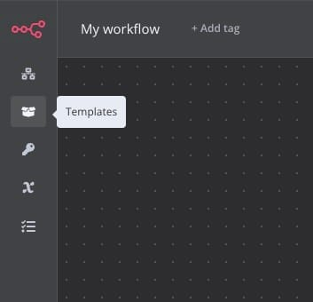Then search for "Receive the weather information of any city" template or simply click [here](https://n8n.io/workflows/807-receive-the-weather-information-of-any-city/?ref=blog.octabyte.io). Next, click on **Use workflow**.

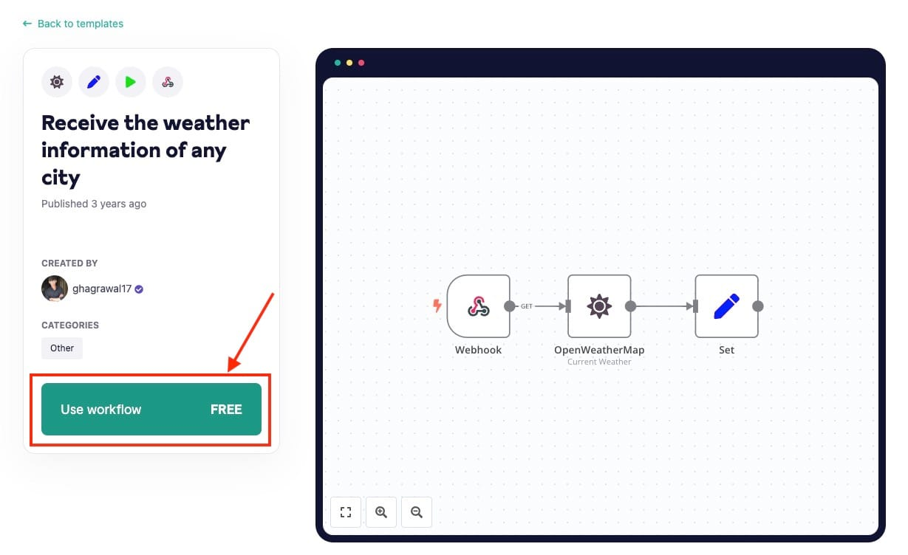Select the N8N instance you want to use this template for. If you have multiple N8N instances running then you can choose the appropriate one.

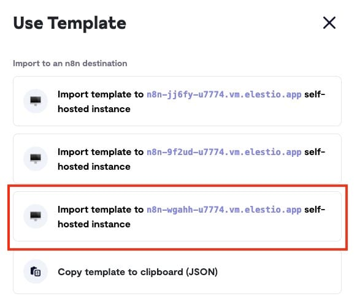## Configuring OpenWeatherMap Credential

Now as you move ahead in the process you will be prompted with pop up to configure OpenWeatherMap credentials. Click on **Create new OpenWatherMap credential**. 

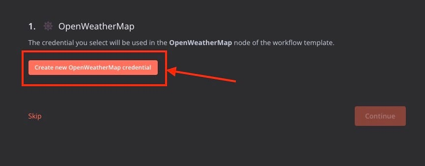Now if you don't have OpenWeatherApp account then follow these steps before heading further. Feel free to skip these if you already have an account and API Key. 

Head over to [OpenWeatherApp Website](https://openweathermap.org/?ref=blog.octabyte.io) and create a new account. Add **Username**, **Email, Password** to create your account.

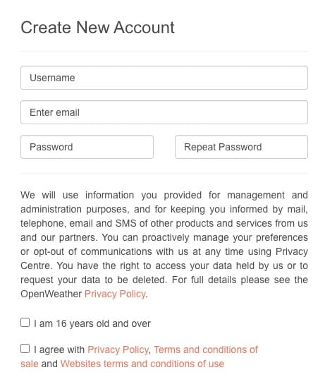Next provide our Company/Organisation and purpose and click **Save**.

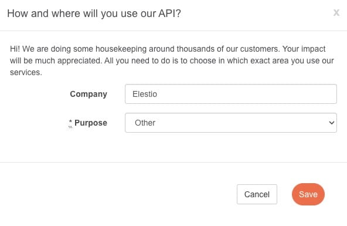Head over to the **API Keys** and add **API key name** and click on **Generate** to generate an API Key. Copy the **Key** that will be used in the further steps.

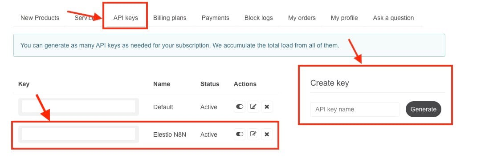Paste the previously copied key in the **Access Token** section and click on **Save.**

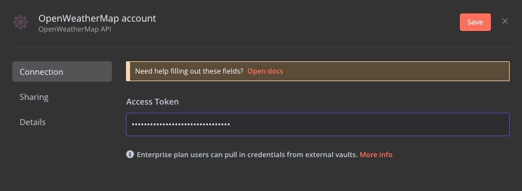## Creating Workflow

Once you are redirected back to the workflow screen you will find components like below. To start with click on the first **Webhook** component. In this component we set up the endpoint URL, authentication mechanism etc for API endpoint to be hit to get the result we desire.

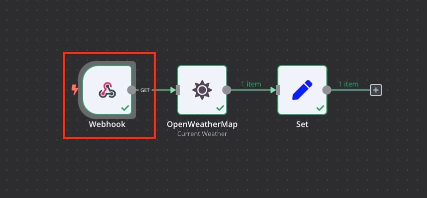Once you click on **Webhook** you can copy **Test URL/Production URL**, Select the HTTP Method. Here we are trying to make a **GET** request so we have selected it from the drop down menu. Let's keep Authentication as none for the simplicity but make sure while in production you add the authentication to provide security to the endpoints. Additionally we will configure the response to be made **When Last Node Finishes** under **Respond**.

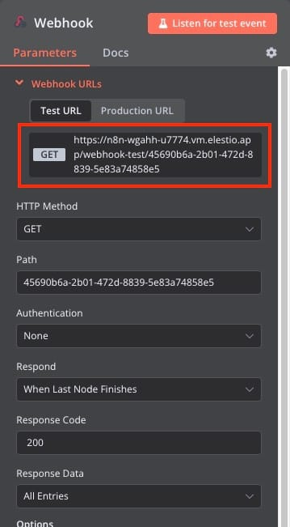Following part of workflow enables you to make API request to **OpenWeatherMap** and get response from it. It takes input from the previous webhooks such as city name or zip code. Click on section to setup the requests.

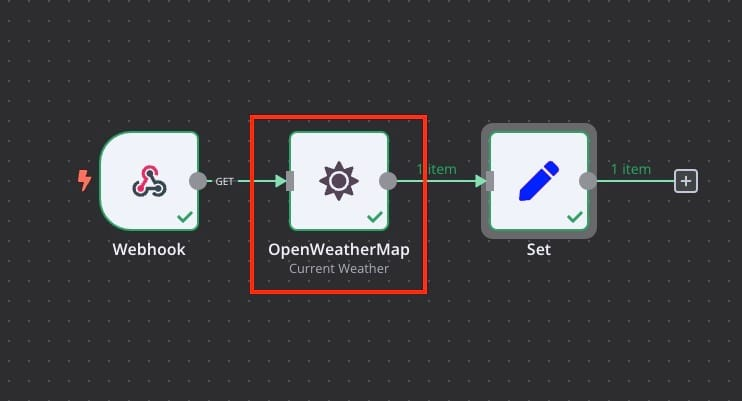Here we will select the credentials created in our previous steps. Select the settings as following

**Operation:** Current Weather

**Format:** Metric

**Location Selection:** City Name

**City:** `{{$node["Webhook"].json["query"]["city]}}`

**Language:** en

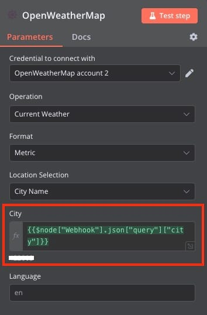Next we will configure the **Set** component. Click on this component as shown in the following images and move to the configuration part.

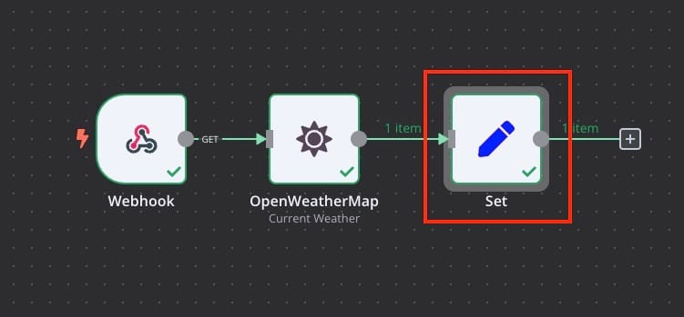Set the **Values to Set** as 

**Name:** temp

**Value:** `{{$node["OpenWeatherMap"].json["main"]["temp"]}}`

**Name:** description

**Value:** `{{$node["OpenWeatherMap"].json["weather"][0]["description"]}}`

## Testing Workflow

For testing your workflow you will see **Test workflow** button. Click on it and paste the endpoint URL copied from the **Webhook** component in the earlier steps. Make sure you add the query property to it. In this case it will be `?city=10019` so the final url will look something like


```
https://n8n-wgahh-u7774.vm.octabyte.io/webhook-test/45690b6a-2b01-472d-8839-5e83a74858e5?city=10019
```
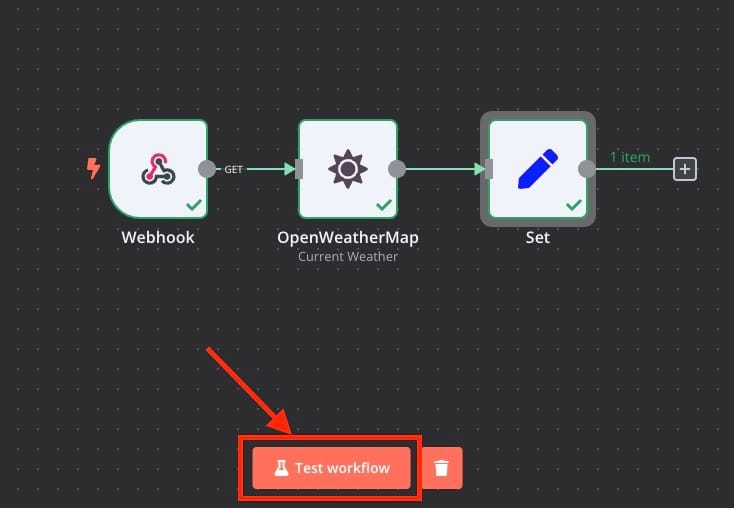And you should see output like below.

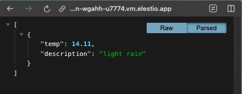And done! You have successfully created application that will make API request to retrieve weather location based on zip code. You can form multiple such workflows based on the request type.

## **Thanks for reading ❤️**

Thank you so much for reading and do check out the OctaByte resources and Official [N8N documentation](https://docs.n8n.io/?ref=blog.octabyte.io) to learn more about N8N. You can click the button below to create your service on [OctaByte](images/n8n) and retrieve weather information based on a zip code. See you in the next one👋

[](images/n8n)

