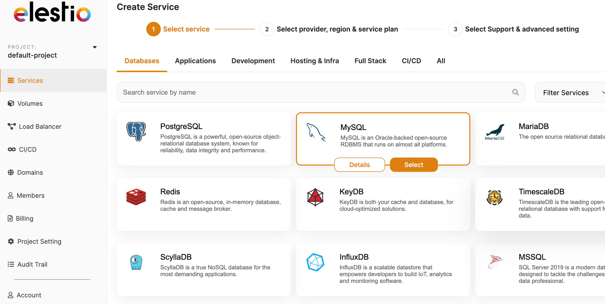

[n8n](https://elest.io/open-source/n8n?ref=blog.elest.io) is a popular open\-source workflow automation tool that allows you to automate repetitive tasks and create custom workflows. The installation process automatically includes a Database for you but if you want to have more control over it (like backups/sharing it with other projects/scalability) you can connect it to your own. In this article, we'll walk you through the steps of how to set up a MySQL instance and connect it to your n8n instance.

If you don't have a ready\-to\-use n8n instance you can click here to deploy it first:

[Deploy n8n](https://elest.io/open-source/n8n?ref=blog.elest.io)### Step 1: Create your managed MySQL instance

In your [Elestio's dashboard](https://dash.elest.io/?ref=blog.elest.io) create a new service and select MySQL.



Elestio Dashboard, MySQL Service Creation

From there you can select your instance resources. You can increase it later when needed.


Instance Selection

When your instance is ready you receive an email to notify you with a link to access your admin panel where you can get your credentials for the next step.


MySQL instance credentials

### Step 2: Setup N8N Environment Variable

The first step is to add an environment variable. You can do this in the .env file in Visual Studio Code (VSCode) or from the Elestio Dashboard \> Update config button. 

The environment variables you need to add are the followings: 

* `DB_TYPE=mysqldb` or `DB_TYPE=mariadb`
* `DB_MYSQLDB_DATABASE` (default: 'n8n' but you can use another one if you want)
* `DB_MYSQLDB_HOST` (copy **Host** from your dashboard)
* `DB_MYSQLDB_PORT` (copy **Port** from your dashboard)
* `DB_MYSQLDB_USER` (copy **User** from your dashboard)
* `DB_MYSQLDB_PASSWORD` (copy **Password** from your dashboard)

It should look like this (with your values):


```
DB_TYPE=mysqldb
DB_MYSQLDB_DATABASE=n8n
DB_MYSQLDB_HOST=mysql-ina8z-u4.vm.elestio.app
DB_MYSQLDB_PORT=24306
DB_MYSQLDB_USER=root
DB_MYSQLDB_PASSWORD=bY9zFTww-Jc9D-qUfJXJg4

```

### Step 3: Restart your instance


Restart your instance

Once your environment variables are set, on your instance admin dashboard, go to the software section and hit restart. Once it's reloaded your n8n instance will be connected to your MySQL one!

It also works with other type of databases. If you need more information we recommend you to jump into [n8n documentation](https://docs.n8n.io/hosting/supported-databases-settings/?ref=blog.elest.io#mysql-mariadb).


