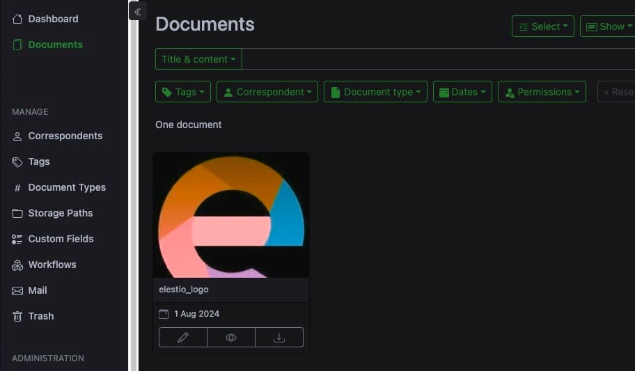

[Paperless\-ngx](https://elest.io/open-source/paperless-ngx?ref=blog.elest.io) is an open\-source document management system that allows you to easily archive, organize, and retrieve your documents. While its web interface provides a way to manage documents, Paperless\-ngx also offers a REST API, which allows for programmatic access and integration with other applications. In this blog, we'll explore how to use the REST API with Paperless\-ngx to interact with your document archive in a more automated manner with the help of [N8N](https://elest.io/open-source/n8n?ref=blog.elest.io).

### What is a REST API?

REST (Representational State Transfer) API is a way to communicate with web services over HTTP. It allows you to perform operations like creating, reading, updating, and deleting data by sending requests to specific endpoints. REST APIs are stateless and rely on standard HTTP methods such as GET, POST, PUT, and DELETE.

### Understanding Paperless\-ngx REST API

Before diving into the specifics of using the REST API with Paperless\-ngx, ensure that your Paperless\-ngx instance is up and running on [Elestio](https://elest.io/open-source/paperless-ngx?ref=blog.elest.io).

**Accessing the API Documentation**:  
Paperless\-ngx has built\-in API documentation that can be accessed by navigating to [https://docs.paperless\-ngx.com/api/](https://docs.paperless-ngx.com/api/?ref=blog.elest.io). This documentation provides detailed information about the available endpoints, the data they expect, and the responses they return.

## Setting Up N8N

In this tutorial, we are going to use N8N for utilizing the Paperless\-ngx API and accessing the documents through simple workflows. We will self\-host N8N on Elestio and you can do the same by heading over to the [Elestio Dashboard](https://elest.io/open-source/n8n?ref=blog.elest.io). For reference, we will be trying to access the following document uploaded on Paperless.

To begin with, our simple N8N workflow will look similar to the following. It will have 2 main components, **Click the Workflow** button and the **HTTP Request** component.

To keep things simple, we are going to make a simple **GET** request to the paperless API and fetch the document. You can use the different API enpoints and routes to do perform other methods like **POST**, **PUT** etc. Now in the **HTTP Request** component, configure the following as below

**Method:** GET

**URL:** `https://<elestio-paperless-url>/api/documents/<document-id>/preview`

**Authentication:** Generic Credential Type

**Generic Auth Type:** Basic Auth

In basic auth settings, add the **username** and **password** provided in elestio dashboard.

Once you run this workflow, you'll see the document from paperless in the output. Additionally you can choose to add additional steps after the document is received in the output. 

💡Refer [https://docs.paperless\-ngx.com/api/](https://docs.paperless-ngx.com/api/?ref=blog.elest.io) for checking out all the available routes and how to utilize them.## **Thanks for reading ❤️**

By following these steps, you can use the Paperless\-ngx REST API to perform your document management tasks and integrate them into your existing workflows. This approach not only enhances your ability to organize and retrieve documents but also opens up new possibilities for automation and efficiency. Thank you for reading, and be sure to explore additional resources and the [official Paperless\-ngx documentation](https://docs.paperless-ngx.com/?ref=blog.elest.io) to unlock even more potential. Click the button below to start using Paperless\-ngx on [Elestio](https://elest.io/open-source/paperless-ngx?ref=blog.elest.io). See you in the next one! 👋

