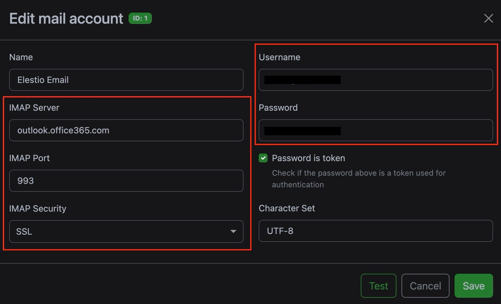

[Paperless\-ngx](https://elest.io/open-source/paperless-ngx?ref=blog.elest.io) allows you to automatically consume and archive documents from your email accounts. This feature is useful if you frequently receive important documents via email that you need to organize and store securely. In this blog, we’ll explore how to set up and configure Paperless\-ngx to manage your email documents effectively.

## Setting Up Email Integration in Paperless\-ngx

To get started, you need to configure the mail consumer feature within Paperless\-ngx. This can be done through the frontend settings at **Manage \> Mail**. The setup process involves a few key steps.

## **Set Up Email Accounts**

Begin by adding the email accounts from which you want Paperless\-ngx to fetch documents. This step is important because Paperless\-ngx needs to know where to look for documents that need to be archived. If necessary, you can add multiple accounts and configure them individually based on your needs. Make sure to provide accurate IMAP or POP3 details, along with the correct authentication information, to ensure integration with Paperless\-ngx. Toset it up, head over to **Mail \> Mail Accounts \> Add Account** and fill out the information found with your mail account.

## **Set Up Mail Rules**

Once your email accounts are configured, the next step is to set up mail rules. These rules dictate how Paperless\-ngx will process incoming emails. Rules can be customized to suit your workflow, allowing you to define specific criteria for email processing.

* **Connecting to the Mail Server:** Paperless\-ngx will establish a connection to your specified mail server using the credentials you provided. This connection is essential for retrieving emails directly from your inbox or specified folders.
* **Fetching Emails:** The system will fetch emails based on the criteria you define, such as specific folders, age limits, and filters. This allows you to control which emails are processed, ensuring that only relevant documents are consumed.
* **Checking for Attachments:** Paperless\-ngx will scan the fetched emails for any attachments that can be consumed and archived. This is where the system’s ability to parse various file formats comes into play, ensuring that important documents are captured.
* **Processing Attachments:** If consumable attachments are found, Paperless\-ngx will automatically archive them into your document management system. You can also set up metadata rules to categorize and organize these documents as they are processed, making it easier to find and manage them later.
* **Filtering Emails:** Filtering options allow you to specify criteria that determine which emails are fetched and processed. These filters can be based on various factors such as specific sender, or the recipient, body of the email, subject, attachment name, type etc. By setting these filters, you can ensure that only relevant emails containing the documents you want to archive are retrieved, preventing unnecessary processing of unrelated messages.
* **Ensuring Efficient and Safe Email Processing:** Paperless\-ngx is designed to ensure that emails are processed efficiently and safely, preventing duplicate processing and maintaining the integrity of your data. The following settings can be configured under the **Actions** tab.
	+ **Delete:** After successfully consuming the documents from an email, Paperless\-ngx can delete the email permanently. This option should be used with caution, as it will remove the email from your account completely, preventing any future access.
	+ **Mark as Read:** Paperless\-ngx can mark emails as read after processing them. This action prevents the system from reprocessing the same email in future scans. However, it’s important to note that if you manually mark an email as read before Paperless\-ngx processes it, the email will be ignored by the system.
	+ **Flag:** Paperless\-ngx can flag emails as important once their attachments have been consumed. This is particularly useful for keeping track of processed emails. The system will skip any flagged emails during future scans, ensuring they aren’t processed twice.
	+ **Move to Folder:** To keep your inbox organized, Paperless\-ngx can move processed emails to a designated folder. This action ensures that these emails are out of the way and not consumed again in subsequent scans.
	+ **Add Custom Tag:** For advanced email management, Paperless\-ngx can add custom tags to processed emails. This feature is useful for categorizing and organizing emails within your inbox. Note that this feature’s availability depends on your mail server’s support for custom tags.

# Additional Configuration Tips

### Automating Email Document Management

With the right set of rules, you can fully automate how Paperless\-ngx handles your email documents. By creating specific rules for each sender or document type, you can ensure that Paperless\-ngx automatically processes and archives all your important emails. The default action to **mark as read** is safe and won’t result in data loss. For additional control, consider setting up a dedicated folder in your email account where you or your email client can move emails that need to be processed. Paperless\-ngx can then move these emails to another folder after they’ve been consumed, allowing you to keep your inbox organized.

### Handling Folder Structure and Common Issues

When defining a rule that involves a folder, you might need to experiment with different characters to correctly identify sub\-folders, as this varies by mail server. Common separators include ".", "/", or "\|". If Paperless\-ngx encounters an error while fetching emails from a specific folder, check the Paperless logs for more details. If a folder isn't located, Paperless\-ngx will attempt to list all available folders in the logs for troubleshooting.

### Rule Processing Order and Catch\-All Rules

Paperless\-ngx processes rules in the order they are defined on the admin page. To ensure that no documents are missed, you can create catch\-all rules that are executed last. These rules can handle any remaining documents that don’t match previous criteria, such as assigning a generic **Unknown mail document** tag for further inspection. Finally, Paperless\-ngx is configured to check your emails every 10 minutes by default, a setting that can be adjusted via `PAPERLESS_EMAIL_TASK_CRON` for more frequent or less frequent checks. By setting up these features, you can significantly improve your document management process, ensuring that important documents are automatically archived and organized with minimal manual intervention.

## **Thanks for reading ❤️**

By following the steps outlined above, you can configure Paperless\-ngx to automatically process and archive documents received via email, helping your document management workflow. This setup not only simplifies the task of managing incoming documents but also ensures that your important files are organized and easily accessible. Thank you for reading, and don't forget to explore additional resources and [documentation for Paperless\-ngx](https://docs.paperless-ngx.com/?ref=blog.elest.io) to unlock even more advanced features. Click the button below to get started with your Paperless\-ngx setup. See you in the next one! 👋

