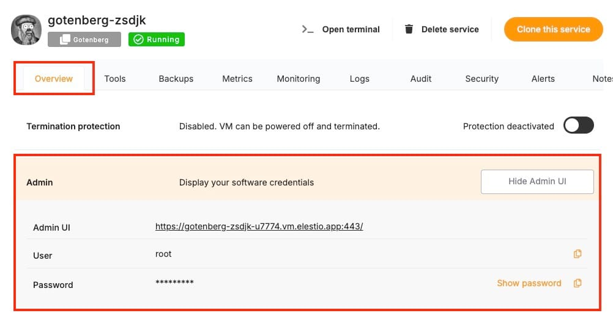

[Paperless\-ngx](https://docs.paperless-ngx.com/?ref=blog.elest.io) is an open\-source document management system that helps you organize, search, and archive your documents. However, what if you need to parse and convert documents into different formats? This is where [Gotenberg](https://gotenberg.dev/docs/getting-started/introduction?ref=blog.elest.io) comes into play. Gotenberg is an API\-based platform that allows you to convert HTML, Markdown, and Office documents into PDFs. When combined with Paperless\-ngx, Gotenberg can help your document management system, making it easier to handle various document formats. In this blog, we’ll walk you through the steps to integrate Gotenberg with Paperless\-ngx using a self\-hosted setup on Elestio.

## Why Use Gotenberg with Paperless\-ngx?

Integrating Gotenberg with Paperless\-ngx adds a layer of functionality that’s useful for anyone dealing with different document formats. It allows you to convert HTML, Markdown, or Office documents into PDFs automatically as they are ingested into Paperless\-ngx. You can also maintain a consistent document format within your Paperless\-ngx instance, making it easier to manage, search, and archive documents.It helps you utilize Gotenberg’s parsing features to extract text and metadata from various document types, ensuring that your Paperless\-ngx database is always up\-to\-date.

## Hosting Gotenberg on Elestio

The first step in this integration process is to set up your [Gotenberg service on Elestio](https://elest.io/open-source/gotenberg?ref=blog.elest.io). If you haven’t already, create an account on Elestio and log in to your dashboard. In the Elestio dashboard, navigate to the **Create New Service** section. Search for **Gotenberg** in the service marketplace. Choose the appropriate server specifications and configure your VPS settings based on your requirements. Ensure that you select a server location that best suits your needs. Once your VPS is configured, click **Create Service** to start the Gotenberg service. Elestio will automatically set up the service and provide you with the necessary access details, including the service **URL**, **Username,** and **Password** which you’ll need in the subsequent steps.

## Deploy \& Configure Paperless\-ngx

With Gotenberg running, the next step is to deploy Paperless\-ngx on Elestio. Similar to how you deployed Gotenberg, search for Paperless\-ngx in the Elestio service marketplace and deploy it on a new VPS. In the Paperless\-ngx admin interface, locate the **Update Config** section. This is where you will integrate Gotenberg into your Paperless\-ngx setup.

Once you click on this option, you will see `docker-compose` the config file which we will update to integrate our Gotenberg instance. Add the following environment variable to the Docker Compose file to point Paperless\-ngx to your Gotenberg instance:


```
environment:
  - PAPERLESS_TIKA_GOTENBERG_ENDPOINT=<Gotenberg-Service-URL-From-Elestio>

```
Replace `<Gotenberg-Service-URL-From-Elestio>` with the actual URL provided by Elestio for your Gotenberg service. To ensure secure and efficient communication between Paperless\-ngx and Gotenberg, you’ll need to add specific `command` and `environment` variables to the Docker Compose file. Add the following under `environment`


```
environment:
  - GOTENBERG_API_BASIC_AUTH_USERNAME=root
  - GOTENBERG_API_BASIC_AUTH_PASSWORD=<password>

```
Replace `<password>` with a strong password of your choice. This will be used by Paperless\-ngx to authenticate with the Gotenberg service. After this add the following commands


```
command:
  - "gotenberg"
  - "--api-enable-basic-auth"

```
This command enables basic authentication for the Gotenberg API, ensuring that only authorized services can interact with it. The final version of your config file should look something like the image provided below.

After making these changes, save the Docker Compose file and restart the Paperless\-ngx service by clicking on **Update \& Restart** to apply the new configurations.

## Testing Connection

To test if your gotenberg service has successfully connected or not, click on **view app logs** (which can be found beside the **Update Config** option used before). Once you can see the logs, check under the Gotenberg title and verify there are no connection errors logged.

## **Thanks for reading ❤️**

By following these steps, you’ve successfully integrated Gotenberg with Paperless\-ngx, significantly enhancing your document management capabilities. This integration allows you to parse and convert documents seamlessly, automating workflows and ensuring consistency across your document archive. Thank you for following along! Be sure to explore Elestio’s resources and the official documentation for both [Paperless\-ngx](https://docs.paperless-ngx.com/?ref=blog.elest.io) and [Gotenberg](https://gotenberg.dev/docs/getting-started/introduction?ref=blog.elest.io) to discover more advanced features and customization options. Ready to get started? Click the button below to set up your services on [Elestio](https://elest.io/open-source/paperless-ngx?ref=blog.elest.io) and build your document management system. See you in the next one! 👋


[](https://elest.io/open-source/paperless-ngx?ref=blog.elest.io)


