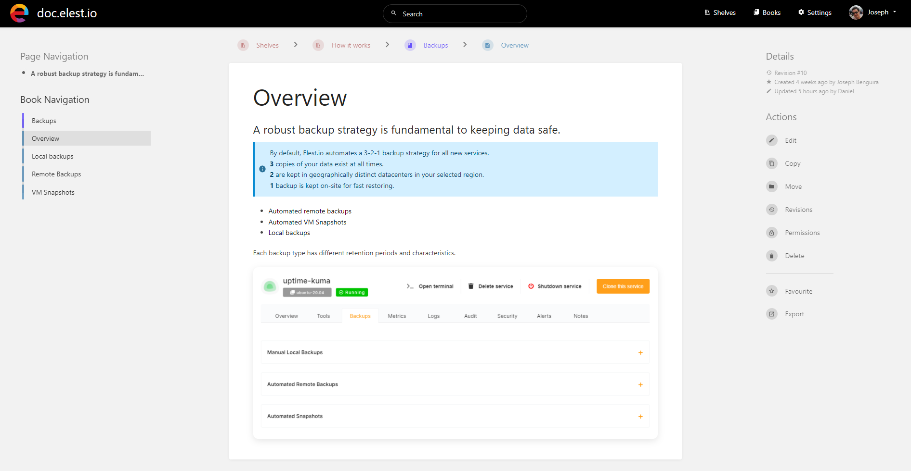

BookStack is a simple, self\-hosted, easy\-to\-use platform for organising and storing information

We used BookStack to create the public [Elestio documentation](https://doc.elest.io/?ref=blog.elest.io), it allowed us to write the whole documentation in a week thanks to its intuitive UI.

The content is sorted in a hierarchy with **Shelves \> Books \> Chapters \> Pages**

You can easily sort chapters, and pages or move elements between categories. The editor is simple enough to not get in your way, but it's powerful enough to create great documentation.

The settings allow some theme configuration, like changing name, logo, colors, default home page, editor type (WYSIWYG or Markdown)

It's also possible to do more advanced customizations by injection custom CSS or JS with the Custom HTML head content setting:

There is a team \& permission management included, you can easily invite your coworkers and assign them a role, you can them limit access to content by role. A full audit log is available to let you know who did what and when.

Finally, it's possible to configure webhooks to be notified on a third party system when something happens, for example you could use this with Zapier to send a notification in Slack or Teams whenever someone performs a certain action.

You can setup BookStack with docker, here is an example docker\-compose.yml 


```
---
version: "2"
services:
  bookstack:
    image: lscr.io/linuxserver/bookstack
    container_name: bookstack
    environment:
      - PUID=1000
      - PGID=1000
      - APP_URL=
      - DB_HOST=bookstack_db
      - DB_USER=bookstack
      - DB_PASS=
      - DB_DATABASE=bookstackapp
    volumes:
      - /path/to/data:/config
    ports:
      - 127.0.0.1:6875:80
    restart: unless-stopped
    depends_on:
      - bookstack_db
  bookstack_db:
    image: lscr.io/linuxserver/mariadb
    container_name: bookstack_db
    environment:
      - PUID=1000
      - PGID=1000
      - MYSQL_ROOT_PASSWORD=
      - TZ=Europe/London
      - MYSQL_DATABASE=bookstackapp
      - MYSQL_USER=bookstack
      - MYSQL_PASSWORD=
    volumes:
      - /path/to/data:/config
    restart: unless-stopped

```
This way it will run on port 6875 of your computer or VM and you can try it in your browser with this URL: http://localhost:6875

You might want to [deploy BookStack on elest.io](https://dash.elest.io/deploy?soft=BookStack&deploy=143&ref=blog.elest.io) if you want automated backups, reverse proxy with SSL termination, DOS protection, firewall, automated OS \& Software updates (So your instance of BookStack stays always up to date), and a team of Linux experts and open source enthusiasts to ensure your services are always safe, and functional.

Click on the button below to get a fully managed instance of BookStack ready to use in less than 3 minutes. 

[Deploy BookStack](https://dash.elest.io/deploy?soft=BookStack&id=143&ref=blog.elest.io)

