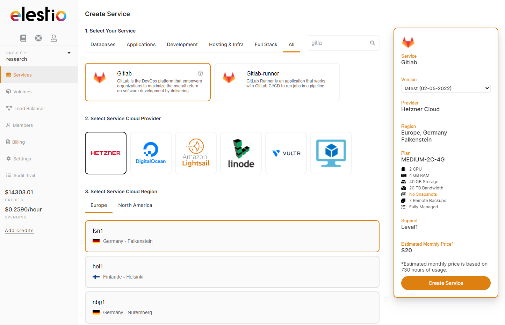

Gitlab [announced recently](https://about.gitlab.com/blog/2022/03/24/efficient-free-tier/?ref=blog.elest.io) that they are limiting the number of users per namespace to 5\. If you have more than 5 users in a group or subgroup you will be impacted by this change.

## What can you do?

1. Upgrade to [Gitlab paid offering](https://about.gitlab.com/pricing/?ref=blog.elest.io), if you have a relatively small number of users this option is quite interesting. But this is a deal\-breaker when you have a few thousand or tens of thousands of users.
2. Migrate to something else like Github, [Gitea](https://elest.io/open-source/gitea?ref=blog.elest.io), Fossil, [Gogs](https://elest.io/open-source/gogs?ref=blog.elest.io), [Onedev](https://elest.io/open-source/onedev?ref=blog.elest.io) or others, but you will not get the same features and you will have to go through a migration and learning curve to master the new tool.
3. Migrate to the self\-hosted version of Gitlab, this version is not limited in the number of users per namespace.


If options 1 \& 2 are not working for you, let's go into more detail about option 3: migrate Gitlab SaaS to Gitlab self\-hosted.

## List of topics you have to take care of when self\-hosting a Gitlab instance

* DNS management
* SMTP Configuration
* Deploying and configuring Gitlab
* Updating frequently Gitlab (at least twice per month)
* Updating frequently OS (at least every week)
* Setting up multiple backups systems in multiple locations
* Setting up monitoring \& alerts
* Setting up firewall / rate limiter / output cache
* Configure \& Renew SSL certificates


Each point in this list above can be challenging depending on your skills, context, and permissions. Also, it can be very time\-consuming.

Another option is to deploy a [fully\-managed instance of Gitlab](https://elest.io/open-source/gitlab?ref=blog.elest.io) and if required also a [fully\-managed instance of Gitlab Runner](https://elest.io/open-source/gitlab-runner?ref=blog.elest.io) with Elestio. 

This way you get all the points above done for you **automatically** and you will also get **professional support** from our team of Linux experts and open\-source enthusiasts.

You can deploy a Gitlab instance in less than 5 minutes to any one of 80 datacenters in 27 countries through our 5 cloud providers. You can also BringYourOwnVM and host anywhere, including on\-premise.

Click on the button below to launch a fully managed Gitlab instance.

[Deploy Gitlab](https://dash.elest.io/deploy?soft=Gitlab&id=182&ref=blog.elest.io)Once your new Gitlab instance is ready you can migrate your repositories from Gitlab.com to your private Gitlab instance by following this tutorial:

[Project importing from GitLab.com to your private GitLab instance \| GitLabDocumentation for GitLab Community Edition, GitLab Enterprise Edition, Omnibus GitLab, and GitLab Runner.Docs](https://docs.gitlab.com/ee/user/project/import/gitlab_com.html?ref=blog.elest.io)## Step by step instructions to Migrate from Gitlab SaaS to Gitlab private instance

1\) First go to your Gitlab.com Applications page: [https://gitlab.com/\-/profile/applications](https://gitlab.com/-/profile/applications?ref=blog.elest.io)

2\) There create a new Gitlab app by providing an app name (whatever you want) and also the redurect URI, you have to put 2 lines: https://YOUR\_PRIVATE\_INSTANCE\_DOMAIN/import/gitlab/callback and  
https://YOUR\_PRIVATE\_INSTANCE\_DOMAIN/users/auth/gitlab/callback

Replace YOUR\_PRIVATE\_INSTANCE\_DOMAIN with the your real gitlab instance domain.

then validate by click on the "Save application" button below all options

You will then get an **Application ID \& Secret** on screen, **copy both of them**, they will be required for next steps.

You will get something similar to this:

**Application ID:** f3205cad586b0eb7c287a629a6e4fa3b47c11e821ac82b95a260e94fdbc630c4  
**Application Secret:** 57e779604e485170c46757b2c63b5643fc4481a8f157da449f613feb0a10f718

3\) Go back to Elestio Dashboard \> click on your Gitlab instance to open the service overview:

There click on "Update Config" button and paste this configuration including your app\_id and app\_secret you got at the previous step from gitlab.com like this:


```

gitlab_rails['omniauth_providers'] = [
    {
    name: "gitlab",
    app_id: "XXXXXXXXXXXXXXXX",
    app_secret: "YYYYYYYYYYYYYYYYY",
    args: { scope: "read_user" } # optional: defaults to the scopes of the application
    }
]

```


It should now look like this:

  
Finally click on Update \& Restart, after 2 minutes your instance will be fully restarted with the new configuration.   


from there you can start importing your Gitlab.com projects into your private Gitlab instance! To do that, go to your private Gitlab instance then click on “New project” \> Import project \> Gitlab

PS: you can also reach that screen with this url: [https://YOUR\_PRIVATE\_INSTANCE/projects/new\#import\_project](https://your_private_instance/projects/new?ref=blog.elest.io#import_project)  


Click on Gitlab.com in the "import project from" section, you will be asked to authorize access to your Gitlab.com account

  
All your detected projects will be visible in the list, just click on the import button for each project you want to import in your private instance and your are done!


****And your are done :)****

FYI, this method will import the repository and issues, but not everything. There is another way to export/import nearly everything, please [check here](https://docs.gitlab.com/ee/user/project/settings/import_export.html?ref=blog.elest.io#export-a-project-and-its-data).

With that alternative method the following items are exported:


* Project and wiki repositories
* Project uploads
* Project configuration, excluding integrations
* Issues with comments, merge requests with diffs and comments, labels, milestones, snippets, time tracking, and other project entities  

Design Management files and data
* LFS objects
* Issue boards
* Pipelines history
* Push Rules
* Awards
* Group members are exported as project members, as long as the user has the
* Maintainer role in the exported project’s group, or is an administrator


The following items are not exported:


* Child pipeline history
* Build traces and artifacts
* Container registry images
* CI/CD variables
* Pipeline triggers
* Webhooks
* Any encrypted tokens
* Merge Request Approvers and the number of required approvals
* Repository size limits
* Deploy keys allowed to push to protected branches
* Secure Files


These content rules also apply to creating projects from templates on the group or instance levels, because the same export and import mechanisms are used.


