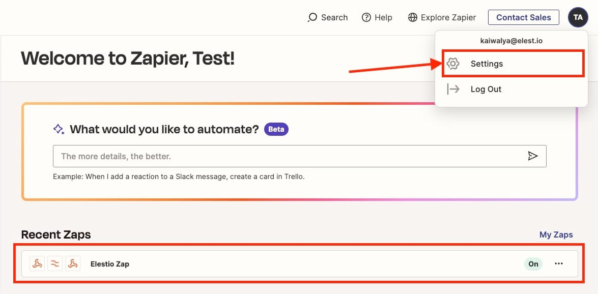

Let's see how you can migrate your workflows and zaps from Zapier \& Make to [N8N](https://elest.io/open-source/n8n?ref=blog.elest.io). During this tutorial, we will be using simple workflows as examples and you can choose to do with complex workflows or multiple workflows. Before we start, ensure you have deployed N8N, we will be self\-hosting it on [Elestio](https://elest.io/open-source/n8n?ref=blog.elest.io).

## What is N8N?

N8N is an open\-source workflow automation tool that allows you to automate tasks and workflows by connecting various applications, services, and APIs together. It provides a visual interface where users can create workflows using a node\-based system, similar to flowcharts, without needing to write any code. You can integrate n8n with a wide range of applications and services, including popular ones like Google Drive, Slack, GitHub, and more. This flexibility enables users to automate various tasks, such as data synchronization, notifications, data processing, and more.

## Exporting from Zapier

Zapier is a web\-based automation tool that allows users to connect different apps and services to create automated workflows, known as "Zaps," without needing to write any code. We will start by exporting the workflow also called Zap from Zapier. Once you are in the Zappier instance, head to the profile section and click **Settings**log in. 

Next, we head over to the **Data Management** section from the left\-hand section. With that click on the **Export My Data** button. This will download the zap content in JSON format.

The data is processed for a while and your files and export are available on your email id. Head to your registered email inbox and click **Download your account data** to download the JSON file on your local machines.

You receive two files in a zip format which we will be utilizing `zapfile.json` in the following steps.

## Exporting from Make

Make previously known as Integromat, is an integration and automation platform that allows users to connect apps and services to automate workflows and tasks. If you are using Make for building workflows previously you can follow these export steps. Head over to your integration click on the **"..."** (Options menu) and click on **Export Blueprint**. 

## Importing into N8N

Now we will import the exported workflows from Zappier/Make in N8N. To import, log in with the credentials presented on the Elestio dashboard. You will be presented with the following screen. Head over to the options menu, click on **Import from File** and select the file downloaded from the previous exporting steps. 

💡Remember that some components might have issues migrating as tools have different components and integration support. Please read the official documentation and releases to learn about the replacement components.And done! This is the workflow we migrated from Zappier/Make to N8N. You can now edit or use the workflow as per your requirement

## **Thanks for reading ❤️**

Thank you so much for reading and do check out the Elestio resources and Official [N8N documentation](https://docs.n8n.io/?ref=blog.elest.io) to learn more about N8N. You can click the button below to create your service on [Elestio](https://elest.io/open-source/n8n?ref=blog.elest.io) and start your vault migration process. See you in the next one👋

