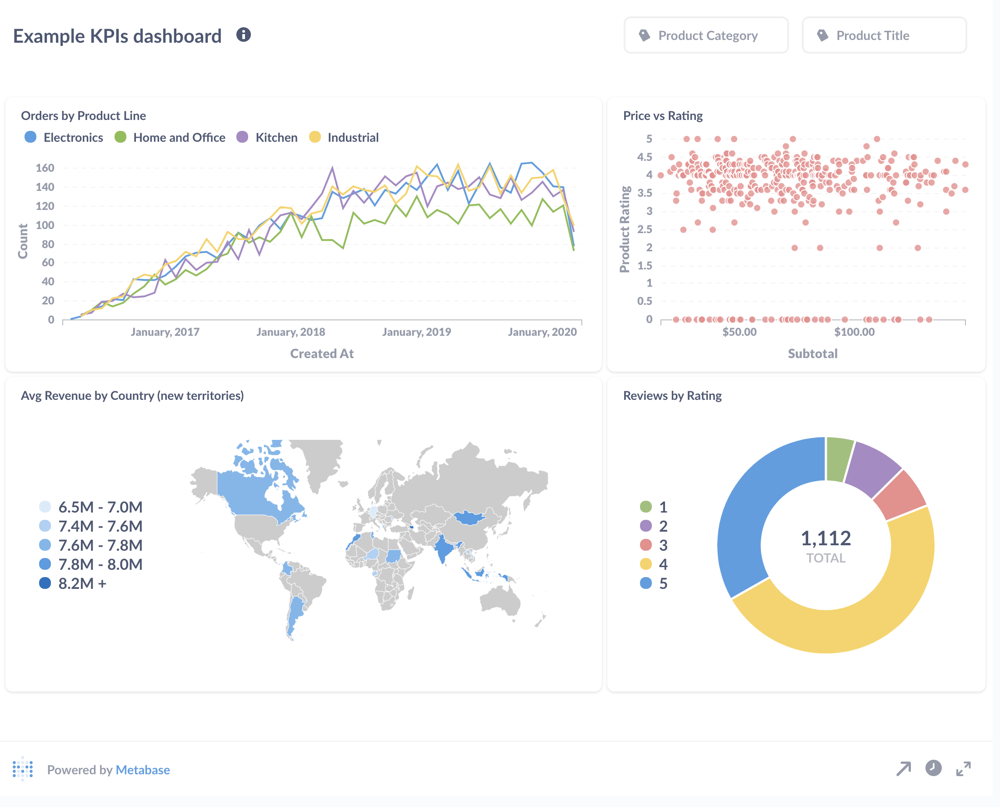

Metabase is one of the simplest and most powerful business intelligence tools I have tried in the last few years. 

It's the kind of tool you can't wait to start using barely 5 minutes after you start to see the demo! I tried it for the first time 3 weeks ago, and I have already deployed it for multiple large customers and added it to OctaByte's catalog. 

**It's just that good!**

## Main benefits

Once you connect Metabase to your existing database (PostgreSQL, MySQL, MongoDB, SQL Server, SQLite, Redshift, BigQuery and others ...), you instantly get a:

* A powerful no\-code dashboard builder
* A ton of visualization options (and it's possible to customize a lot of things though the UI, too!)
* The ability to subscribe to dashboards and receive them on a schedule by email or slack
* A roles \& permissions system for inviting your colleagues

## The requirement \& the pain

Last week, one of our startup customers (e\-commerce) contacted me to create a new database query, apply a lot of special conditions, make it available in their dashboard and send it on the last day of each month to the company's accountant. 

Usually to do that I have to create a new API endpoint that will do authentication, execute a complex SQL query against the database and transform the results to CSV. Then, I would have to create a Web UI with filters that will call the API endpoint and also create a scheduled job that will send the report on the expected date/time.

There are a lot of Business Intelligence tools on the market, but from my experience they are either too limited or too complex or too expensive (e.g. Tableau, Looker).

This time I wanted to try something open\-source and there are several very good options like [Redash](https://octabyte.io/open-source/redash?ref=blog.octabyte.io), [Superset](https://octabyte.io/open-source/superset?ref=blog.octabyte.io), [Lightdash](https://octabyte.io/open-source/lightdash?ref=blog.octabyte.io) or [Metabase](https://octabyte.io/open-source/metabase?ref=blog.octabyte.io).

## Love at first sight

I chose Metabase because has a nice visual interface, it is intuitive (I never had to check the documentation), and had all the features I required like being able to export in CSV, XLSX, JSON, and the scheduled reports that can be sent to a list of recipients according to a schedule, and finally being able to invite the non\-technical team members to use the tool safely with groups \& permissions.

In a very short time I had deployed Metabase, connected it to the replica MySQL database of the customer, created a report in few clicks and automated the report and CSV export to be sent on a schedule to the accountant! 

This is an example KPIs dashboard that can be produced in few clicks with Metabase

Then I invited few employees of the customer to the Metabase instance and they were really impressed by how easy it was to create new reports or view information from the DB without knowing SQL.

The whole team loved it, they are now autonomous for these kind of tasks.

If you also want to explore your data with no\-code open\-source tools click on the button below to get a fully managed instance of Metabase ready to use in less than 3 minutes. 

[Deploy Metabase](https://dash.elest.io/deploy?soft=Metabase&id=87&ref=blog.octabyte.io)

