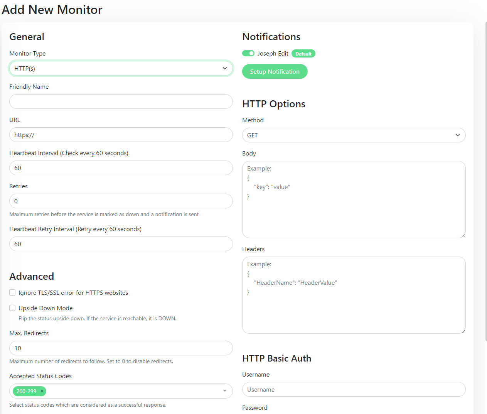

Uptime\-Kuma is a self\-hosted monitoring tool similar to "Uptime Robot". 

I'm using it myself to monitor different parts of our infrastructure, I've also deployed multiple instances for customers who are super happy with it!

It's very lightweight and fast, the UI is nice and modern. I can't recommend it enough :)

**Main features of Uptime\-Kuma**


> Uptime\-Kuma is able to monitor uptime for HTTP(s) / TCP / HTTP(s) Keyword / Ping / DNS Record / Push / Steam Game Server,


> Send notifications via Telegram, Discord, Gotify, Slack, Pushover, Email (SMTP), and over [70\+ other notification services](https://github.com/louislam/uptime-kuma/tree/master/src/components/notifications?ref=blog.elest.io),


> Is translated to [Multiple Languages](https://github.com/louislam/uptime-kuma/tree/master/src/languages?ref=blog.elest.io), has a simple Status Page, ping chart, and provides certificate Info (expiration date, chain)


> And of course, you can configure the heartbeat interval, number of retries, accepted status codes, method, body, headers, and even basic auth if your app needs it!

In case of an alert (when one of the monitored services is down), you will receive notifications, you can configure them to be delivered on one or multiple channels

This open\-source project got a LOT of traction recently, especially since November 2021 and it's still growing quickly. It's an amazing project with very active contributors (more than 100, including myself).

It's quite easy to self\-host it with docker, you can try it quickly with this command (require docker)


```

docker run -d --restart=always -p 127.0.0.1:3001:3001 -v uptime-kuma:/app/data --name uptime-kuma louislam/uptime-kuma:1

```


This way it will run on port 3001 of your computer or VM and you can try it in your browser with this URL: http://localhost:3001

If you don't want to worry about the uptime .... of your uptime server... [deploy Uptime\-Kuma on elest.io](https://dash.elest.io/deploy?soft=Uptime-kuma&deploy=137&ref=blog.elest.io) and get automated backups, reverse proxy with SSL termination, DOS protection, firewall, automated OS \& Software updates (So your instance of Uptime\-Kuma stays always up to date), and a team of Linux experts and open source enthusiasts to ensure your services are always safe, UP and running.

Click on the button below to get a fully managed instance of Uptime\-Kuma ready to use in less than 3 minutes. 

[Deploy Uptime\-Kuma](https://dash.elest.io/deploy?soft=Uptime-kuma&id=137&ref=blog.elest.io)

