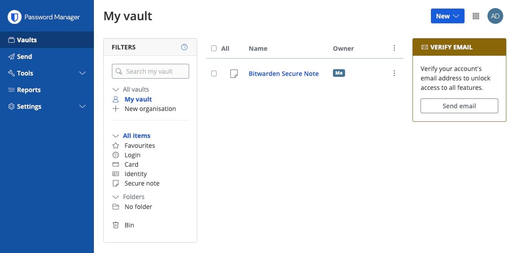
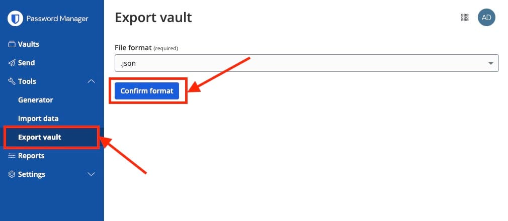
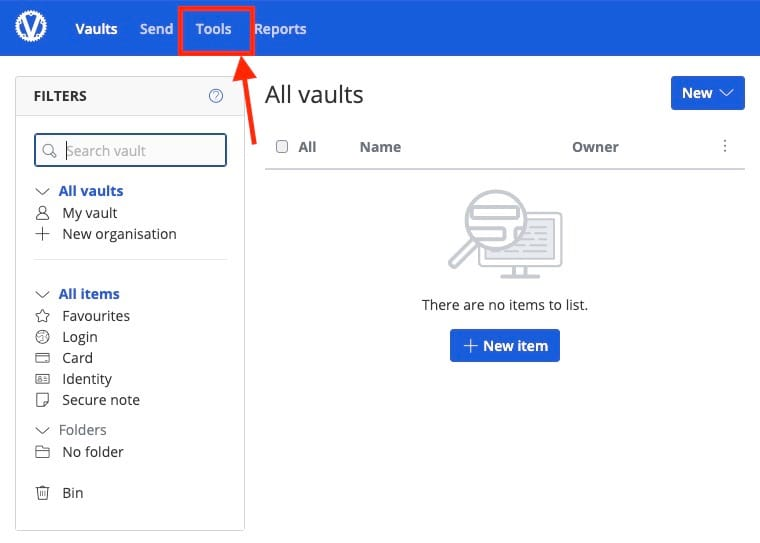
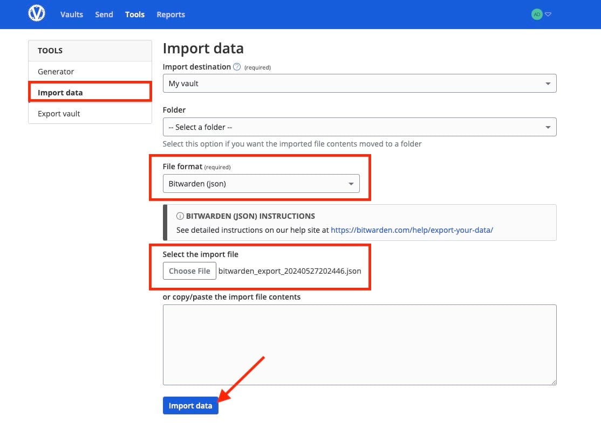
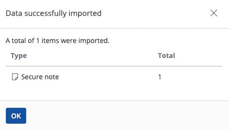
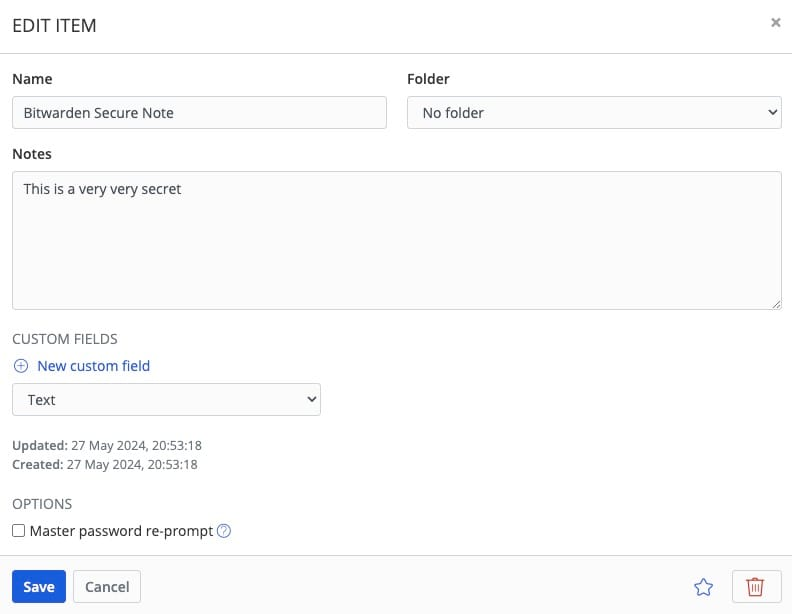

Let's see how you can migrate your already available passwords and secrets vault to [Vaultwarden](images/vaultwarden). During this tutorial, we will be using the already available Bitwarden vault. You can follow along with this tutorial on any other vault provider too. Before we start, ensure you have deployed Vaultwarden, we will be self\-hosting it on [OctaByte](images/vaultwarden).

## What is Vaultwarden?

Vaultwarden formerly known as Bitwarden\_RS, is an open\-source, lightweight alternative implementation of the Bitwarden password manager server. It offers core features of the Bitwarden service, such as storing and managing passwords, notes, and other sensitive information securely, while maintaining compatibility with Bitwarden's official clients and browser extensions. Vaultwarden is popular among users who seek control over their data and prefer a self\-hosted, privacy\-focused solution without the need for extensive system resources.

## Exporting Vault

Exporting your vault in Bitwarden is a procedure aimed at creating a backup of your stored data. Once logged in head over to the **Vaults** section from the left\-hand menu. We will be exporting the secure note named and can be seen as **Bitwarden Secure Note**. 

Head over to the **Tools \>** **Export vault** and choose the file format, here we have selected **JSON** but you can choose whatever format you like and works best for you. Once selected click on **Confirm format**. The file will be downloaded on your local machine which can be later used to import this secure note.

## Importing Vault

The next step is importing the vault in Vaultwarden. Use the credentials from the OctaByte dashboard to log in to the Vaultwarden instance. Once logged in, head over to the **Tools** section from the navigation bar.

Under tools, click on **Import data**. Select the **Import destination**, and select your preferred **Folder**. Since we are using Bitwarden we will choose the file format as **Bitwarden (JSON**,**)**. Next, we select the import file from our local system and click on **Import data**

Once the import is complete you can see all the data and notes imported. If failed, this will be an indicator of what couldn't be imported etc. You can cross\-verify the number of passwords and secure notes in your vault being imported.

And done! This is the secret note we migrated from Bitwarden to Vaultwarden. You can now edit or use the secret as per your requirement

## **Thanks for reading ❤️**

Thank you so much for reading and do check out the OctaByte resources and Official [Vaultwarden documentation](https://docs.cloud68.co/?ref=blog.octabyte.io) to learn more about Vaultwarden. You can click the button below to create your service on [OctaByte](images/vaultwarden) and start your vault migration process. See you in the next one👋

