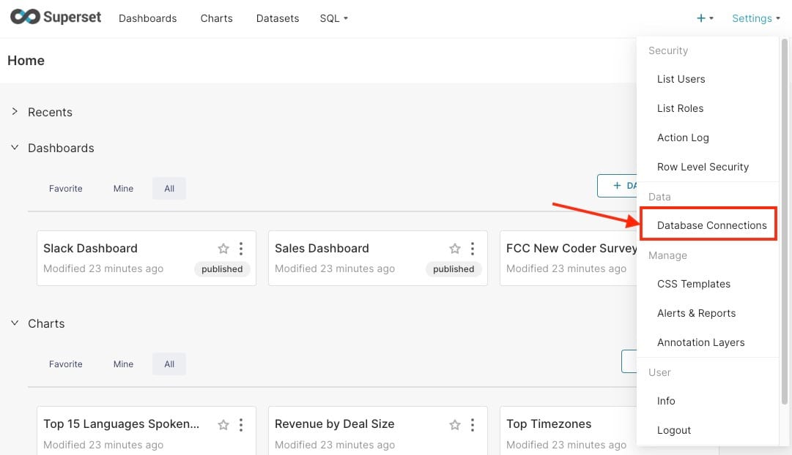

This guide is for users running an instance of [Apache Superset](https://elest.io/open-source/superset?ref=blog.elest.io) looking to explore and analyze data. In this tutorial, we’ll walk you through how to connect Superset to a new database, set it up for data analysis, and create visualizations. This step\-by\-step guide will help you get hands\-on experience with Superset’s features for data exploration.

## Connecting Database

For this tutorial, we will connect [PostgreSQL](https://elest.io/open-source/postgresql?ref=blog.elest.io) as the database but you can implement the same steps to connect any supporting database by Superset. So, log in to the Superset service with the credentials provided in the Elestio dashboard. Once you are in click on **Settings** and head over to **Database Connections** under the **Data** section.

This will lead you to the dashboard where you can manage all of your database connections. Here click on the **Database** button on the top right corner.

This is another option to quickly do the exact same steps as above, this following step will save you time in future to access the database configuration settings sooner. To quickly add a database connection, click on **\+** \> **Data** \> **Connect database**. 

Now you will be prompted with a window to select the database you want to use. We will select PostgreSQL. You can choose to select from the option either from the cards or under supported databases.

For the next step, we will require PostgreSQL server details. For this, head over to your deployed service of Postgres on Elestio and click on **Show DB Credentials**. We will copy these details and use them in the next steps.

Enter the details you got from the Elestio dashboard here and give a database name that already exists in the PostgreSQL database. This data in this mentioned database can be used moving forward in Superset. After adding the details click on **Connect** button.

You can choose to configure your database connection further with performance, security and other things as required, once done click on **Finish.**

Once added, you can see the added databases in the dashboard. This helps you keep track of your database connections along with their configurations.

## **Thanks for reading ❤️**

By following this guide, you’ve successfully connected your databases with Apache Superset on Elestio. Learn more about it through official [Superset documentation](https://superset.apache.org/docs/intro/?ref=blog.elest.io). Click below to start exploring with Superset on [Elestio](https://elest.io/open-source/superset?ref=blog.elest.io). See you in the next guide! 👋

