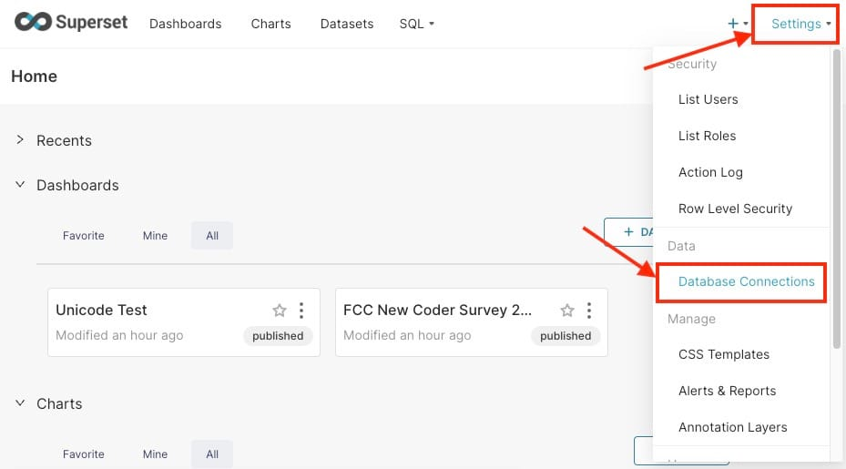

[Apache Superset](https://octabyte.io/open-source/superset?ref=blog.octabyte.io) provides a platform to visualize key metrics, enabling marketing teams to monitor campaigns in real\-time and adjust strategies accordingly. This guide will walk you through the steps of building a marketing campaign dashboard in Superset, incorporating data from various sources such as Google Ads, Facebook, and more. By the end of this tutorial, you'll have a dashboard that tracks crucial metrics like click\-through rates (CTR), cost per conversion (CPC), and return on investment (ROI).

## **Why Use a Marketing Dashboard in Superset?**

A marketing dashboard allows you to centralize data from different tools and visualize key performance indicators (KPIs) in one place. Instead of switching between platforms, a well\-designed dashboard helps you monitor the effectiveness of your marketing efforts at a glance.

Key benefits of using Apache Superset for your marketing campaign dashboard include real\-time insights, allowing you to monitor campaigns as they unfold. By centralizing data from multiple platforms like **Google Ads** and **Facebook Ads**, you can easily track performance across all your marketing efforts in one place. Additionally, the customizable visuals in Superset enable you to create charts and graphs that present complex data in a clear and easily understandable way, making it simpler to analyze and act on the information.

## **Integrating Data from Marketing Platforms**

To start, you'll need to integrate data from your marketing platforms into Apache Superset. Platforms like Google Ads, Facebook, and others provide APIs that allow you to extract performance data. You can connect to the Google Ads API and pull campaign data into your database. Ensure your database contains metrics like impressions, clicks, and costs. Like Google Ads, you can retrieve performance data using the Facebook Marketing API. You may choose to use a dedicated ETL (Extract, Transform, Load) tool like Airbyte or Stitch to sync your marketing data to a database such as [MySQL](https://octabyte.io/open-source/mysql?ref=blog.octabyte.io), [PostgreSQL](https://octabyte.io/open-source/postgresql?ref=blog.octabyte.io), or [ClickHouse](https://octabyte.io/open-source/clickhouse?ref=blog.octabyte.io).

## **Connecting Superset to Your Data Sources**

Once you have your marketing data stored in a database, the next step is to connect Apache Superset to the database. Here's how you can do it:

* **Access the Database Connection Screen**: In the Superset interface, navigate to the **Settings** tab and select **Database Connections**.

* **Add a New Database**: Click **\+ Database** \> **Supported Databases** \> **Other** and provide the connection details for your database, such as the SQLAlchemy URI.

* **Test the Connection**: Ensure that Superset can access the database and pull in the data. With your database connected, you can now move on to visualizing the data.

## **Creating Datasets in Superset**

To build your dashboard, you need to create datasets from your marketing data. Datasets are essentially tables or views from your connected database, which can be queried and visualized in Superset.

* **Navigate to the Datasets Section**: In Superset, go to **Datasets** and select **\+ Dataset**.

* **Select Your Table**: Choose the relevant table that contains your marketing campaign data (e.g., Google Ads performance data).
* **Define Metrics**: Create specific metrics such as click\-through rates (CTR), conversion rates, and ROI, which you'll use in your visualizations.

## **Building Key Visualizations**

Now that your data is ready, it’s time to create visualizations. Superset offers a variety of chart types that are perfect for marketing analytics.

* **Click\-Through Rate (CTR) Chart**: Use a time series chart to track how CTR changes over the course of your campaign. This allows you to identify trends, spot peaks, and evaluate which parts of your campaign are performing best, helping you optimize ad content and placement to improve engagement.
* **Cost per Conversion**: Create a bar chart to compare the cost per conversion across different marketing channels. This visual helps you quickly identify which channels are providing the most cost\-effective results, allowing you to allocate your budget more efficiently and focus on the channels that deliver the highest value.
* **Return on Investment (ROI)**: A line chart can help visualize ROI over time, giving you a clear picture of how your campaigns are performing and whether they are delivering sustainable profitability. This allows you to assess long\-term performance and make informed decisions about scaling or adjusting campaigns.

## **Creating the Marketing Campaign Dashboard**

After creating your visualizations, you can combine them into a single dashboard for a better and more comprehensive view of your campaign performance.

* **Navigate to Dashboards**: In the Superset interface, go to **Dashboards** and click **\+ Dashboard**.

* **Add Charts**: Drag and drop your charts (CTR, CPC, ROI, etc.) into the dashboard or **Create New Chart** according to your needs.

* **Customize Layout**: Arrange the charts in a way that makes sense for your marketing team. You can customize the layout for better readability and understanding.

## **Tracking Key Metrics**

A successful marketing dashboard tracks metrics that are crucial to evaluating campaign performance. By monitoring these metrics in real\-time, you can adjust your campaigns to optimize performance and allocate resources more effectively. Below are some key metrics you should track:

* **Click\-Through Rate (CTR)**: Measures the percentage of users who clicked on your ad after seeing it. A high CTR indicates that your ad content is engaging and relevant to your target audience, driving more users to take action.
* **Cost per Click (CPC)**: This shows how much you're paying for each click on your ads. Lowering your CPC allows you to maximize your budget by generating more traffic without increasing costs, while still targeting the right audience.
* **Cost per Conversion (CPC)**: Tracks how much you spend for each conversion, whether it's a purchase, lead generation, or any other action. This metric helps assess the effectiveness of your ad spend in achieving meaningful outcomes, ensuring you’re getting value for money.
* **Return on Investment (ROI)**: This helps you evaluate how profitable your campaigns are by comparing the revenue generated to the amount spent. A positive ROI indicates that your campaigns are driving profits, making it a key measure of overall marketing success.

## **Real\-Time Data and Alerts**

With frequent data refreshes, your dashboard can show the most up\-to\-date metrics, allowing for timely decision\-making. You can configure Superset to send alerts when specific metrics reach predefined thresholds. For example, you can receive an email if your CTR drops below a certain percentage, helping you take action quickly.

* To set up an alert system, head over to **Settings \> Alerts \& Reports** from the top right\-hand corner.

* Next, click on **\+ Alert** and fill out the alert information like **Alert Name**, **Owners**, **Conditions**, **Contents,** etc click on **Add** once you are done.

## **Thanks for reading ❤️**

By integrating data from various marketing platforms, creating meaningful visualizations, and tracking key metrics, you can better assess your campaigns' effectiveness and optimize for higher returns. Thank you so much for reading and do check out the OctaByte resources and Official [Superset documentation](https://superset.apache.org/docs/intro/?ref=blog.octabyte.io) to learn more about Superset. You can click the button below to create your service on [OctaByte](https://octabyte.io/open-source/superset?ref=blog.octabyte.io). See you in the next one👋

