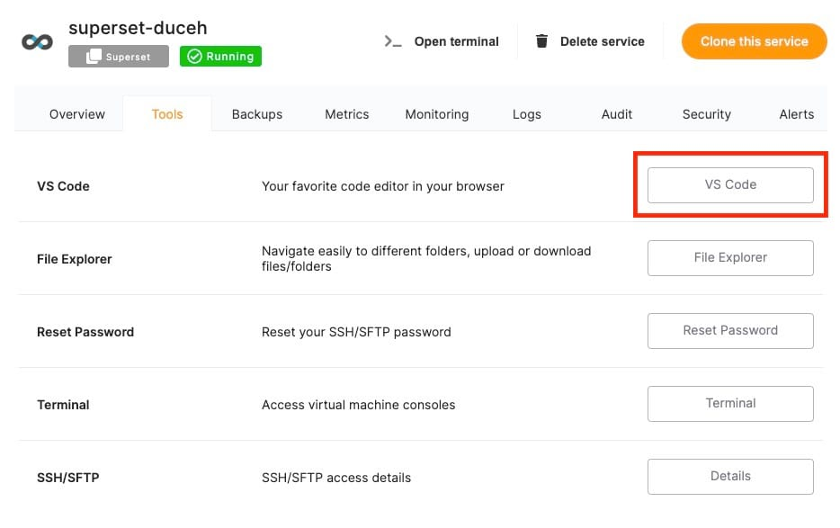
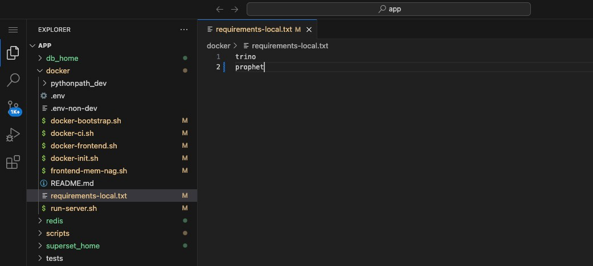
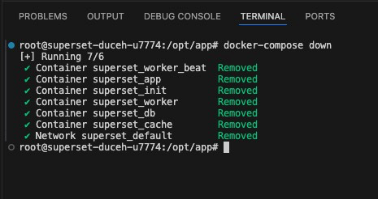
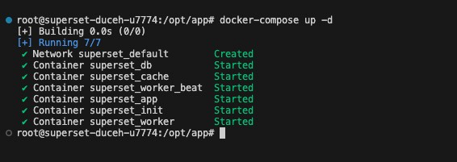

Hey everyone, In this blog we will see how you can install Prophet in superset. During this tutorial, we will be using an internal terminal tool provided at OctaByte Dashboard. Before we start, ensure you have deployed [Superset](images/superset), we will be self\-hosting it on [OctaByte](images/superset).

## What is Superset?

Apache Superset is an open\-source data exploration and visualization platform designed to handle data at scale. It provides a rich set of features for data analysts and business intelligence professionals, including the ability to create interactive dashboards, run complex SQL queries, and visualize data through a variety of charts and graphs. Superset integrates with a wide range of databases and data sources, allowing users to explore and analyze their data in a flexible and user\-friendly environment.

## Introduction to Prophet

The Prophet package developed by Facebook, is a tool for time series forecasting that is designed to handle complex, real\-world datasets with ease. Prophet is built to work well with data that have strong seasonal effects and several seasons of historical data. It is designed to be highly customizable, allowing users to incorporate domain knowledge into the forecasting model through various parameters and adjustments.

## Installing Prophet

Once you are logged into your OctaByte dashboard and deployed, the Superset service. In the service, head over to the **Superset** instance and click on the **Tools** tab from the navigation bar. Now click on **VS Code** this will provide you with the credentials you need to access the terminal.

1. In VS CODE, locate and open the file `requirements-local.txt` situated within the `docker` directory. This file lists the Python packages required for your Superset instance. By appending `prophet` to this file, you can ensure it will be installed the next time the Docker container is built.

2. Open the terminal in VS CODE to execute the necessary Docker commands. This terminal lets you interact directly with your Docker environment from VS CODE. Execute the following commands to restart the container, ensuring that your changes to `requirements-local.txt` take effect:
+ `docker-compose down` stops and removes all containers defined in your `docker-compose.yml` file. This ensures that any running instances of the containers are stopped before new ones are started.


```
docker-compose down

```
+ `docker-compose up -d` rebuilds and starts the containers in detached mode. The `-d` flag stands for "detached," meaning the containers run in the background, freeing up the terminal for other tasks.


```
docker-compose up -d
```
And done! You have successfully installed Prophet in your superset instance. You can install multiple such packages. 

## **Thanks for reading ❤️**

Thank you so much for reading and do check out the OctaByte resources and Official [Superset documentation](https://superset.apache.org/docs/intro/?ref=blog.octabyte.io) to learn more about Superset. You can click the button below to create your service on [OctaByte](https://octabyte.io/open-source/n8n?ref=blog.octabyte.io) and install Prophet in a superset instance. See you in the next one👋

[](images/superset)

