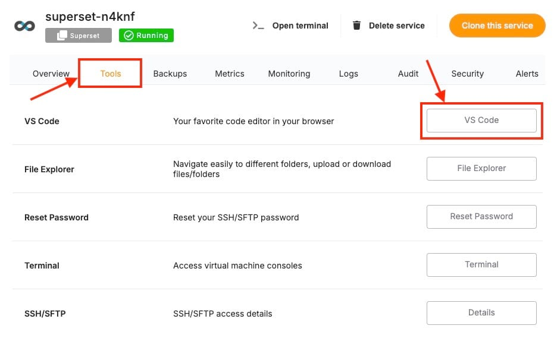

This guide will explain how to set up **OAuth2 authentication** in [Apache Superset](https://elest.io/open-source/superset?ref=blog.elest.io). OAuth2 is a popular open standard used for access delegation, allowing users to log in securely using third\-party providers like Google or GitHub. By integrating OAuth2 into your Superset instance, you can streamline the login process, ensure proper authentication, and improve user experience. In this tutorial, you’ll learn how to configure OAuth2 in your self\-hosted Superset instance, enabling users to log in with their preferred OAuth2 provider.

### Why Use OAuth2 for Apache Superset?

Integrating OAuth2 with Superset offers several advantages:

* **Simplified Login**: Users can sign in with existing credentials from providers like Google, GitHub, or other OAuth2 services.
* **Centralized Authentication**: Manage user authentication from a single, secure OAuth2 provider.
* **Enhanced Security**: OAuth2 enhances security by using tokens and external provider authentication, reducing the need to handle passwords directly in Superset.

### Prerequisites

Before starting, ensure you have:

* Deployed service **of Apache Superset** on [Elestio](https://elest.io/open-source/superset?ref=blog.elest.io).
* Access to an **OAuth2 provider**, such as Google, GitHub, or any provider that supports OAuth2\.
* Administrative access to both Superset and your OAuth2 provider account.

## Step 1: Register Superset with Your OAuth2 Provider

To enable OAuth2, you must register Superset as an application with your chosen OAuth2 provider. The steps will vary depending on the provider (Google, GitHub, etc.), but the general process remains the same.

### For Google OAuth2:

1. Go to the [Google Developers Console](https://console.developers.google.com/?ref=blog.elest.io) and create a new project.
2. Enable **OAuth 2\.0 APIs** by navigating to APIs \& Services \> Library, and searching for the "Google OAuth API."
3. In the **Credentials** section, create OAuth2 credentials:
4. Take note of the **Client ID** and **Client Secret**, as these will be needed in the next step.

**Authorized redirect URIs**: Add the following URL:


```
https://<your_superset_instance>/oauth-authorized/google

```
### For GitHub OAuth2:

1. Go to [GitHub Developer Settings](https://github.com/settings/developers?ref=blog.elest.io) and register a new OAuth2 application.
2. Save the **Client ID** and **Client Secret** for use in the Superset configuration.

Set the **Authorization callback URL** as:


```
https://<your_superset_instance>/oauth-authorized/github

```
### Step 2: Configure Superset for OAuth2

Next, you'll configure your Superset instance to work with the OAuth2 provider.

#### For Docker Compose Users:

1. Edit the `superset_config.py` file in your Docker Compose setup. This file holds Superset’s configuration, if not found head over to **VS Code**  under **Tools** section and create one in specified location (eg: volume mounts)

2. Add the following OAuth2 configurations based on the provider you chose:

##### For Google OAuth2:


```
from flask_appbuilder.security.manager import AUTH_OAUTH

AUTH_TYPE = AUTH_OAUTH
OAUTH_PROVIDERS = [
    {
        'name': 'google',
        'token_key': 'access_token',
        'icon': 'fa-google',
        'remote_app': {
            'consumer_key': '<your_google_client_id>',
            'consumer_secret': '<your_google_client_secret>',
            'request_token_params': {
                'scope': 'email profile'
            },
            'base_url': 'https://www.googleapis.com/oauth2/v2/',
            'request_token_url': None,
            'access_token_url': 'https://accounts.google.com/o/oauth2/token',
            'authorize_url': 'https://accounts.google.com/o/oauth2/auth',
        }
    }
]

```
##### For GitHub OAuth2:


```
from flask_appbuilder.security.manager import AUTH_OAUTH

AUTH_TYPE = AUTH_OAUTH
OAUTH_PROVIDERS = [
    {
        'name': 'github',
        'token_key': 'access_token',
        'icon': 'fa-github',
        'remote_app': {
            'consumer_key': '<your_github_client_id>',
            'consumer_secret': '<your_github_client_secret>',
            'request_token_params': {
                'scope': 'user:email'
            },
            'base_url': 'https://api.github.com/',
            'request_token_url': None,
            'access_token_url': 'https://github.com/login/oauth/access_token',
            'authorize_url': 'https://github.com/login/oauth/authorize',
        }
    }
]

```
Replace `<your_google_client_id>`, `<your_google_client_secret>`, `<your_github_client_id>`, and `<your_github_client_secret>` with the credentials you obtained during the OAuth2 registration.

### Step 3: Restart Superset

After editing the configuration file, restart your Superset instance to apply the changes. You can do this from the **VS Code** terminal itself or the dedicated terminal found on the service dashboard.

For Docker Compose:


```
docker-compose down
docker-compose up -d

```
### Step 4: Test the OAuth2 Integration

Once your Superset instance has restarted, you can test the OAuth2 integration.

1. Open your Superset instance in the browser (`https://<your_superset_instance>`).
2. On the login page, you should see the option to log in via your OAuth2 provider (e.g., Google, GitHub).
3. Select the provider and proceed with authentication.
4. If configured correctly, you will be logged in to Superset using your OAuth2 credentials.

### Step 5: Map OAuth2 Attributes to Superset User Fields

To map user attributes from your OAuth2 provider (e.g., username, email) to the corresponding fields in Superset, you need to configure the attribute mapping.

In your `superset_config.py`, add the following:


```
OAUTH_USER_INFO = {
    'username': 'username',
    'email': 'email',
    'first_name': 'given_name',
    'last_name': 'family_name',
}

```
This ensures that when a user logs in, their OAuth2 information is correctly assigned to the Superset user fields.

### Step 6: Security Considerations

When integrating OAuth2, you should also consider these important security measures:

1. **Use HTTPS**: Ensure your Superset instance is served over HTTPS, especially when dealing with OAuth2\. If you are using Docker Compose, consider setting up an Nginx reverse proxy with SSL (e.g., Let's Encrypt).
2. **Token Expiration and Scopes**: Ensure that OAuth2 tokens are appropriately scoped, and set expiration limits to minimize the risk of unauthorized access.
3. **Role\-Based Access Control (RBAC)**: Depending on your organization’s needs, assign default roles to users logging in via OAuth2, such as "Admin" or "Gamma," to control access to Superset features and dashboards.

### Step 7: (Optional) Enable Auto User Registration

You can enable auto\-registration for users who authenticate via OAuth2 by modifying the `superset_config.py`:


```
AUTH_USER_REGISTRATION = True
AUTH_USER_REGISTRATION_ROLE = "Gamma"  # Default role for new users

```
This will automatically create a new user in Superset if they log in using OAuth2 and don't already have an account.

## **Thanks for reading ❤️**

By following this guide, you’ve successfully enabled OAuth2 authentication, created a login process, and improved the overall security of your Superset instance. Now, your team members can securely login with just a few clicks, accessing all the data they need without friction. Thank you so much for reading and do check out the Elestio resources and Official [Superset documentation](https://superset.apache.org/docs/intro/?ref=blog.elest.io) to learn more about Superset. You can click the button below to create your service on [Elestio](https://elest.io/open-source/superset?ref=blog.elest.io). See you in the next one👋


[](https://elest.io/open-source/superset?ref=blog.elest.io)


