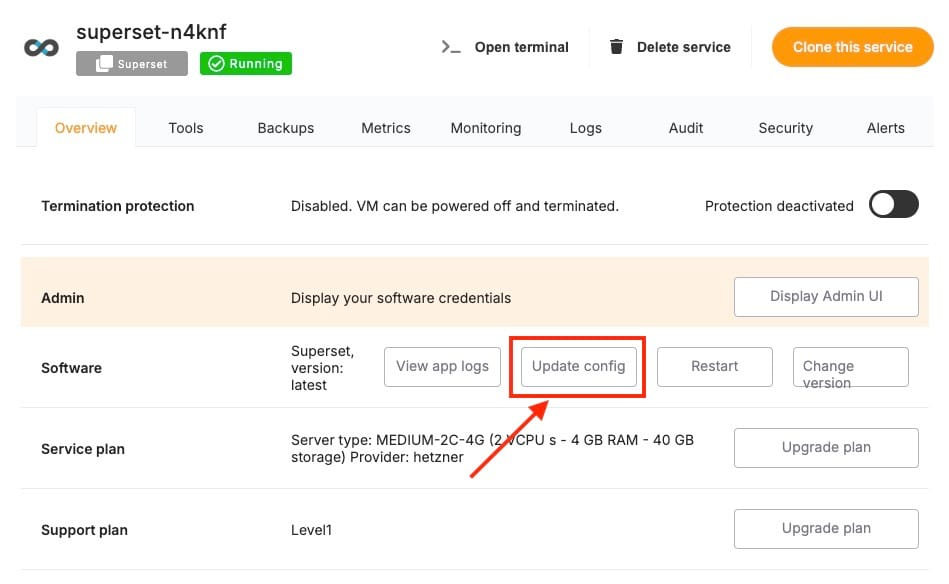

In this guide, we'll explore how to secure your self\-hosted instance of[**Apache Superset**](https://elest.io/open-source/superset?ref=blog.elest.io) using SAML (Security Assertion Markup Language) for user authentication. SAML enables Single Sign\-On (SSO) and helps centralize authentication, allowing users to access Superset dashboards securely via their organization's identity provider (IdP). This guide will take you through the entire process, from setting up your identity provider to configuring Superset for SAML authentication.

### Why Use SAML?

Using SAML for Superset authentication offers several benefits:

* **Single Sign\-On (SSO)**: Users authenticate once with your IdP and can access multiple applications, including Superset, without additional logins.
* **Centralized User Management**: Manage all users via a single identity provider, streamlining permissions and credentials management.
* **Enhanced Security**: SAML ensures that only users authenticated by your IdP can access Superset, reducing the risk of unauthorized access.

### Prerequisites

Before starting, ensure you have:

* Deployed service **of Apache Superset** on [Elestio](https://elest.io/open-source/superset?ref=blog.elest.io).
* Access to your organization’s **Identity Provider (IdP)** that supports SAML 2\.0 (e.g., Okta, Azure AD, OneLogin).
* Administrative access to Superset and your IdP.

### Step 1: Install Required SAML Packages

You need to install the necessary SAML libraries for your Superset instance running in Docker. First, edit your Docker Compose file to include these packages.

In the `docker-compose.yml` file, under the Superset service, modify the `superset` image section to add the required `python3-saml` package. You can update the compose config by clicking on **Update config** button in the service dashboard and update it like follows.


```
services:
  superset:
    image: apache/superset:latest
    environment:
      - SUPERSET_ENV=production
    volumes:
      - ./superset:/app/superset_home
    command:
      - pip install python3-saml

```
Save the file, and restart your Superset service:


```
docker-compose down
docker-compose up -d

```
### Step 2: Configure Your Identity Provider (IdP)

Log into your IdP and create a new application for Apache Superset.

1. **Configure Attributes**: Ensure the IdP provides key user attributes like `email`, `first_name`, and `last_name`.
2. **Download the Metadata**: After configuration, download the IdP metadata XML file or note down important details like **Login URL**, **Logout URL**, and **SAML Issuer**.

**Entity ID**: Use the following as the Entity ID:


```
https://<your_superset_instance>

```
**Set the Assertion Consumer Service (ACS) URL**: This URL tells the IdP where to send the authentication response. For Superset, the ACS URL would be:


```
https://<your_superset_instance>/saml/callback

```
### Step 3: Update Superset Configuration for SAML

Next, update the `superset_config.py` file, which holds the configurations for Superset. Since you’re using Docker Compose, the `superset_config.py` file will be located in your mounted volume, if not you can create one by discovering it on **VS Code** under **Tools**.

Open the `superset_config.py` file and add the SAML\-related configurations:


```
from flask_appbuilder.security.manager import AUTH_SAML

AUTH_TYPE = AUTH_SAML
AUTH_ROLE_ADMIN = 'Admin'
AUTH_USER_REGISTRATION = True
AUTH_USER_REGISTRATION_ROLE = "Gamma"  # Default role for new users

# SAML Configuration
SAML_METADATA_URL = 'https://<your_idp_metadata_url>'
SAML_SP_ENTITY_ID = 'https://<your_superset_instance>'
SAML_ACS_URL = 'https://<your_superset_instance>/saml/callback'

SAML_CERT_FILE = '/path/to/your/certificate.pem'  # Optional
SAML_KEY_FILE = '/path/to/your/privatekey.pem'    # Optional

```
This configuration does the following:

* **AUTH\_TYPE**: Tells Superset to use SAML for authentication.
* **SAML\_METADATA\_URL**: Points to the metadata URL provided by your IdP.
* **SAML\_SP\_ENTITY\_ID**: Identifies Superset as a service provider.
* **SAML\_ACS\_URL**: Tells the IdP where to send authentication responses.

### Step 4: Map SAML Attributes to Superset Fields

You also need to map the SAML attributes provided by your IdP to the appropriate fields in Superset. Add this section to your `superset_config.py`:


```
SAML_ATTRIBUTE_MAP = {
    'username': ['username'],
    'email': ['email'],
    'first_name': ['first_name'],
    'last_name': ['last_name'],
}

```
This ensures that user details like their username, email, first name, and last name are properly mapped when a user logs in via SAML.

### Step 5: Restart Superset and Docker Compose

After making these changes, restart your Docker containers to apply the configuration:


```
docker-compose down
docker-compose up -d

```
This restarts your Superset instance with SAML support enabled.

### Step 6: Test the SAML Integration

Now it’s time to test if everything is working properly. Follow these steps:

1. Navigate to your Superset instance (`https://<your_superset_instance>`).
2. Attempt to log in, and you should be redirected to your IdP’s login page.
3. Log in with your IdP credentials.
4. After successful authentication, you should be redirected back to Superset and logged in.

### Step 7: Optional: Configure Single Logout (SLO)

To ensure users are logged out of Superset and other connected services when they log out from your IdP, configure Single Logout (SLO). In the `superset_config.py` file, add:


```
SAML_SLO_URL = 'https://<your_idp_logout_url>'

```
This URL will log users out from the IdP and any applications they were using with SSO, including Superset.

### Step 8: Security Considerations

When securing Superset with SAML, ensure that your environment is fully protected by:

1. **Using HTTPS**: Always ensure your Superset instance is hosted over HTTPS. In a Docker Compose setup, you can use a reverse proxy (like Nginx) with an SSL certificate (e.g., Let's Encrypt) to serve Superset securely.
2. **Role\-Based Access Control (RBAC)**: Map user roles from your IdP to Superset roles to control which users have access to which parts of your Superset dashboards.


```
SAML_SLO_URL = 'https://<your_idp_logout_url>'

```
## **Thanks for reading ❤️**

Integrating SAML with Apache Superset on Elestio provides a highly secure and streamlined way to authenticate users. By following this guide, you can centralize user management using your IdP, enhance security with SSO, and offer your team a seamless login experience. Thank you so much for reading and do check out the Elestio resources and Official [Superset documentation](https://superset.apache.org/docs/intro/?ref=blog.elest.io) to learn more about Superset. You can click the button below to create your service on [Elestio](https://elest.io/open-source/superset?ref=blog.elest.io). See you in the next one👋


[](https://elest.io/open-source/superset?ref=blog.elest.io)


