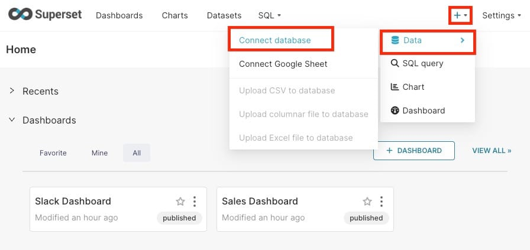

This guide is for end\-users who are using a self\-hosted instance of [Apache Superset](https://octabyte.io/open-source/superset?ref=blog.octabyte.io) on OctaByte for data analysis and exploration. In this tutorial, we'll guide you through connecting Superset to a new database, configuring it for analysis, and creating visualizations. This end\-to\-end walkthrough is designed to give you a hands\-on experience with Superset's features.

## Introduction to Superset

Superset is an open\-source data exploration and visualization platform. It's designed to work with existing SQL\-speaking databases, enabling users to query, visualize, and analyze data without requiring a native storage layer. This flexibility makes Superset an ideal choice for organizations that want to centralize data analysis while maintaining control over their data infrastructure.

## Connecting to a New Database

Superset does not store data itself; instead, it connects to your existing SQL\-compatible databases or data stores. If you're using Superset in a self\-hosted environment on OctaByte, the first step is to add the necessary connection credentials to enable querying and visualization. If you're running Superset locally via Docker Compose, you can skip this step since a Postgres database named `examples` is included and pre\-configured for your use. However, for other databases, follow these steps:

* In the Superset interface, navigate to the **\+** menu in the top right corner, select **Data** and then choose the **Connect Database** option.

* A modal window will appear, prompting you to select your database type. Choose the appropriate database from the list.

* After selecting your database, you'll have the option to configure advanced settings, but for this walkthrough, you can proceed by clicking the link below the fields to specify just the database name and database URI.
* Specify the database name and database URI. If you're unsure about the correct format for the URI, refer to the database documentation for guidance.
* Click the **Test Connection** button to verify that the connection is successful. If everything checks out, save the configuration by clicking the **Connect** button in the bottom right corner.

Congratulations, you’ve successfully added a new data source in Superset!

## Registering a New Table

With your data source configured, the next step is to register specific tables—referred to as Datasets in Superset—that you want to query and visualize.

* Navigate to **Data** \-\> **Datasets**, and click the **\+ Dataset** button in the top right corner.

* A modal window will appear, where you can select the Database, Schema, and Table using the dropdown menus.

* After making your selections, click the **Add** button to complete the registration. Your new dataset will now appear in the list of datasets, ready for exploration and analysis.

## Customizing Column Properties

After registering your dataset, it’s important to configure how each column will be treated within the Explore workflow. This customization allows you to define the role of each column, whether it’s for time\-series analysis, filtering, or dimensioning.

* **Temporal Columns**: If a column represents time\-based data, mark it as temporal. This allows you to slice and dice the data in time\-series charts.
* **Filterable Columns**: Specify which columns should be available for filtering your data within visualizations.
* **Dimensional Columns**: Define columns that categorize or group your data, such as product categories or geographic regions.
* **Datetime Parsing**: For datetime columns, configure how Superset should parse the data. Typically, this involves setting the appropriate ISO\-8601 string pattern for consistent datetime formatting.

## Creating Charts in the Explore View

Superset offers two primary interfaces for exploring and visualizing data:

* **Explore:** A no\-code visual builder where users can select datasets, choose chart types, and customize the appearance of their visualizations. This is ideal for users who prefer a more visual and intuitive approach to data analysis.
* **SQL Lab**: An SQL IDE designed for more advanced users who need to clean, join, and prepare data before creating visualizations in the Explore view.

To create a chart in the Explore view:

* Start by selecting the dataset you want to explore from the Datasets tab.
* The Dataset view on the left\-hand side displays a list of columns and metrics specific to the selected dataset. You can use these to build your chart.

* Use the Data and Customize tabs to select the type of visualization, choose the temporal column, group by specific metrics, and adjust the aesthetics of the chart.
* As you make changes, click the **Run** button to see a live preview of your chart.

For example, you might create a grouped Bar Chart to visualize quarterly sales data by product line, simply by selecting options from the dropdown menus.

## Creating a Slice and Dashboard

Once your chart is ready, you can save it and add it to a dashboard:

* Click the **Save** button, and choose whether to add the chart to an existing dashboard or create a new one.
* After saving, click **Save \& go to Dashboard** to publish your chart. Superset will create a slice, storing all the necessary information about the chart, including the query, chart type, and selected options.

* To resize or reposition the chart within the dashboard, click the **Edit Dashboard** button in the top right corner.

* Then, drag the bottom right corner of the chart to adjust its size and position according to the underlying grid.

* Click **Save** to persist your changes.

Congratulations! You've successfully linked, analyzed, and visualized data in Superset. With many more configuration and visualization options available, you're encouraged to explore and create your own slices and dashboards.

## Managing Access to Dashboards

Dashboard access in Superset is managed through ownership and roles. Users with edit permissions (owners) can manage dashboards, while access for non\-owners can be controlled in two ways:

* **Dataset Permissions**: Adding datasets to a role's permissions grants implicit access to all dashboards using those datasets.
* **Dashboard Roles**: If you enable the `DASHBOARD_RBAC` feature flag, you can specify which roles have access to specific dashboards. Granting role access to a dashboard bypasses dataset\-level checks, implicitly granting read access to all charts and associated datasets within that dashboard.

If no specific roles are assigned, the standard dataset permissions apply.

## Customizing Dashboards

Superset allows you to customize how dashboards are rendered using URL parameters:

* **`standalone`**:
	+ `0` (default): Normal dashboard display.
	+ `1`: Hides the top navigation.
	+ `2`: Hides both the top navigation and title.
	+ `3`: Hides the top navigation, title, and top\-level tabs.
* **`show_filters`**:
	+ `0`: Renders the dashboard without the Filter Bar.
	+ `1` (default): Displays the Filter Bar if native filters are enabled.
* **`expand_filters`**:
	+ (default): Expands the Filter Bar if there are native filters.
	+ `0`: Collapses the Filter Bar.
	+ `1`: Expands the Filter Bar.

For example, if you're running a local development build and want to hide the top navigation and remove the Filter Bar, you could use the following URL: `http://<elestio-hosted-url>/superset/dashboard/<dashboard-name>/?standalone=1&show_filters=0`.

## **Thanks for reading ❤️**

By following this guide, you’ve successfully set up and configured Apache Superset on OctaByte, enabling data analysis and visualization for your organization. You've connected to a new database, created datasets, and built interactive dashboards, all while leveraging Superset’s robust features. This setup helps your data exploration process, allowing you to focus more on deriving insights and making data\-driven decisions. Learn more about it through official [Superset documentation](https://superset.apache.org/docs/intro/?ref=blog.octabyte.io). Click below to start exploring with Superset on OctaByte. See you in the next guide! 👋

