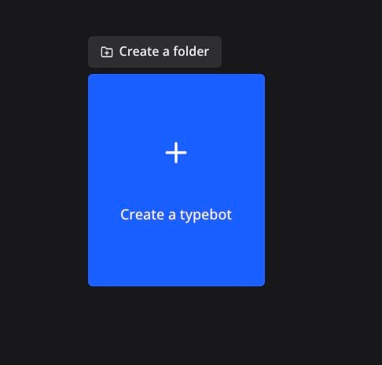
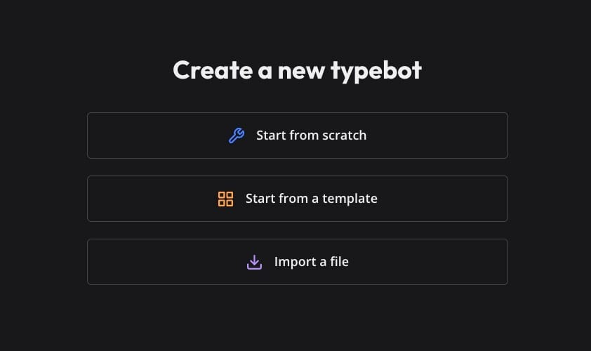
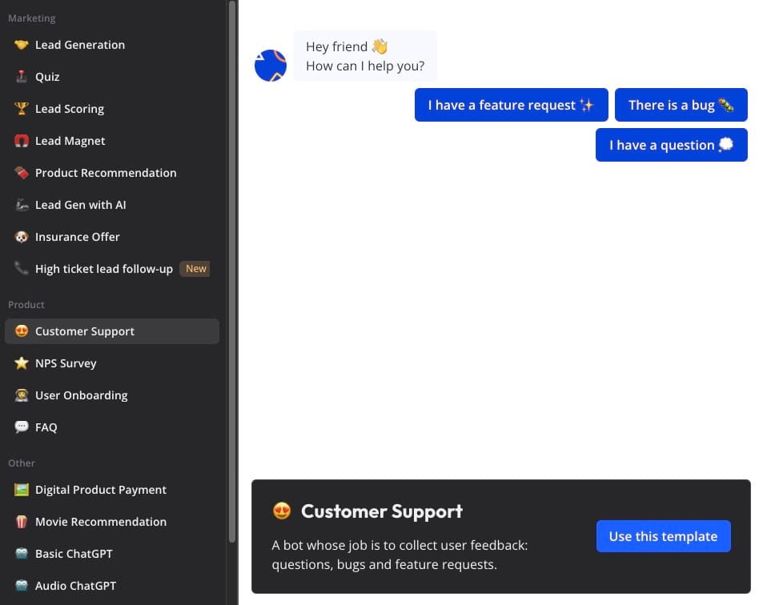
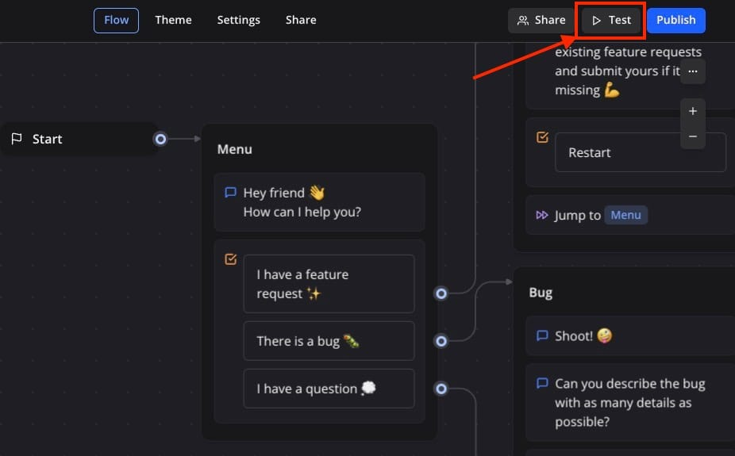
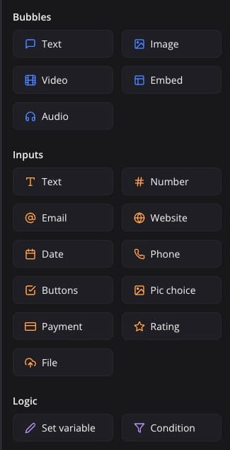
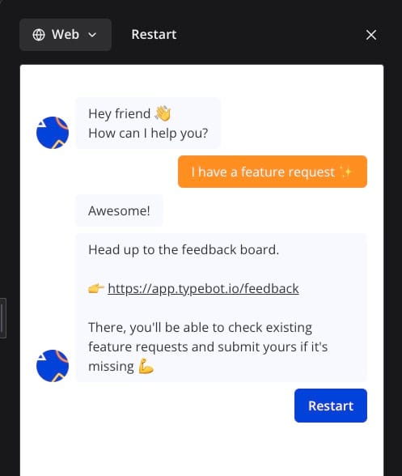

Let's see how you can create a simple customer support chatbot using [Typebot](https://octabyte.io/applications/live-chat/typebot). During this tutorial, we will be using a pre\-defined template to create the chatbot. You can also choose to create the same from scratch. Before we start, ensure you have deployed Typebot, we will be self\-hosting it on [OctaByte](https://octabyte.io/applications/live-chat/typebot).

## What is Typebot?

Typebot is an open\-source, no\-code chatbot builder that allows users to create interactive and conversational chatbots easily. It provides an interface where users can design chatbot flows, set up automated responses, and integrate with various messaging platforms without needing any programming skills.

## Creating Typebot

A chatbot is a software application designed to simulate human conversation through text or speech interactions. It can handle customer queries, provide information, and perform tasks across various industries such as customer service, e\-commerce, healthcare, and banking. We are going to use the Typebot interface to create this chatbot.

Once you get started, You will be presented with a card with **Create a typebot**. You can choose to create a folder from here too if you want to categorise multiple chatbots facilitating the same purpose.

We are going to use the already provided template by Typebot. To do so click on **Start from a template** section. Note that this can be created manually from scratch too. If you wish so then head over to **Start from scratch**. If you already have a chatbot created on a similar service then you can **Import a file**. 

Typebot offers various templates to help users create chatbots quickly and efficiently, catering to diverse needs. These include the Customer Support Template for handling inquiries and support, the Lead Generation Template for capturing potential customer information, the E\-commerce Template for assisting with product searches and orders and many more. These pre\-configured templates help the chatbot creation process, making it easy to deploy effective solutions for specific use cases. As we are using the templates, head over to the **Customer Support** template under the **Product** section. Once selected, click on **Use this template**. 

Now that the template is set, you can make the changes based on your requirements. Use the components to add additional functionalities and responses. Use the theme section to change the look and feel of the chatbot to match your application theme.

Bubbles are visual elements that encapsulate messages, images, and interactive components within the chat. These can include text bubbles for written messages, image bubbles for pictures, button bubbles for interactive options, carousel bubbles for displaying multiple items in a horizontal scroll, and quick reply bubbles for predefined responses. You can easily choose between the following components and drag and drop them on the canvas.

## Testing Typebot

Once you click on **Test**, you will see your chatbot application running, you can choose the prompts and test out the responses. You can restart or test out the typebot on different interfaces like Web, mobile etc.

And done! You have successfully created a customer support typebot. This was a simple application demo and you can configure more options and add multiple integrations to give more power and accuracy to the responses. 

## **Thanks for reading ❤️**

Thank you so much for reading and do check out the OctaByte resources and Official [Typebot documentation](https://docs.typebot.io/get-started/introduction?ref=blog.octabyte.io) to learn more about Typebot. You can click the button below to create your service on [OctaByte](https://octabyte.io/open-source/n8n?ref=blog.octabyte.io) and create your chatbots for different utilities. See you in the next one👋

